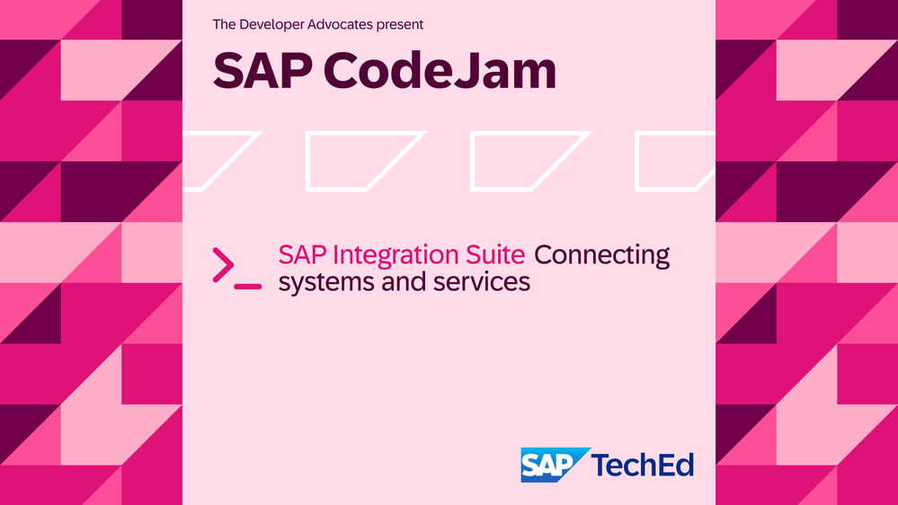
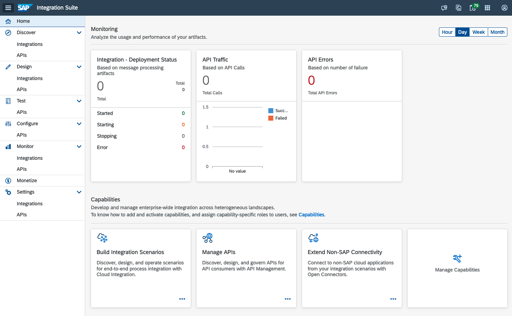

# Connecting Systems and Services Using SAP Integration Suite

---

## *SAP CodeJam events scheduled*

- 2025-07-14: 🇮🇳 SAP CodeJam: Connecting systems and services using SAP Integration Suite (Mumbai, India) - [RSVP here 🗓️](https://community.sap.com/t5/sap-codejam/sap-codejam-connecting-systems-and-services-using-sap-integration-suite/ev-p/14110686).
- 2025-07-18: 🇮🇳 SAP CodeJam: Connecting systems and services using SAP Integration Suite (Bengaluru, India) - [RSVP here 🗓️](https://community.sap.com/t5/sap-codejam/sap-codejam-connecting-systems-and-services-using-sap-integration-suite/ev-p/14110696).

<!-- markdownlint-disable MD033 -->

Previous events

 

- 2022-09-29: 🇪🇸 SAP CodeJam BTP: Connecting systems and services using SAP Integration Suite (Madrid, Spain) - [✅](https://groups.community.sap.com/t5/sap-codejam/sap-codejam-btp-connecting-systems-and-services-using-sap/ec-p/9782#M21).
- 2022-10-28: 🇪🇸 SAP CodeJam BTP: Connecting systems and services using SAP Integration Suite (Barcelona, Spain) - [✅](https://groups.community.sap.com/t5/sap-codejam/sap-codejam-btp-connecting-systems-and-services-using-sap/ec-p/9961#M32).
- 2023-06-21: 🇪🇸 SAP CodeJam BTP: Connecting systems and services using SAP Integration Suite (Madrid, Spain) - [✅](https://groups.community.sap.com/t5/sap-codejam/sap-codejam-btp-connecting-systems-and-services-using-sap/ev-p/259449).
- 2023-09-22: 🇵🇱 SAP CodeJam BTP: Connecting systems and services using SAP Integration Suite (Warszawa, Poland) - [✅](https://groups.community.sap.com/t5/sap-codejam/sap-codejam-btp-connecting-systems-and-services-using-sap/ev-p/263042).
- 2024-01-25: 🇩🇪 SAP CodeJam BTP: Connecting systems and services using SAP Integration Suite (Bonn, Germany) - [RSVP here 🗓️](https://groups.community.sap.com/t5/sap-codejam/sap-codejam-btp-connecting-systems-and-services-using-sap-integration-suite/ev-p/290525).
- 2024-02-15: 🇭🇷 SAP CodeJam BTP: Connecting systems and services using SAP Integration Suite (Zagreb, Croatia) - [RSVP here 🗓️](https://groups.community.sap.com/t5/sap-codejam/sap-codejam-btp-connecting-systems-and-services-using-sap-integration-suite/ev-p/296103)
- 2024-04-16: 🇪🇸 SAP CodeJam BTP: Connecting systems and services using SAP Integration Suite (Valencia, Spain) - [RSVP here 🗓️](https://community.sap.com/t5/sap-codejam/sap-codejam-btp-connecting-systems-and-services-using-sap-integration-suite/ev-p/13635827).
- 2025-03-25: 🇦🇪 SAP CodeJam: Connecting systems and services using SAP Integration Suite (Dubai, UAE) - [RSVP here 🗓️](https://community.sap.com/t5/sap-codejam/sap-codejam-connecting-systems-and-services-using-sap-integration-suite/ev-p/14007747).

<!-- markdownlint-enable MD033 -->

---

Welcome to the Connecting Systems and Services Using SAP Integration Suite CodeJam repository. In this SAP CodeJam, we will look at different services part of the SAP Integration Suite and how we can use them to connect our systems and services. By the end of the CodeJam, we will achieve an integration scenario like the one below in the diagram.

## Integration Scenario

Let's imagine we work for a company, ITeLO. ITeLO uses an external platform to manage its Employee Benefits, through which its employees can select their benefits, e.g. discount gym membership, private health insurance, and dental. In addition, ITeLO is interested in expanding its adoption of the benefits platform to allow employees to include their dependants, e.g. spouse, child or other family members, as beneficiaries of the different offerings available on the platform.

Currently, the benefits platform only has basic employee information, e.g. employee ID, personal email address, full name, and additional data will need to be shared to include dependants as beneficiaries. These employee dependant data exist within ITeLO's systems, and the benefits platform will need to communicate with these systems to retrieve employee dependant data. The employee dependant data is distributed across different geographies, Americas and the European Union (EU). The Americas server stores data for employees in the American continent, whilst the EU instance stores data for employees in the EU.

We are in charge of building the integration scenario to allow the benefits platform access to the employee dependants' data.
  
The benefits platform will not store employee dependant data and will send our integration service a message whenever it needs an employee dependants' data. We will need to validate the employee ID sent in the message against our global SAP S/4HANA Cloud system before retrieving the employee dependant data from the servers hosting the data. Also, our integration service will need to log the requests received.

## Prerequisites

The prerequisites to follow the exercises in this repository, including hardware and software, are detailed in the [prerequisites](prerequisites.md) file.

## Material organization

The material consists of a series of exercises. These exercises build on each other and should be completed in the given order. For example, we start by creating a simple integration flow, and we will extend it in the subsequent exercises.

The repository includes some [slides](slides.md), which will be used when running an SAP CodeJam event. The slides were built using [Marp](https://github.com/marp-team/marp/) and an HTML export is included [in the repository](slides.html). You can also [preview the slides here](https://htmlpreview.github.io/?https://github.com/SAP-samples/connecting-systems-services-integration-suite-codejam/blob/main/slides.html).

> ❗️❗️ The UX of Integration Suite was harmonized a couple of months after the SAP CodeJam content was created, see [roadmap item](https://roadmaps.sap.com/board?PRODUCT=000D3A47875C1EDB98A8A910864AC24B&q=Unified&range=2022Q1-LAST#;INNO=000D3AA914A11EDBBA8EE7A803212203). Some text and screenshots included in this material has been updated to reflect this. That said, if the UI in screenshot/video doesn't impact the learning experience, it wasn't modified. ❗️❗️
>
> In the new UI, the different capabilities (services) are accessible from the left hand menu. As you can see in the screenshot below, when developing/designing integrations or APIs, they are both under the *Design* section. Sections that were specific to a particular capability might only list the details for that capability, e.g. the *Test* section only includes API. The items listed under each section will vary depending on the capabilities that have been enabled in SAP Integration Suite.
>
> 

## Exercises

During the CodeJam you will complete each exercise one at a time. At the end of each exercise, questions are included to help you think about the content just covered and are to be discussed with the entire CodeJam class, led by the instructor, when everyone has finished that exercise.

If you finish an exercise early, please resist the temptation to continue with the next one. Instead, explore what you've just done and see if you can learn more about the subject covered. That way, we all stay on track together and can benefit from some reflection via the questions (and answers).

See below for an overview of the exercises part of this CodeJam.

- Please ensure that you have completed all the [prerequisites](prerequisites.md).
- Exercises:
  - [Exercise 01 - Getting familiar with the SAP Business Accelerator Hub](./exercises/01-getting-familiar-business-accelerator-hub/README.md#exercise-01---getting-familiar-with-the-sap-business-accelerator-hub)
  - [Exercise 02 - Exploring the mock services](./exercises/02-exploring-the-mock-services/README.md#exercise-02---exploring-the-mock-services)
  - [Exercise 03 - Build our first integration flow (Cloud Integration)](./exercises/03-build-first-integration-flow/README.md#exercise-03---building-our-first-integration-flow)
  - [Exercise 04 - Send messages and monitor our integration flow](./exercises/04-send-messages-and-monitor/README.md#exercise-04---sending-messages-and-monitoring-our-integration-flow)
    - [(Optional) Exercise 04.1 - Retrieve Business Partner dependant's information](./exercises/04.1-retrieve-bp-dependants/README.md#optional-exercise-041---retrieve-business-partner-dependants-information)
    - [(Optional) Exercise 04.2 - Add the America's instance of the Business Partner Dependants service](./exercises/04.2-add-americas-bp-dependants/README.md#optional-exercise-042---add-the-americas-instance-of-the-business-partner-dependants-service)
  - [Exercise 05 - Log service call in Slack](./exercises/05-log-requests-in-slack/README.md#exercise-05---log-request-in-slack)
  - [Exercise 06 - Expose integration flow via API Management](./exercises/06-expose-integration-flow-api-management/README.md#exercise-06---expose-integration-flow-via-api-management)
  - [(Optional) Exercise 01 - Running locally services used in CodeJam](./exercises/optional-01-running-locally/README.md#optional-exercise-01---running-locally-services-used-in-codejam)

### Troubleshooting

While going through the exercises, you might encounter common problems not explicitly related to them. Check out the [troubleshooting.md](troubleshooting.md) page, which includes a list of these common problems and their potential solutions.

## Known Issues

None

## Feedback

If you can spare a couple of minutes at the end of the session, please help us improve for next time by giving me some feedback.

Simply use this [Give Feedback](https://github.com/SAP-samples/connecting-systems-services-integration-suite-codejam/issues/new?assignees=&labels=feedback&template=session-feedback-template.md&title=Feedback) link to create a special "feedback" issue, and follow the instructions there.

Gracias/Thank you/Obrigado/Merçi/Danke!

## How to obtain support

Support for the content in this repository is available during CodeJam events, for which this content has been designed.

Alternatively, if you are completing this CodeJam on your own, outside of an event, you can [create an issue](https://github.com/SAP-samples/connecting-systems-services-integration-suite-codejam/issues/new) in this repository if you find a bug or have questions about it.

For additional support, [ask a question in SAP Community](https://answers.sap.com/questions/ask.html).

## Contributing

Please send a pull request if you wish to contribute code or offer fixes or improvements. Due to legal reasons, contributors will need to accept a DCO when they create the first pull request for this project. This happens in an automated fashion during the submission process. SAP uses [the standard DCO text of the Linux Foundation](https://developercertificate.org/).

## License

Copyright (c) 2025 SAP SE or an SAP affiliate company. All rights reserved. This project is licensed under the Apache Software License, version 2.0 except as noted otherwise in the [LICENSE](LICENSES/Apache-2.0.txt) file.
