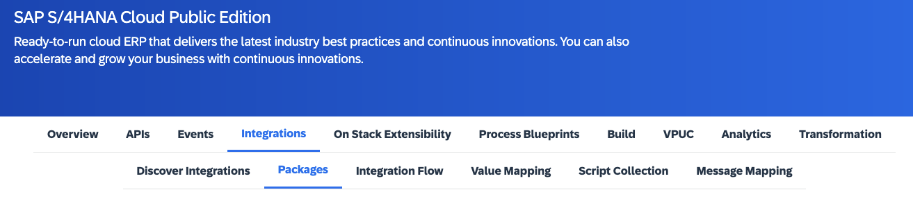
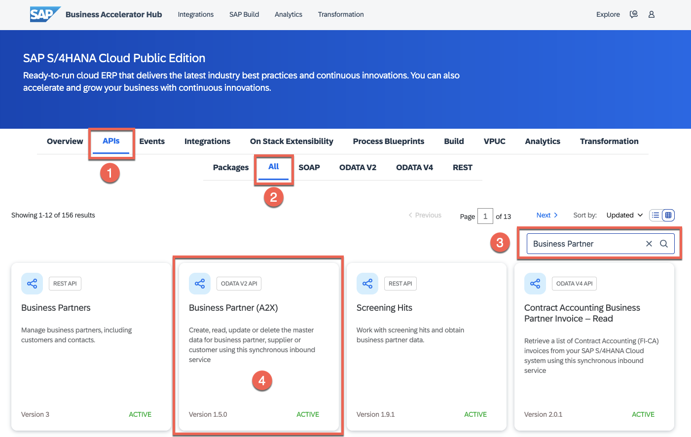

# Exercise 01 - Getting familiar with the SAP Business Accelerator Hub

Before we start connecting systems, it will be beneficial to get familiar with the SAP Business Accelerator Hub. In the SAP Business Accelerator Hub, you can discover, explore, and test the different types of content available for SAP products, as well as third-party products. The content available here can be used to accelerate the development of integrations and extensions required at your company.

At the end of this exercise, you'll have an understanding of the SAP Business Accelerator Hub and some of the content that you will be able to find in it.

## Tour the SAP Business Accelerator Hub

Let's start by exploring the various features of the SAP Business Accelerator Hub.

👉 Perform all the steps in [tutorial: Tour the SAP Business Accelerator Hub](https://developers.sap.com/tutorials/hcp-abh-getting-started.html).

So far we know that it is possible to interact with the APIs available for different SAP products via the SAP Business Accelerator Hub. What other type of content can we find for a product? Let's use [SAP S/4HANA Cloud](https://hub.sap.com/products/SAPS4HANACloud/overview) as an example.

> The categories (content) available will vary depending on the product selected. 

In the case of SAP S/4HANA Cloud we have the following type of content available:
- *APIs*: APIs are application programming interfaces (along with instructions and other documentation) made available by SAP to developers to access SAP services, for extending solutions, integrating with other solutions, or building new apps.
- *Events*: A business event is a message that is sent to notify a consumer that an SAP Object Type has changed. 
- *CDS Views*: Core Data Services (CDS) views are semantically rich data models, providing highly efficient built-in functions like aggregations, annotations, and conceptual associations. 
- *Developer Extensibility*: Exclusively available for SAP S/4HANA Cloud and it allows you to create development projects in an SAP S/4HANA Cloud system.
- *Integrations*: Integrations between SAP S/4HANA Cloud and other SAP products and third parties.
- *Workflow Management*: Readily available content to digitize workflows, manage decisions, gain end-to-end process visibility, and configure common processes.

There is a wealth of content available for each SAP product in the SAP Business Accelerator Hub. It is likely that for common integration scenarios there will be integration content readily available in the SAP Business Accelerator Hub, e.g. integration between SAP S/4HANA Cloud and governmental institutions - [Document and Reporting Compliance](https://hub.sap.com/products/SAPS4HANACloud/overview?target=SAPDocumentandReportingCompliance). If that's the case, there is no need to build an integration but this content can easily be imported into your SAP Cloud Integration tenant, configured and deployed. 

## Explore the Business Partner API available in SAP S/4HANA Cloud 

As part of this CodeJam we will simulate interacting with the Business Partner data from an SAP S/4HANA system. 

👉 Now that you are familiar with how to get around the SAP Business Accelerator Hub, search for the [Business Partner API](https://hub.sap.com/products/SAPS4HANACloud/apis/all) available for SAP S/4HANA Cloud, try it out and get acquainted with the response of the [/A_BusinessPartner](https://hub.sap.com/api/API_BUSINESS_PARTNER/tryout) method.

👉 Once you've retrieved some data, find out how can you include Business Partner Address in the response.

Hint 🔦

<i>Check out the <b>$expand</b> query param. This parameter can be used to Expand related entities, see [Expand](https://help.sap.com/doc/5890d27be418427993fafa6722cdc03b/Cloud/en-US/OdataV2.pdf#page=63).

Available values: to_BuPaIdentification, to_BuPaIndustry, to_BusinessPartnerAddress, to_BusinessPartnerBank, to_BusinessPartnerContact, to_BusinessPartnerRole, to_BusinessPartnerTax, to_BusPartAddrDepdntTaxNmbr, to_Customer, to_Supplier</i>

> Why is this important? We will be using Business Partner Address data in our integration service to know to which server we will route our request.

🧭 Take some time to explore what's documented on the [Business Partner API - Overview page](https://hub.sap.com/api/API_BUSINESS_PARTNER/overview). You will be able to find lots of valuable information here, e.g. attributes, authentication methods, API specifications, and configuration details. In [exercise 08](../08-expose-integration-flow-api-management/) we will explore API specifications further.

## Summary

Now that you are familiar with the basic functionality of SAP Business Accelerator Hub and the Business Partner API, we are ready to start interacting with the services from which our integration will be extracting data.

Although we focused, in this exercise, on exploring APIs.... you can also find other types of objects in the Business Accelerator Hub, e.g. API Management - Policy templates. We will see more on this in [exercise 08](../08-expose-integration-flow-api-management/).

## Further Study

* [Explore the SAP Business Accelerator Hub Community](https://hub.sap.com/community)
* [Configure workspaces for integration content available in the SAP Business Accelerator Hub](https://help.sap.com/docs/SAP_API_BUSINESS_HUB/e56a6c50d31541ea826021dc8e721a53/8f1a5bc71eef498aa51b99e90365c66e.html?locale=en-US)
* [SAP API Deprecation Policy](https://help.sap.com/docs/SAP_API_BUSINESS_HUB/e56a6c50d31541ea826021dc8e721a53/5cbfda5a9efe4e97a3e24ddaf7ec5c16.html?locale=en-US)

---

If you finish earlier than your fellow participants, you might like to ponder these questions. There isn't always a single correct answer and there are no prizes - they're just to give you something else to think about.

1. Can you list some of the third-party services that there are integration packages available for SAP SuccessFactors?
2. We were able to retrieve data from a sandbox environment via the web browser. What is required to retrieve data from the sandbox APIs available in SAP Business Accelerator via other utilities/applications, e.g. curl, Postman?
3. Whilst navigating the APIs for different SAP products, you might have noticed the different states of an API, e.g. `ACTIVE`, `BETA`, `DECOMMISSIONED`, `DEPRECATED`. What is the deprecation policy of APIs published by SAP? 

## Next

Continue to 👉 [Exercise 02 - Exploring the mock services](../02-exploring-the-mock-services/README.md#exercise-02---exploring-the-mock-services)
