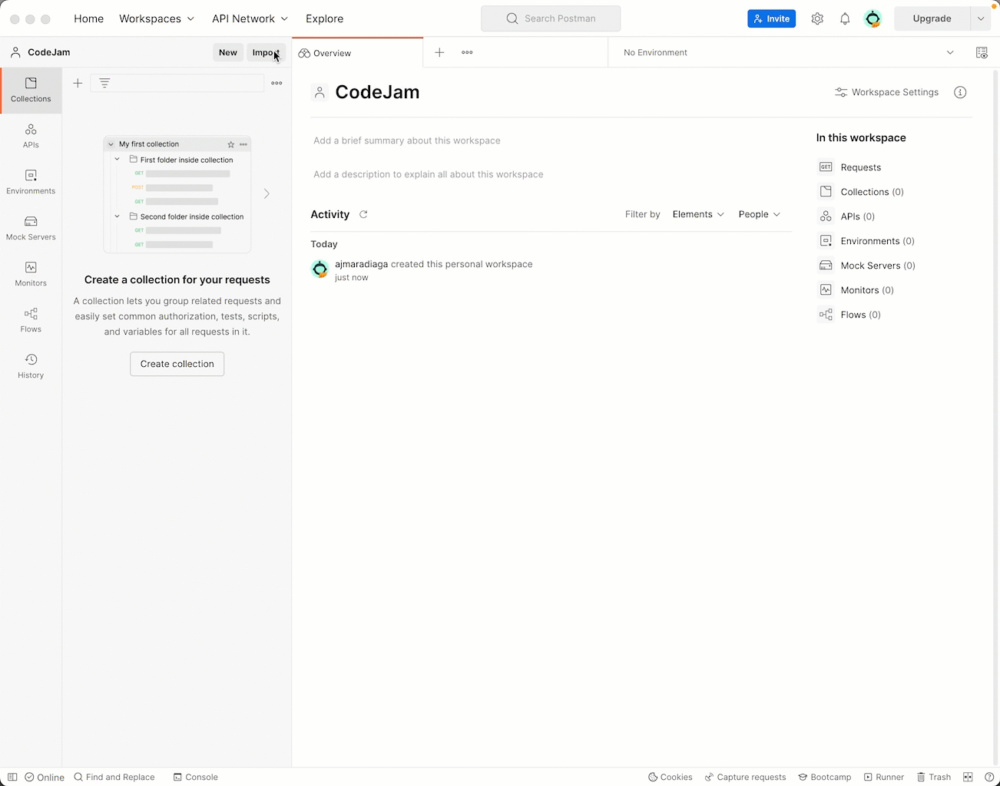
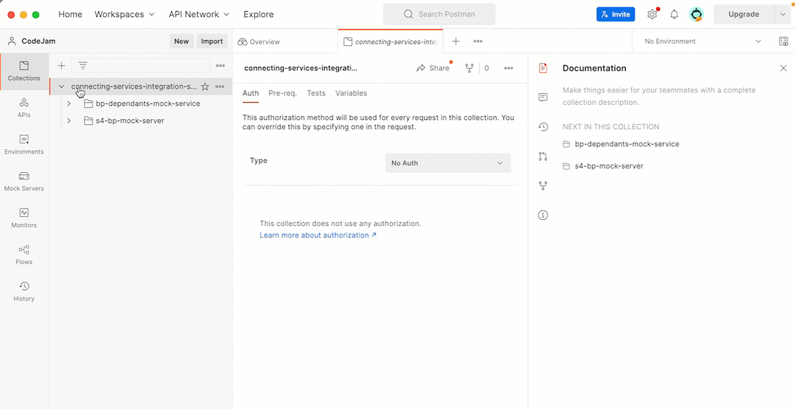
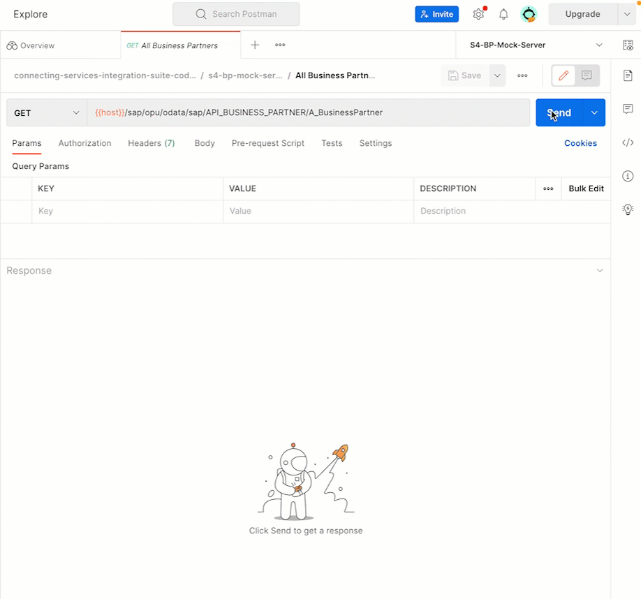

# Exercise 02 - Exploring the mock services

Before attempting to build an integration between the services, it is important to get familiar with them. The easiest way to achieve this is by using a REST client, e.g. Postman, to interact with the API exposed by the service. 

> If you are following this exercise outside of a CodeJam event, you can follow the instructions included in [Optional Exercise 01 - Running and deploying the mock services](../optional-01-deploy-mock-services/README.md) to either run the services locally or deploy them to a [Kyma environment part of the SAP BTP](https://discovery-center.cloud.sap/serviceCatalog/kyma-runtime?region=all).

A couple of things that we need to keep in mind when exploring new APIs/services:
- Is there any documentation that can guide me on how to interact with the API, e.g. [OpenAPI](https://www.openapis.org/) specifications?
- What do we need to authenticate with the service?
- What data is exposed via the API?
- Which are the API methods that we need to interact with?
- Are there any API rate limits that we need to worry about?

> This is an exploration exercise. There are no step-by-step instructions to be completed but questions are included to guide your exploration. I encourage you to be curious about the different aspects of the API available.

At the end of this exercise, you'll have an understanding of the data that we will be interacting with when building our first integration flow in the next exercise.

## Importing collections and environments of the mock services

A collection and a few environments are included in this repository to facilitate interacting with the APIs exposed by the services that we will be using in our integration. The collection and environments for the S/4HANA mock server and the Business Partner Dependants mock service can be found in the assets folder, under the [s4-mock-server](assets/s4-mock-server/) and [bp-dependants-mock-service](assets/bp-dependants-mock-service/) folders respectively.

> - [Postman Collections](https://www.postman.com/collection/): Postman Collections are Executable API Descriptions. Postman's collection folders make it easy to keep your API requests and elements organized. 
> - [Postman enviroment](https://learning.postman.com/docs/sending-requests/managing-environments/): A Postman environment is a set of variables you can use in your Postman requests. You can use environments to group related sets of values together and manage access to shared Postman data if you are working as part of a team.

👉 Import the collection and the environments provided to your Postman client. The files are located under the root folder of the repository -> `./connecting-services-integration-suite-codejam/assets/postman`

List of the files that you need to import to Postman:
```
Collection:
- ../postman/connecting-services-integration-suite-codejam.postman_collection.json

Environments:
- ../postman/bp-dependants-mock-service/BP-Dependants-Americas.postman_environment.json
- ../postman/bp-dependants-mock-service/BP-Dependants-EU.postman_environment.json
- ../postman/s4-bp-mock-server/S4-BP-Mock-Server.postman_environment.json
```



The collection contains all the requests that we can make to the services. These are the requests that we need to get familiar with before we can build our first integration flow. 

## SAP S/4HANA Cloud - Business Partner mock service

In Exercise 1, we had a brief look at the Business Partner API. This mock service is based on that API. Let's start by opening a request and selecting the correct environment.

👉 Select the `All Business Partners` request in the `s4-bp-mock-server` folder and select the `S4-BP-Mock-Server` environment. 



> ⚠️ If you are running the services locally, you will need to select the `S4-BP-Mock-Server-localhost` environment

You'll notice in the gif above that there is a placeholder in the URL called *{{host}}*. This placeholder is a [variable in Postman](https://learning.postman.com/docs/sending-requests/variables/). At first, the colour of the variable is red, this is because Postman is unable to resolve the variable. It changes to orange after selecting the environment - `S4-BP-Mock-Server`, meaning that Postman can substitute the variable, with a value, when we execute the request.

👉 We are now ready to send the first request to our server. Click the *Send button* to send a request to the server. The server response will be shown in the response section below. 



If the call was successful, you will see a response similar to the one above. The JSON payload contains the Business Partner data that we are after. If you've interacted with SAP S/4HANA OData services before you'll see a familiar response structure. The service is a mock OData service. Not all OData functionality is available but we can `$select` fields and `$expand` some attributes.

> If you want to learn the basics on OData, I recommend checking out the Hands-on SAP Dev, Back to basics: OData with [@qmacro](https://people.sap.com/dj.adams.sap) - https://www.youtube.com/playlist?list=PL6RpkC85SLQDYLiN1BobWXvvnhaGErkwj

👉 Now, let's dive deeper into the requests available on this server. For that, make sure to go through all the questions listed below:
- Notice how there are different parts in the response section, e.g. Body, Cookies, and Headers. Get familiar with each one of them.
- Under which node in the JSON payload can we find a list of Business Partners?
- Which field is the Business Partner ID?
- Send a request to retrieve a single Business Partner, e.g. Business Partner ID = 1003765.
- Can we limit the fields returned in the response? How can we do that?
- Open the `All Business Partners with Addresses` request and send a request to the server
  - Did you notice any differences in the URL when comparing it to the previous request - `All Business Partners`? How is this additional query parameter changing the response?
  - Are there any additional fields included in the to_BusinessPartnerAddress structure? Can any of them be used for our integration?

## Custom Service - Business Partner Dependants mock service

Let's start by validating that the API is up and running 

👉 Send a Ping request to the service. Change the environment to `BP-Dependants-*`, Open the *Ping* request and click the send button.

If the call was successful, you will see a response similar to the one below.

```json
{
    "status": "Service is running"
}
```

The Business Partner dependants mock service will return all the dependants for a Business Partner. As mentioned in the overview of the SAP CodeJam, we have separate services to serve America's and European data. Separate environments have been provided to be able to communicate with each service.

👉 Now, let's dive deeper into the requests available for this service. For that, make sure to go through all the questions listed below:
- Environments:
  - There are two environments for the BP Dependants mock service. Let's inspect the environments, can you spot any differences between the environments available for `BP-Dependants-*`?
  - Check out how the variables are used in the different requests included in the `bp-dependants-mock-service` folder.
- Headers:
  - Notice how there are different parts in the request section, e.g. Params, Authorization, Headers, Body. Get familiar with each one of them.
  - Did you notice an additional parameter that has been set as a header? We didn't specify such a header for `S4-BP-Mock-Server`. What happens if we don't send the header? 
- Requests:
  - Retrieve `All Dependants` for each environment and compare the data returned.
  - Send a request to retrieve a single Dependant, e.g. Dependant ID = 8255729496883.
  - How does the response differ when retrieving `All Dependants` compared to a `Single Dependant`?
  - For which countries will we be able to retrieve data in each environment?    


## Summary

Now that you are familiar with the APIs and the data included in their responses, we are ready to start building our first integration flow.

## Further reading

* [Business Partner (A2X) documentation](https://help.sap.com/docs/SAP_S4HANA_CLOUD/3c916ef10fc240c9afc594b346ffaf77/85043858ea0f9244e10000000a4450e5.html?locale=en-US)
* [Swagger Inspector - Create an OpenAPI definition by calling your API](https://swagger.io/docs/swagger-inspector/how-to-create-an-openapi-definition-using-swagger/)
* [OpenAPI specification](https://spec.openapis.org/oas/latest.html)

---

If you finish earlier than your fellow participants, you might like to ponder these questions. There isn't always a single correct answer and there are no prizes - they're just to give you something else to think about.

1. Which API methods, of the different mock services, do you consider we will need for our integration?
2. OpenAPI specs are included in the SAP API Business Hub, do you know where you can find them? What if you import one of them to Postman?

## Next

Continue to 👉 [Exercise 03 - Building the first integration flow](../03-build-first-integration-flow/README.md)