# Exercise 03 - Building our first integration flow

At the end of this exercise, you'll have successfully created a simple integration flow that communicates with the SAP S/4HANA Cloud mock server.

> **What is an integration flow [^1]?** 
> 
> An integration flow allows you to specify how SAP Cloud Integration is to process a message. The modelling environment, provided in SAP Cloud Integration, enables you to design the details of message processing (its senders and receivers and the individual processing steps) with a graphical user interface.

The diagram below captures what we will achieve as part of this exercise from a data flow point of view. First, we will expose an HTTP endpoint through which we can send requests to the integration flow we develop. Next, the integration flow will extract some data (the `employee_id`) from the payload received. Finally, the employee_id is passed to the SAP S/4HANA Cloud Business Partner mock service to retrieve Business Partner information. 

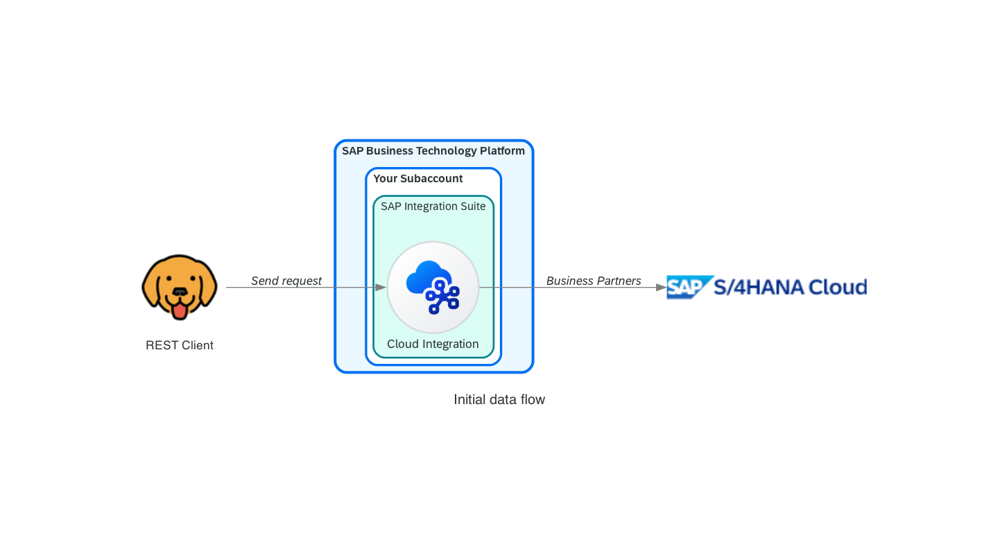

The integration flow expects a sample request message like the one below and should return a response message like the one underneath the request. 

> The [assets folder](./assets/) contains a [sample request](assets/request-payload-sample.json) and a complete [response payload](assets/sample-response.json).

```json
// Sample request
{
    "employee_id": "1003764"
}

// Sample response
{
    "d": {
        "__metadata": {
            "id": "http://s4-mock-server-service.default.svc.cluster.local:443/sap/opu/odata/sap/API_BUSINESS_PARTNER/A_BusinessPartner('1003764')",
            "uri": "http://s4-mock-server-service.default.svc.cluster.local:443/sap/opu/odata/sap/API_BUSINESS_PARTNER/A_BusinessPartner('1003764')",
            "type": "API_BUSINESS_PARTNER.A_BusinessPartnerType"
        },
        "BusinessPartner": "1003764",
        "Customer": "",
        "Supplier": "",
        "AcademicTitle": "",
        "AuthorizationGroup": "",
        "BusinessPartnerCategory": "1",
        "BusinessPartnerFullName": "John Doe",
        "BusinessPartnerGrouping": "BP02",
        "BusinessPartnerName": "John Doe",
        "BusinessPartnerUUID": "00163e30-4e2a-1ed8-8483-a08c52249f04",
        ...
        "to_BusinessPartnerAddress": {
            "results": [
                {
                    "__metadata": {
                        "id": "http://s4-mock-server-service.default.svc.cluster.local:443/sap/opu/odata/sap/API_BUSINESS_PARTNER/A_BusinessPartnerAddress(BusinessPartner='1003764',AddressID='28238')",
                        "uri": "http://s4-mock-server-service.default.svc.cluster.local:443/sap/opu/odata/sap/API_BUSINESS_PARTNER/A_BusinessPartnerAddress(BusinessPartner='1003764',AddressID='28238')",
                        "type": "API_BUSINESS_PARTNER.A_BusinessPartnerAddressType"
                    },
                    "BusinessPartner": "1003764",
                    "AddressID": "28238",
                    "ValidityStartDate": "/Date(1518393600000+0000)/",
                    "ValidityEndDate": "/Date(253402300799000+0000)/",
                    "AuthorizationGroup": "",
                    "AddressUUID": "00163e30-4e2a-1ed8-8483-a08c5224bf04",
                    "AdditionalStreetPrefixName": "",
                    "AdditionalStreetSuffixName": "",
                    "AddressTimeZone": "CET",
                    "CareOfName": "",
                    "CityCode": "",
                    "CityName": "Walldorf",
                    "CompanyPostalCode": "",
                    "Country": "DE",
                    "County": "",
                    "DeliveryServiceNumber": "",
                    "DeliveryServiceTypeCode": "",
                    ...
                }
            ]
        }
    }
}
```

> ℹ️ While going through the exercise, you might encounter common problems not explicitly related to it. Your first stop should be the [troubleshooting.md](troubleshooting.md) page, which includes a list of these common problems and their potential solutions.

## Enterprise Integration Patterns (EIP)

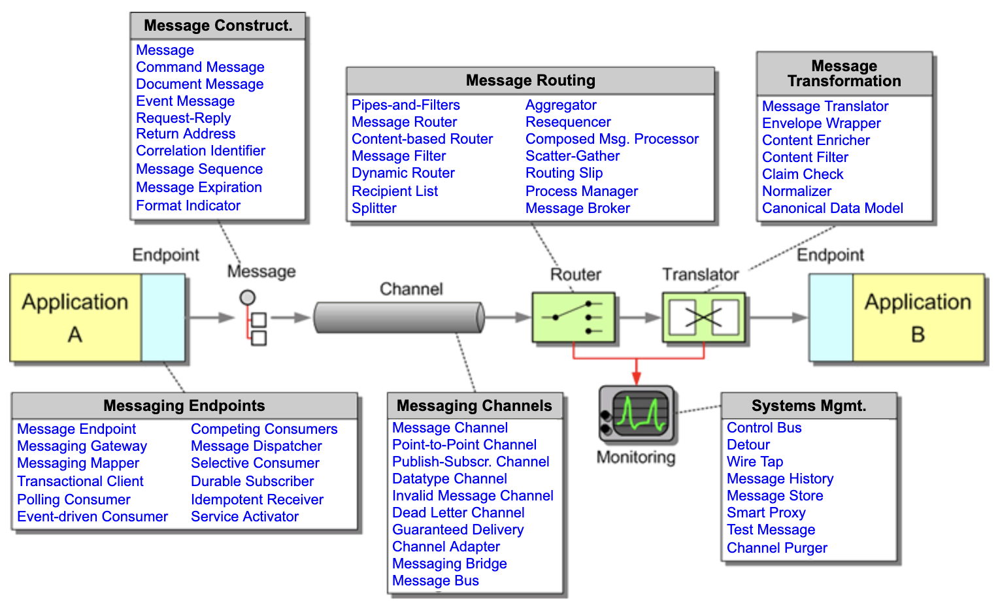
<p align = "center">
<i>Messaging patterns - <a href="https://www.enterpriseintegrationpatterns.com/patterns/messaging/">Source</a></i>
</p>

Under the hood, SAP Cloud Integration runs [Apache Camel](https://camel.apache.org/) 🐪, an open-source integration framework based on the enterprise integration patterns. This means that SAP Cloud Integration supports the implementation of these patterns. The patterns are explained in detail in the [Enterprise Integration Patterns book](https://www.enterpriseintegrationpatterns.com/books1.html) by Gregor Hohpe and Bobby Woolf and as stated on the [website](https://www.enterpriseintegrationpatterns.com/patterns/messaging/), *the patterns provide a consistent vocabulary and visual notation framework to describe large-scale integration solutions across many technologies*. The Enterprise Integration Patterns book is a great place to start if you are interested in the integration topic and want to understand the underlying concepts behind the patterns and some components available in SAP Cloud Integration.

The [Integration Flow Design Guidelines - Enterprise Integration Patterns package](https://api.sap.com/package/DesignGuidelinesPatterns/overview), available in the SAP API Business Hub, contain integration flows that illustrate the design of the most common Enterprise Integration Patterns. These integration flows can be used as a reference when exploring an integration pattern and seeing how you can implement it in SAP Cloud Integration. These also come in handy when implementing the integration patterns in your integration flows.

> ℹ️ For more information about enterprise integration patterns, see https://www.enterpriseintegrationpatterns.com/patterns/messaging/

## Access your Cloud Integration workspace

You set up SAP Integration Suite and activated several capabilities as part of the prerequisites of this SAP CodeJam. We now must access the Cloud Integration workspace to build our first integration flow.

👉 Go to the BTP Cockpit, open the SAP Integration Suite application from within Services > Instances and Subscriptions, and then choose the *Design, Develop, and Operate Integration Scenarios* tile.

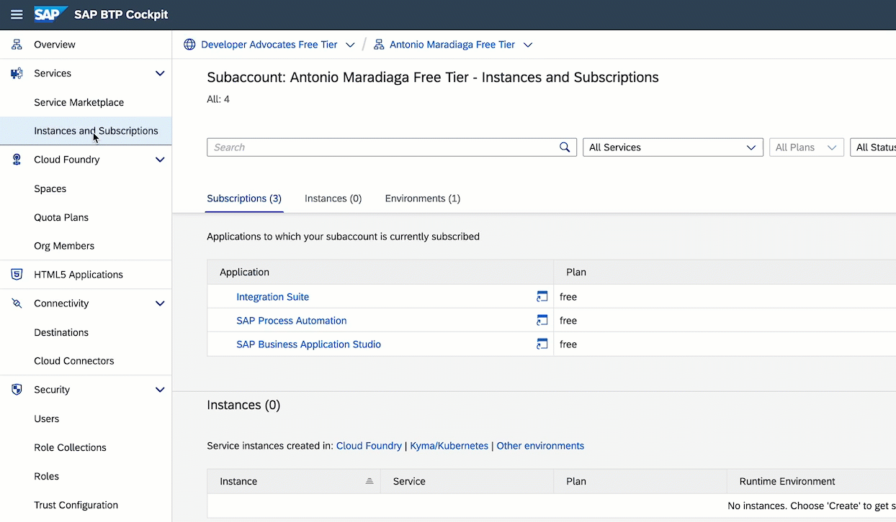

We are now on the landing page of SAP Cloud Integration. The page is divided into the following sections: Discover, Design, Monitor, and Settings. In this CodeJam, we will interact the most with Design and Monitor. Below is a brief explanation of what you can find in each section.

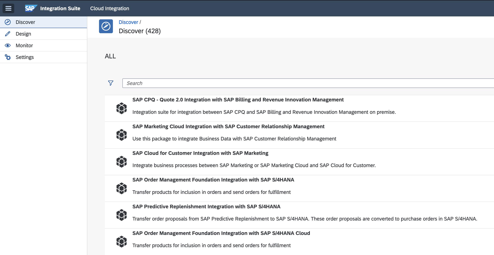

- *Discover*: Here, you can find predefined integration content provided by SAP that you can use out of the box and adapt to your requirements.
- *Design*: This is where you design your integration content. It contains the graphical integration flow modelling environment. You will find a list of integration packages defined for the tenant. When you select an integration package, you can find the integration flows (and other artefacts) defined for the package (on the `Artifacts` tab).
- *Monitor*: This is where you can monitor your integration flow. You also use this section to manage additional artefacts that you deploy on your tenant to complement your integration flows (for example, User Credential artefacts to configure connections using basic authentication).

## Design

Let's jump to the Design section to start developing our integration flow. Before designing our integration flow, we will need to create an integration package. Cloud Integration allows us to assemble integration contents, e.g. integration flows, message mappings, value mappings, scripts, and APIs, into packages so that they can be part of our integration scenarios.

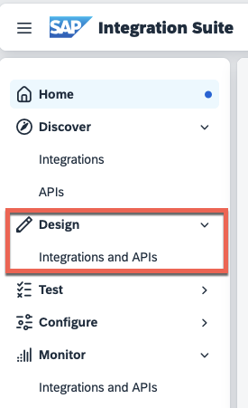

👉 Click the Create button and enter the integration package's name and short description.

| Field               | Value                                                            |
| ------------------- | ---------------------------------------------------------------- |
| *Name*              | Connecting Systems CodeJam                                       |
| *Technical Name*    | ConnectingSystemsCodeJam                                         |
| *Short description* | The benefits platform will send us a request for an employee ID. |

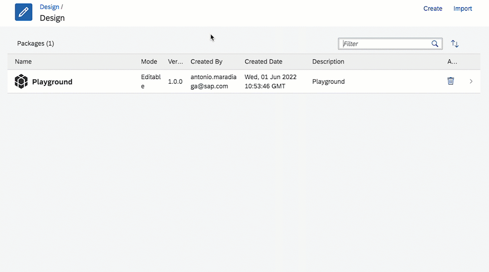

Once created, we can start adding artefacts to our package. 

👉 Navigate to the `Artifacts` tab in your integration package, Add an Integration Flow, and specify a Name and ID for the integration flow. Once created, click on the new integration flow.

| Field  | Value                       |
| ------ | --------------------------- |
| *Name* | Request Employee Dependants |
| *ID*   | RequestEmployeeDependants   |

> If the `Add button` is greyed out, you are not in Edit mode. Click the `Edit button` in the upper right-hand corner.

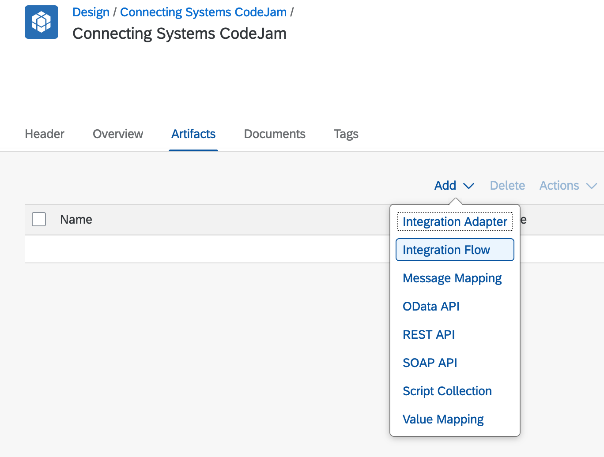

When accessing the newly created integration flow, you'll notice a couple of things:

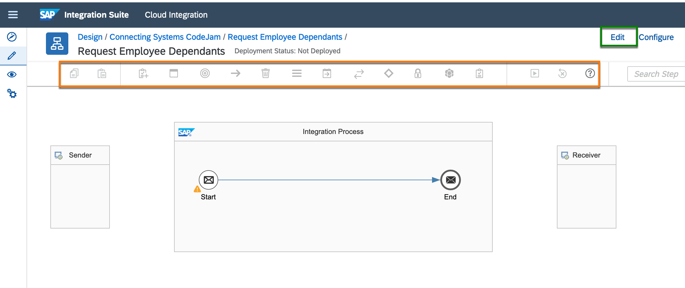
- There is no connection between the Sender participant and our integration process or the integration process and the Receiver participant.
- The palette is greyed out (*highlighted in orange*), and we cannot modify the integration flow. This is because our integration flow is not in edit mode. To switch to edit mode, click the `Edit button` (*highlighted in green*).
- The configuration section at the bottom of the modelling area is collapsed. The contents of this section will change depending on the object selected in the modelling area. To expand it, click the `Restore button`.
  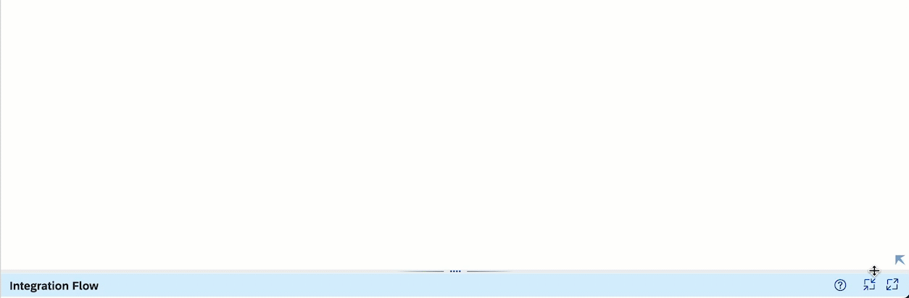


### Modeling 

We will expose the integration flow via an HTTP endpoint. To send requests to the integration flow, we will also require a user with the ESBMessaging.send role. The user we will use should have been created as part of the CodeJam [prerequisites](../../prerequisites.md#create-sap-cloud-integration-runtime-client-credentials).

#### Sender participant

👉 If not in editing mode, click the `Edit button` to enter edit mode in our integration flow, connect the sender participant to the start message event, and select HTTPS as the adapter. 

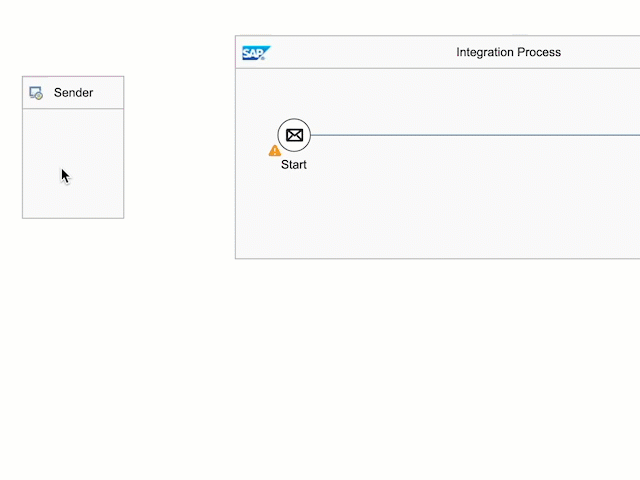

👉 Now that we've connected the sender participant, we can proceed to configure the connection of the HTTPS adapter. First, we need to specify an address, then a user role and finally, if the endpoint should be CSRF (Cross-site request forgery [^2]) protected. 

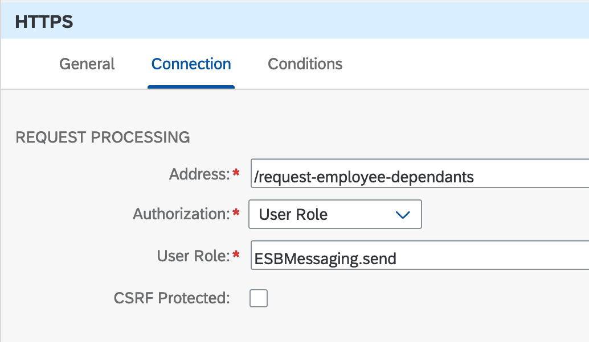

#### JSON to XML converter

To extract the data needed from the request, we will first convert the JSON payload to XML. Using XML eases the message processing in the integration flow, e.g. take advantage of XPath in the Content Modifier transformation step. For this, we will need to add a couple of steps to the integration flow. We can do this by selecting the step from the palette (highlighted in orange in a few screenshots above) or clicking the Add button in the hover menu. *I prefer using the hover menu as the search functionality is convenient.* 

👉 Add the JSON to XML converter and the Content Modifier transformation to the integration flow

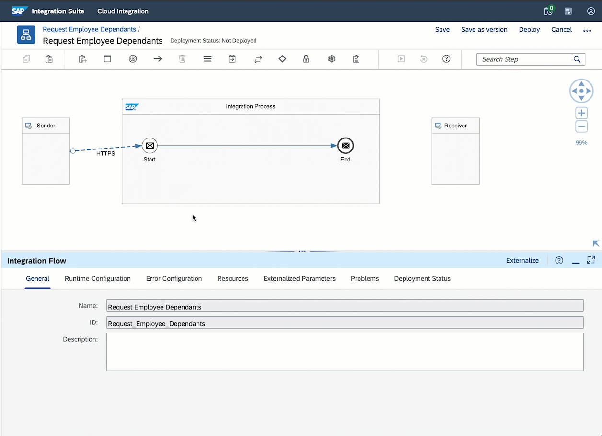

The JSON to XML converter enables you to transform messages in JSON format to XML format. This step replaces the exchange body with an XML payload, similar to the one below, and the XML payload will contain a `root` node. We can set the name of the `root` node in the JSON to XML Converter - Processing tab.

```xml
<?xml version='1.0' encoding='UTF-8'?>
<root>
    <employee_id>1003764</employee_id>
</root>
```

#### Content Modifier

We can use the content modifier to define local properties for storing additional data during message processing. You can also use it to set header properties required in the HTTP request to other systems. The header and properties in the exchange can be used in connectors and conditions in the integration flow. 

👉 Let's create a property in our exchange. The `employee_id` exchange property will store the employee_id value sent in the request payload. To do this, we need to access the field value using XPath. Let's configure the Content Modifier - Exchange Property, as shown in the screenshot below.

| Field          | Value                       |
| -------------- | --------------------------- |
| *Action*       | Request Employee Dependants |
| *Name*         | employee_id                 |
| *Source Type*  | XPath                       |
| *Source Value* | /root/employee_id           |
| *Data Type*    | java.lang.String            |

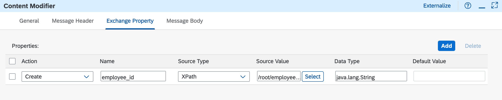

#### Request/Reply

For our integration scenarios, we require that our integration flow communicates with the SAP S/4HANA Cloud mock server to retrieve Business Partner data. In this case, we will use the request reply step to connect to the Business Partner mock service.

> In exercise 4, we will further process the data received from the SAP S/4HANA Cloud - Business Partner mock service.

👉 Add a Request Reply external call to call the SAP S/4HANA Cloud - Business Partner mock service, connect it to the Receiver participant, and select as a [receiver the HTTP adapter](https://help.sap.com/docs/CLOUD_INTEGRATION/368c481cd6954bdfa5d0435479fd4eaf/2da452effb764b3bb28f8e0a2f5bd480.html?locale=en-US), and set the connections details in the HTTP adapter.

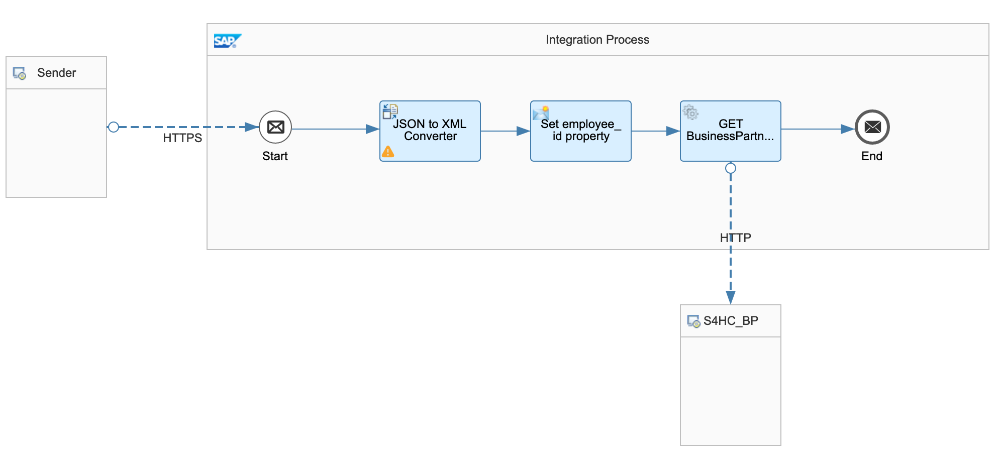

HTTP Connection details:
| Field           | Value                                                                                                                                          |
| --------------- | ---------------------------------------------------------------------------------------------------------------------------------------------- |
| *Address*       | https://s4-mock-server-service.c-1e90315.kyma.ondemand.com/sap/opu/odata/sap/API_BUSINESS_PARTNER/A_BusinessPartner('${property.employee_id}') |
| *Query*         | $expand=to_BusinessPartnerAddress                                                                                                              |
| *Proxy Type*    | Internet                                                                                                                                       |
| *Method*        | GET                                                                                                                                            |
| *Authenticaton* | None                                                                                                                                           |

Let's break down the configuration set in the HTTP adapter:
- Connection Details:
  - *Address*: URL of the SAP S/4HANA Cloud mock server we're connecting to, e.g., https://s4-mock-server-service.c-1e90315.kyma.ondemand.com. You'll notice that we are also including the full path and dynamically setting the value stored in the `employee_id` exchange property as part of the URL.
  > 🐪 ${property.employee_id} - Simple expression
  - *Query*: Query string that we want to send with the HTTP request. In our case, we are just expanding the `to_BusinessPartnerAddress` field.
  - *Proxy*: The type of proxy that you are using to connect to the target system. In our case, we are communicating with a cloud system; therefore, we select Internet. If we would be communicating with an on-premise system, we will need to set it to On-Premise.
  - *Method*: Action that the HTTP request must perform. In our case, a GET request.
  - *Authentication*: The mock server has no authentication enabled hence why we select None. In a real-world scenario, you would set up a communication user in SAP S/4HANA and deploy the credentials to the secure store in SAP Cloud Integration. 
- Header Details:
  - *Request Headers*: List of headers that you want to send to the target system. We don't need to send request headers to the Business Partners mock service, but we will use this field to include a header parameter in a future exercise.
  - *Response Headers*: List of headers coming from the target system's response. They will be available in the exchange after the request.

We've completed the design of our basic integration flow. In it, we've used some of the most commonly used flow steps, converter (JSON to XML), transformer (Content Modifier), and external call (Request Reply). We will extend this integration flow in future exercises to cover other commonly used flow steps. 

🧭 Before deploying the integration flow, let's dedicate some time to navigate/click around and get familiar with the properties of the flow steps we just included in the integration flow. Click around the palette and see what other flow steps are available. Check out other flow steps that we've not used. Drag/add them to the integration flow to see their properties. Once you've done some self-discovery, make sure you leave the integration flow like the one on the screenshot above and come back here to continue with the exercise.

Now let's proceed to deploy the integration flow.

## Deploy

We need to deploy the integration flow before it is ready to receive requests. 

👉 Save your integration flow and deploy it by clicking the respective buttons in the upper right corner of the modelling area.

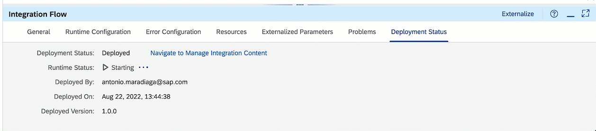

Once deployed, and the runtime status is `✅ Started`, you can click the `Navigate to Manage Integration Content link` and it will take you to the details of the deployed content. An HTTP endpoint URL, similar to the one below, will be displayed in the UI.

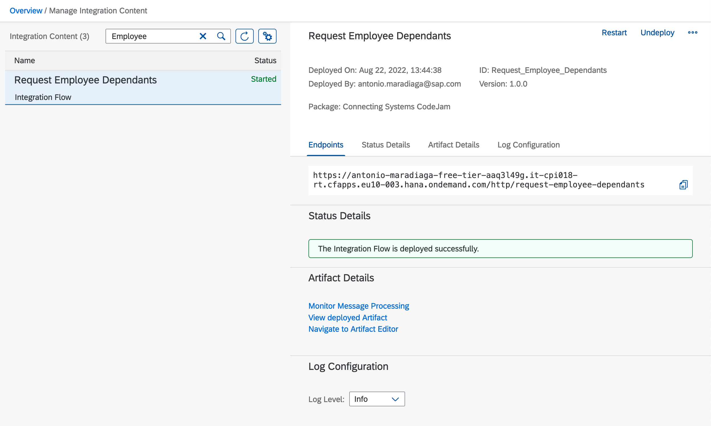

> ℹ️ In case you don't see the HTTP endpoint URL immediately in the deployed content page, see [troubleshooting](../../troubleshooting.md#there-is-no-http-endpoint-url-on-the-deployed-content-page).

👉 Copy the HTTP endpoint URL, as we will use it in the next exercise, [sending requests and monitoring the integration flow](../04-send-requests-and-monitor/).

## Summary

Congratulations, you've built and deployed the first integration flow. Now you have a basic understanding of some of the most commonly used integration flow steps.

## Further reading

* [Defining the JSON-to-XML converter](https://help.sap.com/docs/CLOUD_INTEGRATION/987273656c2f47d2aca4e0bfce26c594/2f75a807d7574f099170de52dd8f91e2.html?locale=en-US&version=Cloud)
* [Request Reply external call](https://help.sap.com/docs/CLOUD_INTEGRATION/987273656c2f47d2aca4e0bfce26c594/dc39fdd4a44d4b9a9eabb56f49434250.html?locale=en-US&version=Cloud)
* [Externalise parameters of an Integration flow](https://help.sap.com/docs/CLOUD_INTEGRATION/368c481cd6954bdfa5d0435479fd4eaf/45b2a0772db94bd9b0e57bc82d8d3797.html?locale=en-US)

---

If you finish earlier than your fellow participants, you might like to ponder these questions. There isn't always a single correct answer and there are no prizes - they're just to give you something else to think about.

1. Now that you've built your first integration flow with SAP Cloud Integration, how would you compare the process of building an integration flow to writing a program to achieve the same?
2. Can you think of a problem we might face if we set the `employee_id` property as a header property instead of an exchange property?
3. In the receiver HTTP adapter, we hardcoded a URL. How can we parametrise this field or other fields in our integration flow? Why would we want to parametrise our integration flow?
4. How can we configure our integration flow so that the error can be returned to the sender whenever an error is raised during execution?

[^1]: [Getting Started with Integration Flow Development](https://help.sap.com/docs/CLOUD_INTEGRATION/368c481cd6954bdfa5d0435479fd4eaf/e5724cd84b854719973afe0356ea128b.html?locale=en-US&q=%22integration%20flow%22)
[^2]: [Cross-site request forgery]((https://owasp.org/www-community/attacks/csrf))