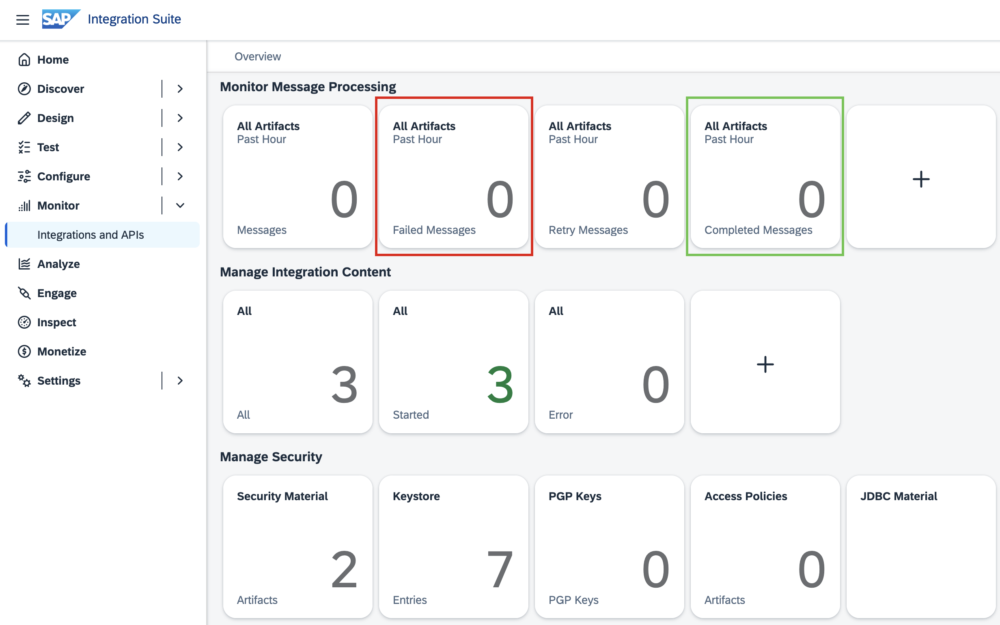
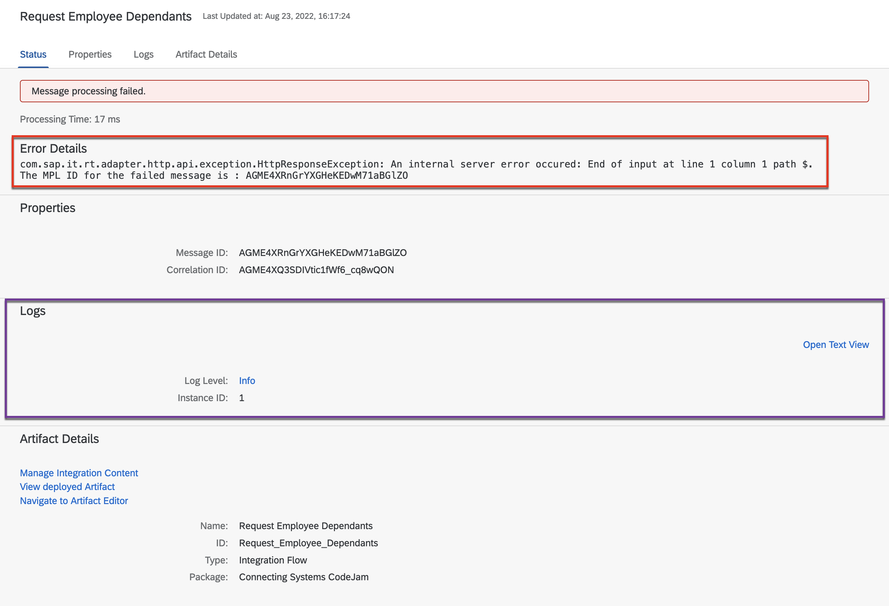

# Exercise 04 - Sending messages and monitoring our integration flow

At the end of this exercise, you'll have successfully sent messages to the integration flow deployed in the previous exercise and have a basic understanding of how we can monitor the integration flow.

> [!TIP]
> ℹWhile going through the exercise, you might encounter common problems not explicitly related to it. Your first stop should be the [troubleshooting.md](../../troubleshooting.md) page, which includes a list of these common problems and their potential solutions.

## Set up the Cloud Integration instance environment

As part of the prerequisites of this CodeJam, you should have imported the [Bruno collection and environments](../../prerequisites.md#bruno) included in the assets folder. We will use these to send messages to the integration flow we deployed.

👉 First, we will update the Current Value of the `host`, `client_id`, `client_secret`, and `token_url` variables included in the `Cloud Integration Instance` environment. Open the `Cloud Integration Instance` environment and update the variable's current value.

> [!NOTE]
> For your reference, values have been included in the Initial Value column. These are dummy values and are only meant to give you an idea of what a real value will look like. For `host` you can extract the value from the HTTP endpoint URL obtained in the previous exercises. The values for `client_id`, `client_secret`, and `token_url` can be retrieved from the service key created as part of the [Create SAP Cloud Integration runtime client credentials prerequisite](../../prerequisites.md#create-sap-cloud-integration-runtime-client-credentials). If you ran the `Enable Integration Suite` booster, this would have created the `default_it-rt_integration-flow` instance. There is a service key within it.

Once set up, we will need to authenticate against the SAP Cloud Integration authentication server to get an access token. This token will then be included in messages sent to the integration flow as a Bearer Token[^1].

👉 Open the `POST Token` request and click the send button.

> [!NOTE]
> ℹ️ You'll notice some Javascript code if you click on the Scripts tab part of the `POST Token` request. The code facilitates copying the value of the `access_token` field in the response payload to the `access_token` variable in our environment. The token expires after 4200 seconds, as stated in the `expires_in` field, meaning that during the CodeJam, we will need to refresh it a couple of times. Keep this in mind in case you get an [HTTP 401 error](../../troubleshooting.md#http-401-unauthorized-error-when-sending-requests-to-the-integration-flow) when sending messages to the integration flow.

Hooray! 🎉 🥳 We are now ready to send messages to the integration flow.

## Sending a message to our integration flow

👉 Firstly, select the `Cloud Integration Instance` environment in Bruno. Next, expand the `cloud-integration` folder in collections and open the `POST Request Employee Dependants request`. Finally, click the `Send button`.

> [!TIP]
> If everything goes as expected, you should see a response similar to the one in the screenshot below. If not, check out the [troubleshooting.md](../../troubleshooting.md) page, which includes a list of common problems and their potential solutions.

**What's going on in the request/response**

In the request body, we specified that we want the details available for employee with ID *1003764*. SAP Cloud Integration retrieves the value in the `employee_id` field, passes the value to the Business Partner mock service as part of the URL and returns the response from the Business Partner mock service.

The response contains Business Partner (employee) data, as expected, and address information in the `to_BusinessPartnerAddress` field. This is because we specified, in the [HTTP Receiver adapter](../03-build-first-integration-flow/README.md#requestreply), to *$expand* the `to_BusinessPartnerAddress` field as a query parameter.

> [!WARNING]
> The URL's hostname [^2] where our integration flow is deployed , e.g. https://my-instance.it-cpi018-rt.cfapps.eu10-003.hana.ondemand.com/http/my-endpoint is very similar to the URL's hostname through which we access the SAP Cloud Integration UI, e.g. https://my-instance.it-cpi018.cfapps.eu10-003.hana.ondemand.com/itspaces/. So make sure to use the correct hostname when invoking the integration flow; if not, an HTML page will be returned as a response when trying to send a message to the integration flow. A sample response is included under the request - *Wrong host - HTML page response*.  🙋‍♂️ Can you spot the difference in the URL hostnames❓❓❓

We've successfully sent a message to our integration flow. Now, let's have a look at the monitoring section to check the status of messages sent to our Cloud Integration tenant.

## Monitor > Integrations

SAP Cloud Integration provides us monitoring capabilities out-of-the-box. We can check the status of messages and integration content artefacts for our tenant via the `Monitor` section.

👉 Go to the `Monitor > Integrations and APIs` component of the SAP Integration Suite. A page like the one below will be on display.

<i>Monitor - Overview</i>

As we've deployed an integration flow and sent some requests to it, we will see some numbers indicating such artefacts/actions in this view. 
- `Monitor Message Processing`: You should at least have one successful message in the `All Integration Flows - Completed Messages` tile. If there were any errors when processing the message sent this will be under the `All Integration Flows - Failed Messages`.
- `Manage Integration Content`: There should be at least one integration content here - the integration flow we deployed. If we navigate to the tile here and select the deployed integration flow you will see the HTTP endpoint URL to which we sent our message and several options to manage the deployed artefact, e.g. Restart, Undeploy, and Configure the Log Level.
- `Manage Security`: We can manage the security artefacts deployed in our tenant. If you faced the [PKIX certificate issue](../../troubleshooting.md#http-500-internal-server-error---pkix-path-building-failed-unable-to-find-valid-certification-path-to-requested-target) described on the troubleshooting page, you will be familiar with the `Keystore` tile. In a future exercise, we will deploy additional authentication credentials to our tenant through the `Security Material` tile.

> [!NOTE]
> A detailed description of each section/tile in the Monitoring start page can be found here - [https://help.sap.com/docs/CLOUD_INTEGRATION/368c481cd6954bdfa5d0435479fd4eaf/05446d0616d44e1daf821c273b69fcc6.html?locale=en-US](https://help.sap.com/docs/CLOUD_INTEGRATION/368c481cd6954bdfa5d0435479fd4eaf/05446d0616d44e1daf821c273b69fcc6.html?locale=en-US)

👉 Go to the `All Integration Flows - Messages` tile to view all the messages sent in the past hour. You'll see a screen like the one below.

In a productive tenant, we will have thousands of messages here. By using the filter options (*highlighted in orange*) we can narrow down the messages that we are interested in. In the example below I filtered by Time, extending it to the past 24 hours, so that we can see how multiple messages will appear on the screen.

🧭 Navigate around a couple of `Completed` and `Failed` messages in your tenant. Then, click around and observe the available information; this will vary depending on the message status. Once you've done some self-discovery, come back here to continue with the exercise.

<i>Message monitoring - Overview and successful message</i>

👉 Select from the list, a message in `Completed` status

The following information is presented to us when selecting a message:
- *Status*: `Completed`, `Processing`, `Failed`, and `Cancelled`, are among the statuses that we can see for a message. In our case, we only have two statuses: `Completed` and `Failed`. For a complete list check out the [documentation](https://help.sap.com/docs/CLOUD_INTEGRATION/368c481cd6954bdfa5d0435479fd4eaf/733a57b10f504ac9b2b5aa7fda664dc5.html?locale=en-US).
- *Basic properties*: These are properties of this particular message (exchange). The Message ID and Correlation ID uniquely identify the message. The value might seem meaningless at this stage but they are quite useful when searching for a needle in a haystack, e.g. these values can be easily shared with colleagues when troubleshooting a problematic message.
- *Logs*: In the logs, we can find structured information about a message. Some basic information will be available if a message was successful, as in the screenshot above, and if you select a failed message, there will be more information available, e.g. in the screenshot below, there is a hyperlink in the `Log Level` field and the Open Text View more details on where the error occurred.  
- *Artifact details*: From here we can jump directly to the deployed integration content or to the modelling area to edit the integration flow.

> [!TIP]
> The cause and solution to the error in the screenshot below is included in the [troubleshooting](../../troubleshooting.md#an-internal-server-error-occurred-end-of-input-at-line-1-column-1-path) page. You can replicate this error by sending a message to the integration flow with no request body.

<i>Message monitoring - Failed message</i>

👉 If available, select a message in `Failed` status and click the `Info` link in the `Log Level` field.

The log level will tell us exactly where the integration flow is failing and details of the error. If additional information is required to "debug" our integration flow, we can update the log level of our deployed integration flow. This is explained in the [tracing section](../../troubleshooting.md#tracing-an-integration-flow) of the troubleshooting page.

<i>Message monitoring - Failed message log content</i>

## Summary

Congratulations, you've sent messages to the deployed integration flow. Also, you now have a basic understanding of some of the Monitoring capabilities of SAP Cloud Integration.

## Further reading

* [Managing Integration Content](https://help.sap.com/docs/CLOUD_INTEGRATION/368c481cd6954bdfa5d0435479fd4eaf/09a7223883a74dcb9f4b1b96a7c7f011.html?locale=en-US)
* [Guidelines and Best Practices for Message Monitoring](https://help.sap.com/docs/CLOUD_INTEGRATION/368c481cd6954bdfa5d0435479fd4eaf/6f598b4d4e0e44c3bd8445b5d58b832c.html?locale=en-US)

---

If you finish earlier than your fellow participants, you might like to ponder these questions. There isn't always a single correct answer and there are no prizes - they're just to give you something else to think about.

1. Compare the response headers when calling the service directly (`s4-bp-mock-server > GET Single Business Partner`) vs via Cloud Integration (`cloud-integration > POST Request Employee Dependants`). Do you see any headers returned that might be specific to SAP Cloud Integration? Can you think of a place where you can use one of those headers?
2. Go ahead and on purpose make the integration flow fail. You can do this by sending a malformed payload to the integration flow. What's the error that you get? Try not sending a valid access token, what error do you get? What happens if no authentication token is sent? The idea here is to get familiar with different error situation that you might face.

## Next

Continue to 👉 [Exercise 05 - Log request in Slack](../05-log-requests-in-slack/README.md#exercise-05---log-request-in-slack)

[^1]: Bearer Tokens: https://www.oauth.com/oauth2-servers/differences-between-oauth-1-2/bearer-tokens/ 
[^2]: URL hostnames: https://developer.mozilla.org/en-US/docs/Web/API/URL/hostname
