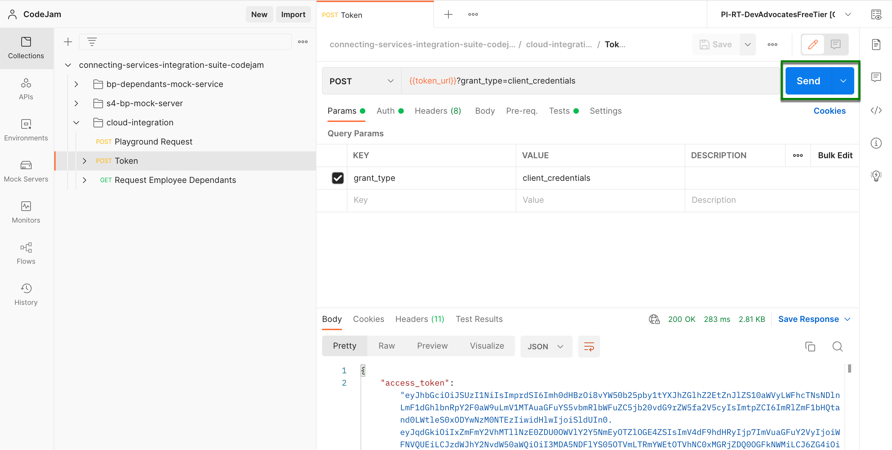
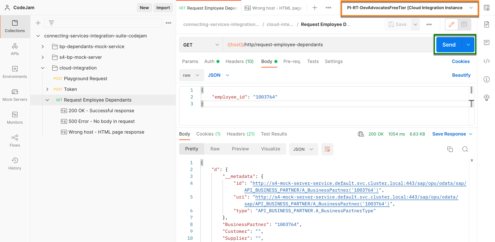

# Exercise 04 - Sending requests and monitoring our integration flow

At the end of this exercise, you'll have successfully sent requests to the integration flow deployed in the previous exercise and have a basic understanding of how we can monitor the integration flow.

> ℹ️ While going through the exercise, you might encounter common problems not explicitly related to it. Your first stop should be the [troubleshooting.md](troubleshooting.md) page, which includes a list of these common problems and their potential solutions.

## Set up the Cloud Integration instance environment

As part of the prerequisites of this CodeJam, you should have imported the [Postman collection and environments](../../prerequisites.md#postman) included in the assets folder. We will use these to send requests to the integration flow we deployed.

👉 First, we will update the Current Value of the `host`, `client_id`, `client_secret`, and `token_url` variables included in the Cloud Integration Instance environment. Open the Cloud Integration Instance environment and update the variable's Current Value. 

> For your reference, values have been included in the Initial Value column. These are dummy values and are only meant to give you an idea of what a real value will look like. For `host` you can extract the value from the HTTP endpoint URL obtained in the previous exercises. The values for `client_id`, `client_secret`, and `token_url` can be retrieved from the service key created as part of the [Create SAP Cloud Integration runtime client credentials prerequisite](../../prerequisites.md#create-sap-cloud-integration-runtime-client-credentials).

Once set up, we will need to authenticate against the SAP Cloud Integration authentication server to get an access token. This token will then be included in requests sent to the integration flow as a Bearer Token[^1].

👉 Open the `POST Token` request and click the send button.

> ℹ️ You'll notice some Javascript code if you click on the Tests tab part of the `POST Token` request. The code facilitates copying the value of the `access_token` field in the response payload to the `access_token` variable in our environment. The token expires after 4200 seconds, as stated in the `expires_in` field, meaning that during the CodeJam, we will need to refresh it a couple of times. Keep this in mind in case you get an [HTTP 401 error](../../troubleshooting.md#http-401-unauthorized-error-when-sending-requests-to-the-integration-flow) when sending requests to the integration flow.

Hooray! 🎉 🥳 We are now ready to send requests to the integration flow.

## Sending a request to our integration flow

👉 Firstly, select the Cloud Integration Instance environment. Next, expand the `cloud-integration` folder in collections and open the `GET Request Employee Dependants request`. Finally, click the `Send button`.

> ⚠️ The URL's hostname [^2] where our integration flow is deployed , e.g. https://my-instance.it-cpi018-rt.cfapps.eu10-003.hana.ondemand.com/http/my-endpoint is very similar to the URL's hostname through which we access the SAP Cloud Integration UI, e.g. https://my-instance.it-cpi018.cfapps.eu10-003.hana.ondemand.com/itspaces/. So make sure to use the correct hostname when invoking the integration flow; if not, an HTML page will be returned as a response when trying to send a request to the integration flow. A sample response is included under the request - *Wrong host - HTML page response*.  🙋‍♂️ Can you spot the difference in the URL hostnames❓❓❓

## Monitoring

It is possible  that you've 

//TODO: Justo donec enim diam vulputate ut pharetra. Pulvinar proin gravida hendrerit lectus a. Leo a diam sollicitudin tempor id eu. Enim eu turpis egestas pretium aenean pharetra magna. Et molestie ac feugiat sed lectus vestibulum mattis. A iaculis at erat pellentesque. 

## Simulation

## Tracing

## Summary

Now that you are familiar with the basic functionality of SAP API Business Hub and the Business Partner API, we are ready to start interacting with the services from which our integration will be extracting data.

## Further reading

* [Link 1](https://blogs.sap.com/)
* [Link 2](https://blogs.sap.com/)

---

If you finish earlier than your fellow participants, you might like to ponder these questions. There isn't always a single correct answer and there are no prizes - they're just to give you something else to think about.

1. First question.
2. Second question.

[^1]: Bearer Tokens: https://www.oauth.com/oauth2-servers/differences-between-oauth-1-2/bearer-tokens/ 
[^2]: URL hostnames: https://developer.mozilla.org/en-US/docs/Web/API/URL/hostname