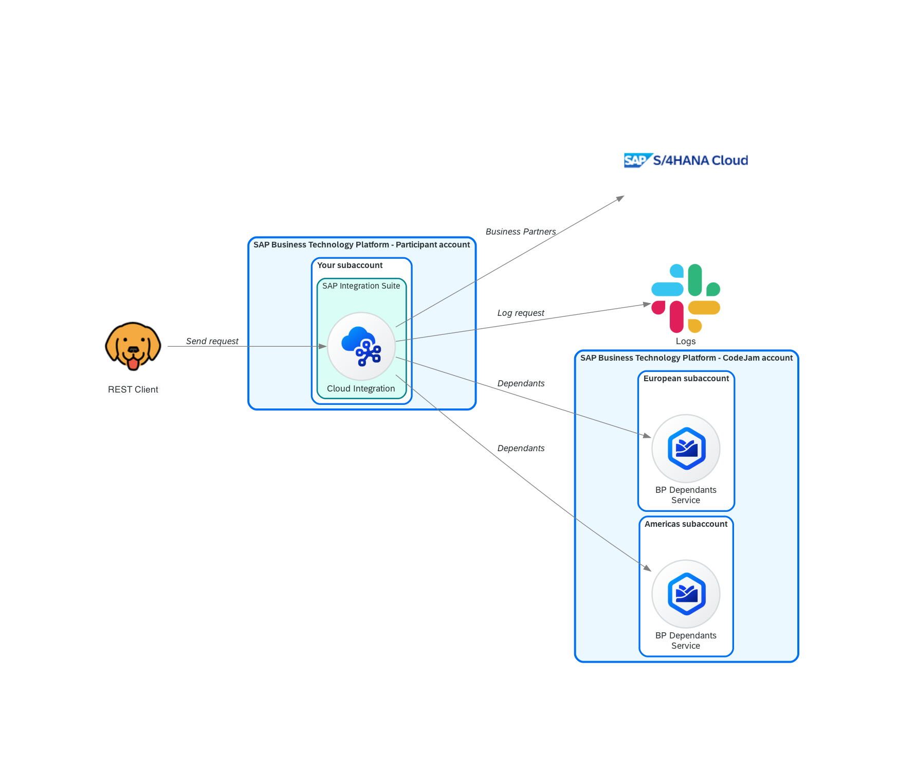

# Exercise 05 - Log request in Slack

In our [integration scenario](../../README.md#integration-scenario), it is mentioned that we need to log the requests received by the integration flow. These requests will be logged in as messages in a Slack workspace. We will achieve this by using a separate integration flow which will be responsible of posting the messages in a Slack workspace.



At the end of this exercise, you'll have successfully configured an integration flow that will send messages to Slack. This integration flow logs every request received. You would have also learned about decoupling integration flows and asynchronous processing.

## Slack

As part of the [prerequisites](../../prerequisites.md#slack) of this CodeJam, you should have created a Slack account, if you didn't have one, and you've joined the Slack workspace that we've created as part of this CodeJam.

You will be using Slack to log the requests received by our integration flow. The messages will be posted in a channel in the Slack workspace that has been created for this CodeJam. You will be provided with two Slack URLs: one to join the Slack workspace (*Slack workspace invite URL*) and another to post messages in a channel (*Slack webhook URL*). The *Slack webhook URL* will be configure in the integration flow to post messages in the channel.

To communicate with Slack, a Slack workspace was previously created, as well as an app (Employee Request). The app allows incoming communications via webhooks. If you are interested in learning how you can reproduce creating an app to allow this functionality in another Slack workspace, check out the links below:

- Slack API:
  - [Sending messages using incoming webhooks](https://api.slack.com/messaging/webhooks)
  - [Messages](https://api.slack.com/surfaces/messages)
- Block Kit Builder: [Preview](https://app.slack.com/block-kit-builder/T08RNAT1065#%7B%22blocks%22:%5B%7B%22type%22:%22divider%22%7D,%7B%22type%22:%22section%22,%22text%22:%7B%22type%22:%22mrkdwn%22,%22text%22:%22Request%20received%20for%20:factory_worker::%20*_1003766_*%22%7D%7D,%7B%22type%22:%22context%22,%22elements%22:%5B%7B%22type%22:%22mrkdwn%22,%22text%22:%22Sender:%20:technologist:%20*ajmaradiaga*%5CnMPLID:%20134831238431321-6516845-513213-320320%22%7D%5D%7D,%7B%22type%22:%22divider%22%7D%5D%7D)

## SAP Cloud Integration

Before we can jump to add the necessary flow steps in our integration flow, we will first deploy the integration flow, that was built for us, which is responsible for sending the message to Slack.

👉 Go to the integration package and import the [Send BP Dependants Request Log to Slack integration flow](../../assets/cloud-integration/Send%20BP%20Dependants%20Request%20Log%20to%20Slack.zip) by clicking `Add` > `Integration Flow` and upload the integration flow. Once uploaded, configure it by setting the external parameters and deploy it.


To configure the integration flow, select the three dots next to the integration flow name and select `Configure`. This will open the configuration dialog for the integration flow.


> [!WARNING]
> When configuring the integration flow, we need to set two values:
>
> 1. In the **Receiver** tab, set the address with the *Slack webhook URL* provided by the event instructor. This URL is where the integration flow will post the message.
>
>     
>
> 2. In the **More** tab, set your SAP Community Display Name in the `SAP_Community_Display_Name`field.
>
>     

### Send BP Dependants Request Log to Slack integration flow

Take some time to explore the integration flow that we just imported. It is a simple but powerful integration flow.


Which sender adapter has been configured? Why are we using this adapter? How often will this integration flow run? What happens after the message is sent to Slack? How can it be improved?

### Decouple request logging from our integration flow

As mentioned in the [integration scenario](../../README.md#integration-scenario), we need to log the requests that our integration service receives. That said, this logging is irrelevant to the message sender. Logging the request should in no way affect the response of the integration service. Although we want to do the logging, this can be handled by a separate process and doesn't need to affect the processing of the message received. For example, if logging the request fails, it should not impede our integration flow from serving requests.

To achieve this, we can decouple (separate) request logging from the integration service. The `Send BP Dependants Request Log to Slack` integration flow is responsible for communicating with Slack and creating a record in a table. We can "communicate" with it in an asynchronous manner, using persistence, e.g. [using the Data Store](https://help.sap.com/docs/CLOUD_INTEGRATION/368c481cd6954bdfa5d0435479fd4eaf/5467c77da3064f65a5b3a9351fed7d84.html?locale=en-US), and creating data entries in a Data Store. The `Send BP Dependants Request Log to Slack` integration flow will then, on a scheduled basis, process any entries it finds in the Data Store and proceeds to publish a message to a Slack channel.

> [!NOTE]
> What is a **Data Store**?
>
> We are able to temporarily store data in our SAP Cloud Integration tenant database. We don't have physical access to the database itself but we can store data in it through the "Data Store" interface. There are a number of integration flow steps that allow us to perform [operations in the the Data Store](https://help.sap.com/docs/CLOUD_INTEGRATION/4b57f249012e4e1f8c15cbd5dbb4fff3/79f63a4bf5a44b5996aa34c51e2f187f.html?locale=en-US), e.g. Data Store Write, Data Store Read, Data Store Delete. The Data Store can also be used for asynchronous processing as mentioned in the [help.sap.com](https://help.sap.com/docs/CLOUD_INTEGRATION/368c481cd6954bdfa5d0435479fd4eaf/5467c77da3064f65a5b3a9351fed7d84.html?locale=en-US) website.

Now that we have a basic understanding of why and how we can decouple request logging, let's go ahead and modify our integration flow to handle this.

<!-- markdownlint-disable no-inline-html -->
<details>
<summary>If you've completed the optional exercises 4.1 and 4.2</summary>
<br>


<p align = "center">
<i>Add Content Modifier and DataStore</i>
</p>

</details>

<details>
<summary>If you've NOT completed the optional exercises</summary>
<br>


<p align = "center">
<i>Add Content Modifier and DataStore</i>
</p>

</details>
<!-- markdownlint-enable no-inline-html -->

### Design > Integrations

👉 Let's start by making a copy of the integration flow we created in the previous exercises. Click the Actions button and select Copy and add the `- Exercise 05` suffix to the name and open it.

> [!TIP]
> You might want to add a suffix to the address in the `HTTP Sender` adapter, e.g. `-ex5`, so that the address `/request-employee-dependants-ex5`  doesn't clash with the one configured for our previous integration flows.

Given that the imported integration flow handles the communication with Slack, there is very little that we need to do in our main integration flow to "log requests".

👉 After the `Get Employee Country`/`GET BusinessPartner`, depending if you've completed the optional exercises or not, add a new content modifier, that we will use to set the payload that we want the `Send BP Dependants Request Log to Slack` integration flow to process asynchronously. The payload will then be stored in the `BP-Dependants-Request-Log` data store by using the `Data Store Operation Write` flow step.

- `Prepare request log payload` content modifier: Go to the Message Body tab and set the *Type* to `Expression` and *Body* below.
  
    ```json
    {
        "employee_country": "${property.employee_country}",
        "request_timestamp": "${date:now:yyyy-MM-dd HH:mm:ss}",
        "employee_id": "${property.employee_id}"
    }
    ```

    > [!NOTE]
    > 🐪 Here, we are using the [Simple language](https://camel.apache.org/components/3.18.x/languages/simple-language.html) in our integration flow again. In this instance we are using Simple expressions to define/modify the payload in the exchange. In the example above, we access the exchange properties and [create a date and set its format](https://camel.apache.org/components/3.18.x/languages/simple-language.html#_examples).

- `Write BP-Dependants-Request-Log` data store operation: Set the values below.
  
  | Field                    | Value                     |
  | ------------------------ | ------------------------- |
  | *Data Store Name*        | BP-Dependants-Request-Log |
  | *Visibility*             | Global                    |
  | *Retention Threshold*    | 2                         |
  | *Expiration Period*      | 30                        |
  | *Encrypt Stored Message* | Checked                   |

  

That was simple, wasn't it?  We are now ready to deploy our integration flow.

### Deploy

👉 Save and deploy the integration flow.

> If the deployment process fails with an error similar to this: [Failed to create route - HTTP address already registered](../../troubleshooting.md#failed-to-create-route---http-address-already-registered-for-another-iflow), add a suffix to the address in the `HTTP Sender` adapter, e.g. `-ex5`, so that the address `/request-employee-dependants-ex5`  doesn't clash with the one configured for our previous integration flow, and try deploying it again.

Our integration flow is now ready. Let's send some messages to it using Bruno.

👉 Open the `Request Employee Dependants - Exercise 05` request under the cloud-integration folder in the Bruno collection and test the following scenarios:

- Send a request and check the Data Store (`Monitor > Integrations > Manage Stores > Data Stores`). You will see that there is a new entry in the Data Store.


After some time the entry will be processed by the integration flow we imported and deployed - `Send BP Dependants Request Log to Slack integration flow`. The integration flow will delete the data store entry once processed.


In Slack, you will see a new message in the channel where the integration flow is configured to post messages. The message will contain the employee ID and country of the request received.


## Summary

Very few changes in our main integration flow but we got to learn about a few components in this exercise. We started by creating OAuth credentials in Google Cloud Platform, followed by setting up a connector instance in Open Connectors and testing basic communication from the Open Connectors UI. We then moved to SAP Cloud Integration where we imported and deployed a new integration flow, set up a new credential type - Open Connectors, and learnt about Data Stores and how we can use them to decouple our integration flows.

## Further reading

- [Decouple Sender and Flows Using Data Store](https://help.sap.com/docs/CLOUD_INTEGRATION/368c481cd6954bdfa5d0435479fd4eaf/5467c77da3064f65a5b3a9351fed7d84.html?locale=en-US)
- [Modeling Basics - Decouple Flows Using Persistence](https://hub.sap.com/integrationflow/ModelingBasics_DecoupleFlowsUsingPersistence)

---

If you finish earlier than your fellow participants, you might like to ponder these questions. There isn't always a single correct answer and there are no prizes - they're just to give you something else to think about.

1. In this exercise, we used the Data Store for decoupling. What other persistence methods could have been used for decoupling?
2. What will happen to our main integration flow if the `Send BP Dependants Request Log to Slack` integration flow fails? How will it be affected? What will happen to the requests received by the integration flow?
   > 💡 To simulate this, you can undeploy the `Send BP Dependants Request Log to Slack` integration flow, send a few messages and check out what happens.
3. Why do you think we didn't build the [Slack integration flow](../../assets/cloud-integration/Send%20BP%20Dependants%20Request%20Log%20to%20Slack.zip) as part of this exercise? Why import an existing integration flow? How is this approach similar to using libraries/utilities available in programming languages?

## Next

Continue to 👉 [Exercise 06 - Expose integration flow via API Management](../06-expose-integration-flow-api-management/README.md#exercise-06---expose-integration-flow-via-api-management)
