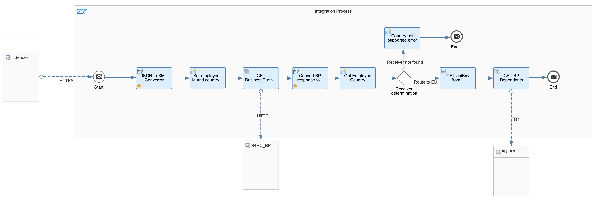
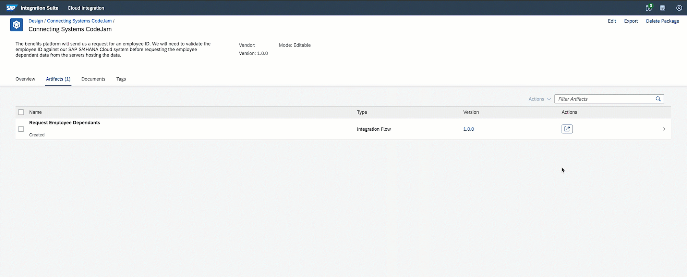
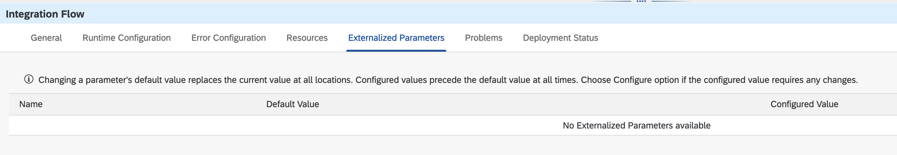
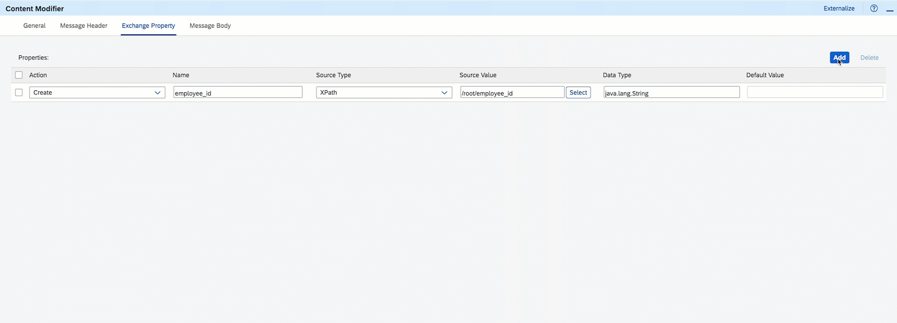
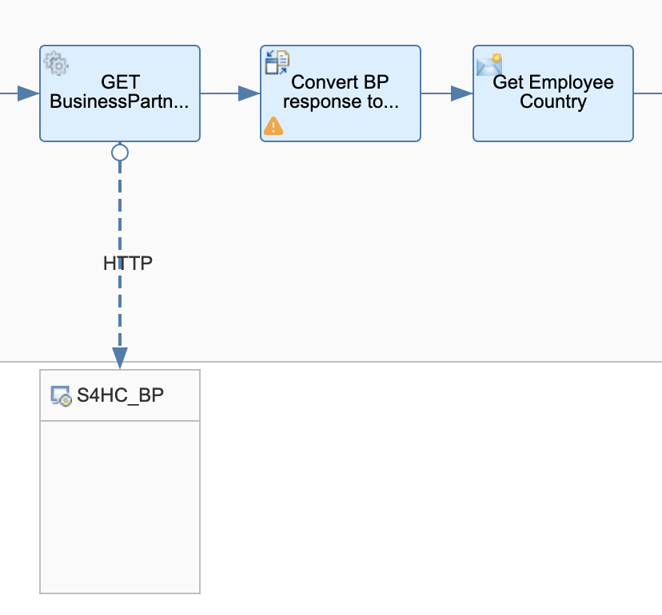
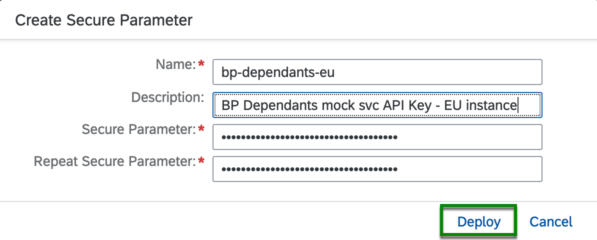

# Exercise 05 - Retrieve Business Partner dependant's information

At the end of this exercise, you'll have successfully retrieved Business Partner dependant data hosted in the European instance of the BP Dependants service.


<p align = "center">
<i>Exercise 05 - Data flow</i>
</p>

Now that we are familiar with the basics of SAP Cloud Integration, we will start moving a bit faster when adding components and deploying the integration flow. When we finish the exercise, the integration flow will include a few additional Content Modifiers and we will be familiar with a few new concepts/components, externalised parameters, simulation, secure store, scripting, and implemented a new pattern - Router (Content Based Routing)[^1].


<p align = "center">
<i>Integration Flow - End of Exercise 05</i>
</p>

## Design

👉 Let's start by making a copy of the integration flow we created in Exercise 03, add the `- Exercise 05` suffix to the name and open it.



We create a copy of the integration flow to keep the past version as a reference. This will help you revisit the integration flow when reviewing the content or trying to remember what you've developed as part of the CodeJam.

To keep things simple we will only process data for European countries in this exercise. The integration flow needs to know the data of which countries can be served by the EU server. In a real-world scenario, we would not want to have this as a fixed (hard-coded) value in our integration flow. It needs to be easy to tell our integration flow that the data for new countries can be retrieved from a particular server. Ideally, this would be a parameter that we can configure in our integration flow. Enter Externalised Parameters.

### Externalised Parameters

As stated in the [documentation](https://help.sap.com/docs/CLOUD_INTEGRATION/368c481cd6954bdfa5d0435479fd4eaf/45b2a0772db94bd9b0e57bc82d8d3797.html?locale=en-US), *the Externalize feature allows us to declare a parameter as a variable and reuse it across multiple components in our integration flow*. In our case, we will create an external parameter called `european_countries`, that will contain the details of the countries that we can retrieve from the European instance of the Business Partner Dependants service. So far, we have not defined any external parameters. You can see the external parameters of an integration flow by going to the `Externalized Parameters tab` in the Integration Flow configuration section.


<p align = "center">
<i>Integration Flow configuration - Externalized Parameters tab</i>
</p>

👉 Extend the `Set employee_id property` content modifier to create a new property called `european_countries` which will be assigned the value configured for the external parameter with the same name and set `DE,FR,ES,IT,PT` as the default value. Optional: Rename the content modifier to reflect the additional action, e.g. Set employee_id and country properties.

> Click the **Add button** in the Exchange Property tab, enter `european_countries` as the name and `{{european_countries}}` as source value. The double curly braces indicates to SAP Cloud Integration that this is an external parameter. Click the tab or enter key on your keyboard or change the focus field so that the UI can detect the external parameter. As the external parameter doesn't exist, we need to define a value for it.


<p align = "center">
<i>Create european_countries property and external parameter</i>
</p>

### Process the SAP S/4HANA Cloud mock service response

In the previous exercise, we returned the response of the mock service as is to test that our initial communication was working. Let's do some minor processing of the response. 

The response contains the Business Partner details. In it, we can find the `to_BusinessPartnerAddress` field. This field contains an array of addresses associated with the employee. In our case, we can know where an employee is located based on the first address' `to_BusinessPartnerAddress.results.Country` field. 

```bash
$ echo "Business Partner address: $(jq '.d.to_BusinessPartnerAddress.results[0].Country' exercises/03-build-first-integration-flow/assets/sample-response.json)"
Business Partner address: "DE"
```

We will process the response by first converting the JSON response to XML. Once our payload is in XML format, we can retrieve the Business Partner Address Country using XPath and assign it to a variable. This variable can then be used to define the conditions required to process the request further.


<p align = "center">
<i>Process mock service reponse - JSON to XML Converter and Content Modifier</i>
</p>

👉 First, add another `JSON to XML converter` after the Request Reply step. Then, add a `Content Modifier` and create a new property called `employee_country`. Given that our payload is in XML format, we can use XPath to retrieve the . Set `/d/to_BusinessPartnerAddress/results/Country` as the XPath.

Our response payload contains a field that we can use as "root node" - `d`. We don't need to add a root node so we can unselect the `Add XML Root Element checkbox` when configuring the converter.


<p align = "center">
<i>Convert BP response to XML configuration</i>
</p>

🔎 Check that your Get Employee Country configuration matches the screenshot below.


<p align = "center">
<i>Get Employee Country content modifier configuration</i>
</p>

Once we set up the steps above, we are ready to route our message using the data available.

### Route the message

We need to direct the message to the correct service instance based on the employee's country. We've stored the `employee_country` in the previous section and we will need to define the conditions based on its value. To achieve this, we can use the [Router component](https://help.sap.com/docs/CLOUD_INTEGRATION/368c481cd6954bdfa5d0435479fd4eaf/d7fddbd52e3944d3a6d4e5b228c7e63b.html?locale=en-US) and set different conditions depending on the route.

To keep things simple we will only send requests to the european instance of the Business Partner Dependants mock service. Therefore, we will only define two routes for our router:
- Default route (*Receiver not found*): This will be the route taken when no receiver is found. A receiver will not be found when the employee's country is not a European country, e.g. US. Here we will handle an error scenario. 
- European route (*Route to EU*): Proceed to call the european instance.


<p align = "center">
<i>Add router and content modifier in default route</i>
</p>

👉 First, add a `Router` step right after the `Get Employee Country` content modifier we added in the previous section. Then, add the two routes below. *Note: To define the condition/settings of a route, you need to select the connection (→) between the router and the target step.*
1.  *Route to EU*: Connect it to the existing `End Message event` and define as its condition the following:
    - Expression Type: `Non-XML`
    - Condition: `${property.employee_country} in ${property.european_countries}`. 
    > 🐪 This is a Simple language expression[^2]. We check that a string exists within another string.
2. *Receiver not found*: Connect the Router to a new `End Message event` and within it include a `Content Modifier` step. In the Content Modifier, we create a new message header - `CamelHttpResponseCode` and set the constant 500 as its value. Also, set the Message Body to the payload below.
   ```json
    {
        "error": "Employee's country not supported"
    }
   ```
   > 🐪 The CamelHttpResponseCode message header is documented in the [HTTP Camel Component](https://camel.apache.org/components/3.18.x/http-component.html). We need to set a value for it if we want our integration flow to return a different HTTP code than the default 200 HTTP Code.

Once you've set up the routes, go to the Router's Processing tab and set the Receiver not found as the default route.


<p align = "center">
<i>Router - Processing routes</i>
</p>

#### (Optional) Test the routing condition

We've done quite a few things already. We can run a test in our integration flow to ensure that everything is set up correctly. SAP Cloud Integration allow us to test elements (simulate) in our integration flow without the need of deploying the integration flow and sending a request from an external client. Using [Simulation](https://help.sap.com/docs/CLOUD_INTEGRATION/368c481cd6954bdfa5d0435479fd4eaf/45a71f8ffd74436aaf02a3536f3c6992.html?locale=en-US) we can speed up our development process and quickly validate that our conditions are working as expected. Let's simulate that we've received the response from the SAP S/4HANA Cloud system and test our routing condition. 


<p align = "center">
<i>Set up simulation in integration flow</i>
</p>

Below, are the steps that you need to carry out to run a simulation:
- Select a connection (arrow)
- Add a simulation start point
- Add a simulation end point
- Define the headers, properties, body of our message
  - Property: `european_countries` = `DE,FR,ES,IT,PT`
  - Body: Import [`sample_response.json` file](../03-build-first-integration-flow/assets/sample-response.json)
- Run the simulation

### Call the European instance of the Business Partner Dependants mock service

Now that we've defined our routing conditions, we can simply call the Business Partner Dependants mock service and return the response to the sender.

#### Deploy API Key to SAP Cloud Integration

We need to include an API key in the request we send to the EU instance of the Business Partner Dependants mock service. We can use the secure store in SAP Cloud Integration to securely store the API key.

👉 First, copy the API Key that's included in the `BP-Dependants-EU` Postman environment. Then, go to `Monitor > Security Material`, create a Secure Parameter and deploy it


<p align = "center">
<i>Deploy API key as secure parameter</i>
</p>

#### Add Groovy script and Request Reply

To include the API Key in our request, we will first retrieve the secure parameter using a Groovy script and in the same script, we will add it as a header in the exchange. The script that we will use is included in the [exercises/05-retrieve-bp-dependants/assets/scripts](assets/scripts/retrieve-api-key.groovy) folder. 


<p align = "center">
<i>Add Groovy script and Request Reply</i>
</p>

👉 In the `Route to EU` route, add a `Groovy Script` step, followed by a `Request Reply` and a new `Receiver participant`.
- *Groovy script*: Import the script included in the exercise assets folder by uploading it from the file system after clicking the Select button and set `processData` as the script function in the processing tab. The script reads an exchange property to know which secure parameter it needs to retrieve from the secure store. Once retrieved, it sets the value as a header in the exchange.
  ```groovy
  import com.sap.gateway.ip.core.customdev.util.Message;
  import com.sap.it.api.ITApiFactory;
  import com.sap.it.api.securestore.SecureStoreService
  import com.sap.it.api.securestore.exception.SecureStoreException

  // Source: Read Security-Related Artifacts
  // https://help.sap.com/docs/CLOUD_INTEGRATION/368c481cd6954bdfa5d0435479fd4eaf/8dd981e4f1f44d22bee22c174e5c52d0.html?locale=en-US

  def Message processData(Message message) {
      def apiKeyAlias = message.getProperty("eu-bp-dependants-api-key-alias")
      def secureStorageService =  ITApiFactory.getService(SecureStoreService.class, null)
      try{
          def secureParameter = secureStorageService.getUserCredential(apiKeyAlias)
          def apiKey = secureParameter.getPassword().toString()
          message.setHeader("apiKey", apiKey)
      } catch(Exception e){
          throw new SecureStoreException("Secure Parameter not available")
      }
      return message;
  }
  ```
- *Request Reply → Receiver participant*: We will use the HTTP adapter to communicate with the service. Set the below configuration details in the HTTP adapter.

  | Field             | Value                                                                                                                  |
  | ----------------- | ---------------------------------------------------------------------------------------------------------------------- |
  | *Address*         | https://businesspartner-dependants-europe-svc.c-1e90315.kyma.ondemand.com/employees/${property.employee_id}/dependants |
  | *Proxy Type*      | Internet                                                                                                               |
  | *Method*          | GET                                                                                                                    |
  | *Authenticaton*   | None                                                                                                                   |
  | *Request Headers* | apiKey                                                                                                                 |

> If you are running the services used in this CodeJam locally 🐳 , checkout how you will need to configure the Receiver HTTP Adapter in the [Configure HTTP adapter in Cloud Integration section](../../exercises/optional-01-running-locally/README.md#configure-http-adapter-in-cloud-integration) of the optional exercise 01.

We are almost done, we just need to define the property that the script is reading and we are ready to deploy the integration flow.

👉 Add a new exchange property in the `Set employee id and country` content modifier with the same name specified in the Groovy script `eu-bp-dependants-api-key-alias`. Set as the value an external parameter with the same name - `{{eu-bp-dependants-api-key-alias}}` -  and set as the default value the name of the secure parameter that we deployed before, e.g. `bp-dependants-eu`. In the end, the Content Modifier properties should look like the screenshot below.


<p align = "center">
<i>Set employee id and country Content Modifier - Exchange properties</i>
</p>

## Deploy

👉 Save and deploy the integration flow.

> If the deployment process fails with an error similar to this: [Failed to create route - HTTP address already registered](../../troubleshooting.md#failed-to-create-route---http-address-already-registered-for-another-iflow), add a suffix to the address in the `HTTP Sender` adapter, e.g. `-ex5`, so that the address `/request-employee-dependants-ex5`  doesn't clash with the one configured for our previous integration flow, and try deploying it again.

Our integration flow is now ready. Let's send some messages to it using Postman. 

👉 Open the `Request Employee Dependants - Exercise 05` request under the cloud-integration folder in the Postman collection and test the following scenarios:
- Send a request for `employee_id` = 1003764. Where is this employee from and what's the response you get?
- Now, `employee_id` = 1003765. Where is this employee from and what's the response you get?
- Finally, an employee that doesn't exist, e.g. `8765432ABC`.

## Summary

We've added some cool functionality to the integration flow. Some parts of it have been parametrised, it does some data validations, it communicates with more than one service and we even modify its behaviour by using the exchange headers.

## Further reading

* [Externalise parameters of an integration flow](https://help.sap.com/docs/CLOUD_INTEGRATION/368c481cd6954bdfa5d0435479fd4eaf/45b2a0772db94bd9b0e57bc82d8d3797.html?locale=en-US)
* [Message routers in SAP Cloud Integration](https://help.sap.com/docs/CLOUD_INTEGRATION/368c481cd6954bdfa5d0435479fd4eaf/ad0a19ab854c4e6e929013a9be66d809.html?locale=en-US)
* [Integration Flow Design Guidelines - Enterprise Integration Patterns](https://api.sap.com/package/DesignGuidelinesPatterns/integrationflow)

---

If you finish earlier than your fellow participants, you might like to ponder these questions. There isn't always a single correct answer and there are no prizes - they're just to give you something else to think about.

1. How else could we have set the API key required by BP Dependants service? Is it secure? 
2. How can we prevent hard coding the service hostname in the HTTP adapter? 

## Next

Continue to 👉 [Exercise 06 - Add the Americas instance of the Business Partner Dependants service](../06-add-americas-bp-dependants/README.md#exercise-06---add-the-americas-instance-of-the-business-partner-dependants-service)

[^1]: Pattern Content Based Routing: https://api.sap.com/integrationflow/Pattern_ContentBasedRouting_IgnoreIfNoReceiver
[^2]: Simple: https://camel.apache.org/components/3.18.x/languages/simple-language.html 
