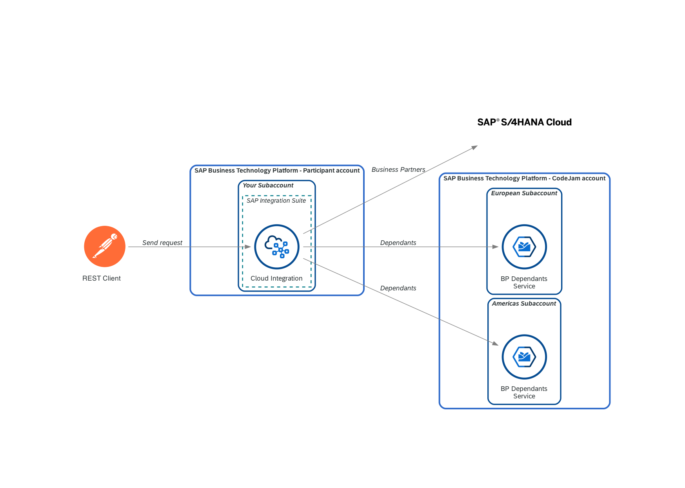
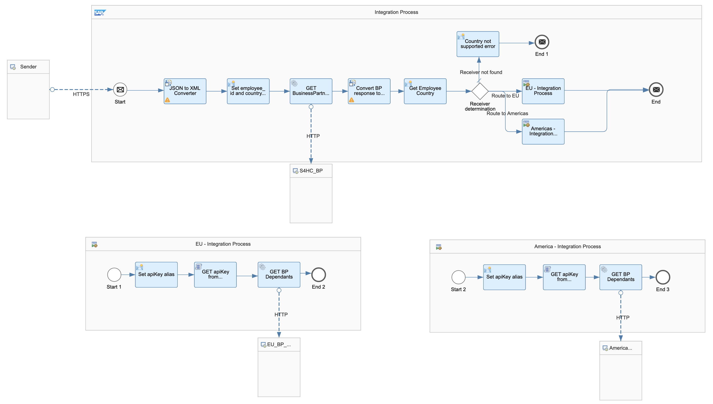
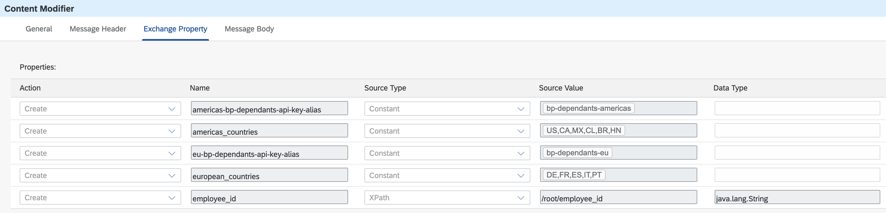
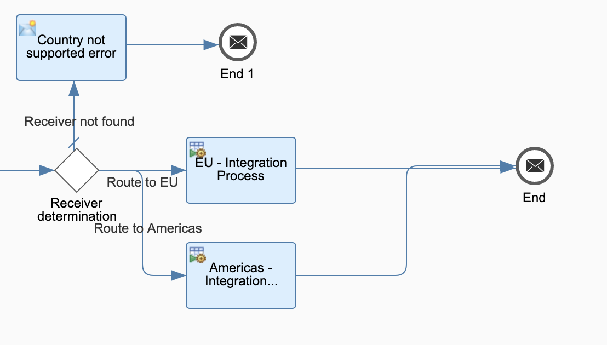
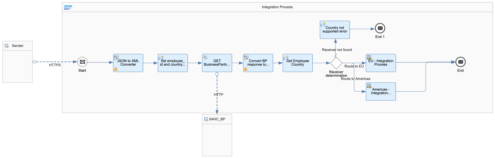
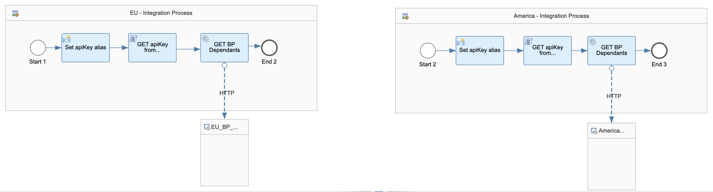

# Exercise 06 - Add the America's instance of the Business Partner Dependants service

In the previous exercise we set up the communication between our integration flow and the European instance of the Business Partner dependants service. In this exercise, we will extend our integration flow to also send requests to the Americas instance. We will repeat various of the steps carried out in exercise 05, helping us reinforce what we've learned, introduce a new component - local integration processes,  and add some additional conditions to handle the new instance.

<i>Exercise 06 - Data flow</i>

Now that we are familiar with the basics of SAP Cloud Integration.....

<i>Integration Flow - End of Exercise 06</i>

At the end of this exercise, you'll have successfully added America's instance of Business Partner service to the integration flow.

## Design

👉 Let's start by making a copy of the integration flow we created in Exercise 05, add the `- Exercise 06` suffix to the name and open it.

> As stated in the previous exercise, you might want to add a suffix to the address in the `HTTP Sender` adapter, e.g. `-ex6`, so that the address `/request-employee-dependants-ex6`  doesn't clash with the one configured for our previous integration flows.

In SAP Cloud Integration it is possible to define integration processes (smaller) within an integration process. This is called a local integration process. The idea behind fragmenting our integration process into smaller processes is to make our integration process more readable and easier to maintain.

### Move EU components to a Local Integration Process

There is no need to redo our call to the EU instance, we can just move the components to a local integration process and rewire the components. The below instructions will show you step by step on how you can achieve this.

👉 Add the `Process Call` step in the main integration process and create a new `local integration process`.

<i>Add process call and local integration process</i>

👉 Remove the existing connections of the Groovy script and Request Reply steps and move them to the `EU - Integration Process`.

<i>Remove connections and move elements</i>

👉 Assign the `EU - Integration Process` in the `Process Call` step. 

<i>Assign local integration process</i>

You can save and deploy the exercise 06 integration flow. If everything has been set up correctly... you can send a message to it and it should behave the same as the integration flow deployed in exercise 05. The difference is that we've encapsulated the call to the EU instance in a local integration process.

### Create Local Integration Process for Americas instance

The Americas instance set up is very similar to the one we completed in the previous exercise for the European instance. Meaning that many of the configuration steps that we need to carry out are the same.

👉 Carry out the steps below:
- *Deploy API Key*: [Deploy the Americas instance API key](../05-retrieve-bp-dependants/README.md#deploy-api-key-to-sap-cloud-integration) to the secure store
- *Create Americas instance exchange properties*: Extend the `Set employee_id and country properties` content modifier to create a new property called `americas_countries`. The property will be assigned the value configured for the external parameter with the same name and set `US,CA,MX,CL,BR,HN` as the default value. Also, create an `americas-bp-dependants-api-key-alias` property. This property will be assigned the value configured for the external parameter with the same name and set `bp-dependants-americas` as the default value.
    
    

    <i>Content Modifier - Add americas_countries properties</i>
    

- *New route*: Add a new route in the `Receiver Determination` Router by adding a `Process Call` flow step.  Set the route *Expression Type* to `Non-XML` and the *Condition* to `${property.employee_country} in ${property.americas_countries}`. *Note: We will configure the process to call later.*
    
    

    <i>Route to Americas</i>
    

- *Update the Groovy script*: The script we imported in exercise 05 is reading the `eu-bp-dependants-api-key-alias` property. Let's replace this value with `bp-dependants-api-key-alias` so that the script can be reused in the local integraion process we will create two steps below
- *Include a new content modifier in the `EU - Integration Process`*: The new content modifier will just assign the "location specific" key alias to the `bp-dependants-api-key-alias` exchange property that the Groovy script expects.
  | Action | Name                        | Source Type | Source Value                   |
    | ------ | --------------------------- | ----------- | ------------------------------ |
    | Create | bp-dependants-api-key-alias | Property    | eu-bp-dependants-api-key-alias |
- *Create another local integration process (`Americas - Integration Process`)*:  This new local integration process will look the same as the `EU - Integration Process` but we will assign the corresponding Americas configuration.
  - Set apiKey alias:
    | Action | Name                        | Source Type | Source Value                   |
    | ------ | --------------------------- | ----------- | ------------------------------ |
    | Create | bp-dependants-api-key-alias | Property    | americas-bp-dependants-api-key-alias |
  - GET BP Dependants Groovy script: Select the `/script/retrieve-api-key.groovy` script and `processData` as the script function.
  - Request Reply - HTTP adapter:
    | Field             | Value                                                                                                                    |
    | ----------------- | ------------------------------------------------------------------------------------------------------------------------ |
    | *Address*         | https://businesspartner-dependants-americas-svc.c-1e90315.kyma.ondemand.com/employees/${property.employee_id}/dependants |
    | *Proxy Type*      | Internet                                                                                                                 |
    | *Method*          | GET                                                                                                                      |
    | *Authenticaton*   | None                                                                                                                     |
    | *Request Headers* | apiKey                                                                                                                   |
- *Configure Americas process call*: In the `Route to Americas`, set the `America - Integration Process` in the `Local Integration Process` field.

Once you've carried out all the steps above, your integration flow will look like the screenshots below.

<i>Main integration process</i>

<i>European and Americas local integration processes</i>

## Deploy

👉 Save and deploy the integration flow.

> If the deployment process fails with an error similar to this: [Failed to create route - HTTP address already registered](../../troubleshooting.md#failed-to-create-route---http-address-already-registered-for-another-iflow), add a suffix to the address in the `HTTP Sender` adapter, e.g. `-ex6`, so that the address `/request-employee-dependants-ex6`  doesn't clash with the one configured for our previous integration flow, and try deploying it again.

Our integration flow is now ready. Let's send some messages to it using Postman. 

👉 Open the `Request Employee Dependants - Exercise 06` request under the cloud-integration folder in the Postman collection and test the following scenarios:
- Send a request for `employee_id` = 1003764. Where is this employee from and what's the response you get?
- Now, `employee_id` = 1003765. Where is this employee from and what's the response you get?
- //TODO: Include request for an employee who's country we don't handle.

## Summary

We've added a couple of local integration processes to our integration flow. This makes our integration flow more readable, when compared to having everything in a single integration flow. 

## Further reading

* [Local Integration Process](https://help.sap.com/docs/CLOUD_INTEGRATION/)
* [Pattern Recipient - Dynamic routing](https://api.sap.com/integrationflow/Pattern_RecipientList_DynamicRouting)

---

If you finish earlier than your fellow participants, you might like to ponder these questions. There isn't always a single correct answer and there are no prizes - they're just to give you something else to think about.

1. Can you think of how this process would be different if one of the instance required OAuth 2.0 authentication? Where would we store the credentials? How will we get a new token?
2. Given that the process carried out to call the instances is very similar, it is possible that we could create a single local integration process to handle it. How could we achieve that?

## Next

Continue to 👉 [Exercise 07 - Log requests in BigQuery](../07-log-requests-in-bigquery/)
