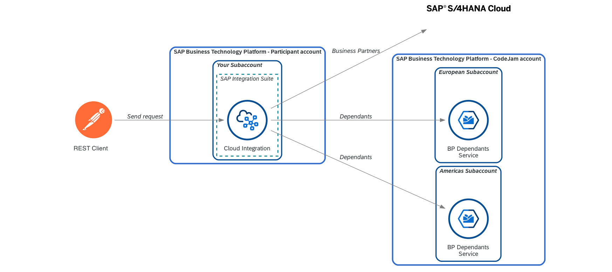

# Exercise 06 - Add the Americas instance of the Business Partner Dependants service

At the end of this exercise, you'll have successfully added the Americas instance of Business Partner service to the integration flow.

<i>Exercise 06 - Data flow</i>

Now that we are familiar with the basics of SAP Cloud Integration.....

<i>Integration Flow - End of Exercise 06</i>

## Design

👉 Let's start by making a copy of the integration flow we created in Exercise 06, add the `- Exercise 06` suffix to the name and open it.

### Move EU components to a Local Integration Process

TBD

### Create Local Integration Process for Americas instance

TBD

### Handle scenario when an employee doesn't exist

TBD

## Deploy

👉 Save and deploy the integration flow.

> If the deployment process fails with an error similar to this: [Failed to create route - HTTP address already registered](../../troubleshooting.md#failed-to-create-route---http-address-already-registered-for-another-iflow), add a suffix to the address in the `HTTP Sender` adapter, e.g. `-ex6`, so that the address `/request-employee-dependants-ex6`  doesn't clash with the one configured for our previous integration flow, and try deploying it again.

Our integration flow is now ready. Let's send some messages to it using Postman. 

👉 Open the `Request Employee Dependants - Exercise 06` request under the cloud-integration folder in the Postman collection and test the following scenarios:
- Send a request for `employee_id` = 1003764. Where is this employee from and what's the response you get?
- Now, `employee_id` = 1003765. Where is this employee from and what's the response you get?
- Finally, an employee that doesn't exist, e.g. `8765432ABC`.

## Summary

We've added some cool functionality to the integration flow. Some parts of it have been parametrised, it does some data validations, it communicates with more than one service and we even modify its behaviour by using the exchange headers.

## Further reading

* [Local Integration Process](https://help.sap.com/docs/CLOUD_INTEGRATION/)
* [Link 2](https://help.sap.com)

---

If you finish earlier than your fellow participants, you might like to ponder these questions. There isn't always a single correct answer and there are no prizes - they're just to give you something else to think about.

1. Question 1
2. Question 2

## Next

Continue to 👉 [Exercise 07 - TBD](../07-log-requests-in-big-query/)
