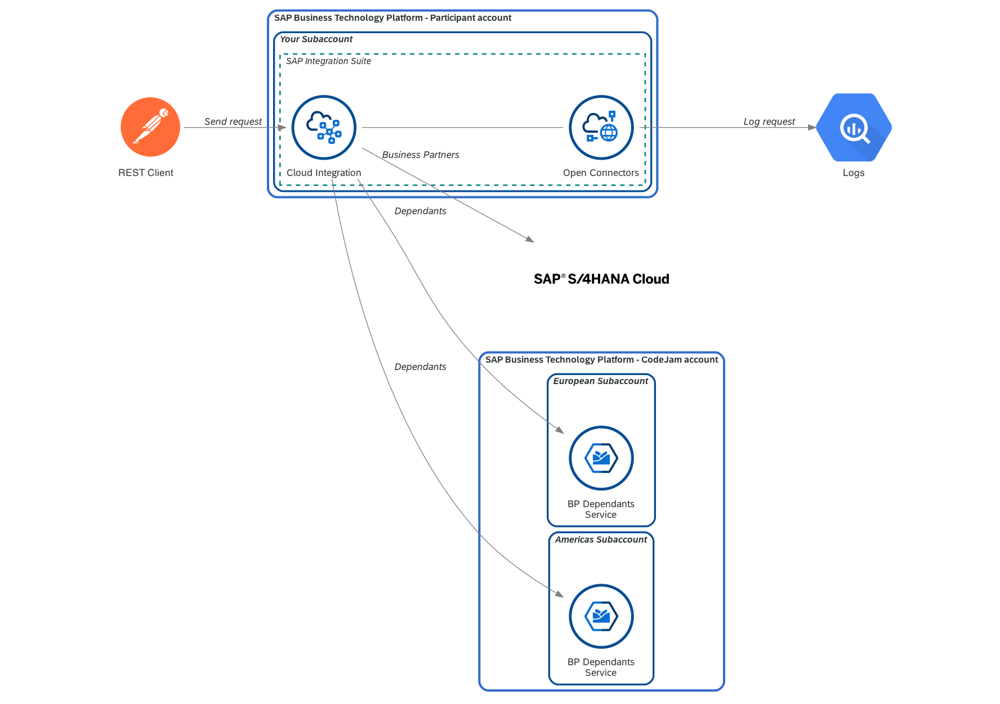

# Exercise 07 - Log request in BigQuery

In our [integration scenario](../../README.md#integration-scenario), it is mentioned that we need to log the requests received by the integration flow. These requests will be logged in a table that exists in BigQuery. We will achieve this by using Open Connectors to simplify the connection between SAP Cloud Integration and Google's BigQuery. 



<p align = "center">
<i>Exercise 07 - Data flow</i>
</p>

At the end of this exercise, you'll have successfully configured an instance of a BigQuery in Open Connectors and modified the integration flow so that it logs every request received. You would have also learned about decoupling integration flows and asynchronous processing.

## BigQuery

As part of the [prerequisites](../../prerequisites.md#bigquery) of this CodeJam, you should have created a Google Cloud Platform account if you didn't have one and also create a dataset and a table, which will be used to log the requests received by the integration flow.

Before we can configure the connectivity between Open Connectors and BigQuery, we will need to create an OAuth client which we need to set up an instance in Open Connectors.

### Create an OAuth 2.0 application in Google Cloud Platform


#### (Optional) ⚠️ If you've not defined an OAuth consent screen before ⚠️

👉 In Google Cloud Platform, select the project and go to `API & Services > OAuth consent screen` - https://console.cloud.google.com/apis/credentials/consent. Set the `User Type` to `Internal` and the app configuration similar to the one in the screenshot below.

<p align = "center">
<br/>
<i>OAuth consent screen</i>
</p>


#### Create an OAuth 2.0 Client

An OAuth client is needed to configure the connection between Open Connectors and BigQuery. For this, follow the instructions below:

👉 Navigate to the Google Cloud Platform console and create an OAuth 2.0 client. In Google Cloud Platform, select the project and go to `API & Services > Credentials`. Create a credential for OAuth Client ID and select `Web application` as the application type. Make sure to add https://auth.cloudelements.io/oauth as an Authorised redirect URI.

<p align = "center">
<br/>
<i>CodeJam - OAuth 2.0 Client</i>
</p>

Once the client is created, a view like the one below will be displayed. Copy the Client ID and Client secret as we will need them to configure an instance of BigQuery in Open Connectors.

<p align = "center">
<br/>
<i>OAuth client created</i>
</p>

## Open Connectors

From the Open Connectors website... 

> Open Connectors is built from the ground up to bring API integration and management together with a data-centric approach.<br/><br/>Our platform – combined with our unique Connectors – is designed to unify the developer experience across all kinds of applications and services. Regardless of the application’s backend – REST, SOAP, Proprietary SDK, Database, etc – Open Connectors creates a unified API layer and standards-based implementation across every environment.

We will use Open Connectors to enable the connection between our integration flow and the BigQuery service. Through it, we will create the record that logs the request sent by the sender participant of the integration flow. We previously created an OAuth client in Google Cloud Platform and we will now use these details to set up an instance of BigQuery.

### Set up a BigQuery instance in Open Connectors

Access the Open Connectors UI, from within the SAP Integration Suite landing page, and create an instance of the BigQuery connector. Once created, copy the Authorization header details displayed in the API docs.

<p align = "center">
<br/>
<i>Access Open Connectors from SAP Integration Suite</i>
</p>

👉  In Open Connectors, go to Connectors and search for BigQuery and select Authenticate. It will open the configuration screen to create a new instance. Enter the required information and complete the authorization flow to grant Open Connectors access to BigQuery.


<p align = "center">
<i>Create BigQuery instance in SAP   Open Connectors</i>
</p>

🧭 Take some time to explore the methods available in the Test API docs section of the instance we just created. You'll notice that there is a method for the table that is in our dataset. Try retrieving some data or creating data from the Open Connectors UI. Test some other methods available.

| Field               | Value                                              |
| ------------------- | -------------------------------------------------- |
| Name                | CodeJam-BQ                                         |
| Authentication Type | oauth2                                             |
| OAuth API Key       | \<Value from OAuth Client ID\>                     |
| OAuth API Secret    | \<Value from OAuth Client Secret\>                 |
| Project ID          | Google Cloud Project ID                            |
| Dataset ID          | Copy the value from dataset properties in BigQuery |

| Project ID                               | Dataset ID                                    |
| ---------------------------------------- | --------------------------------------------- |
|  |  |

> ⚠️ You'll notice in the gif below that the Project ID is removed from the Dataset ID copied from the Dataset properties. If you don't remove it there will be an authentication error when creating the instance.


<p align = "center">
<i>Testing instance API Docs</i>
</p>

👉  In the API docs, select any method and copy the value included as an Authorization header, e.g. `User QNBF4V=, Organization a0f234e, Element d3jbWv5/xxx/yyyyyyy/zzzzxqrk=`. We will use this value to configure the Open Connector credentials in the next step.

## SAP Cloud Integration

Before we can jump to add the necessary flow steps in our integration flow, we will first deploy the Open Connectors instance credentials in SAP Cloud Integration. These credentials will then be configured in the adapter when setting up a new receiver participant.

👉 Go to your SAP Cloud Integration instance and create/deploy a new user credential (`Monitor > Manage Security > Security Material`) for BigQuery. This will be used by the integration flow to communicate with BigQuery.

| Name        | Type            | Fields                                                                       |
| ----------- | --------------- | ---------------------------------------------------------------------------- |
| oc-bigquery-bp-dependants-log | Open Connectors | Enter the `User`, `Organization`, and `Element` details from Open Connectors |

Now that our Open Connectors credentials are in place, we can proceed to import the integration flow, that was built for us, which is responsible for inserting the request record in BigQuery. 

👉 Go to the integration package and import the [Send BP Dependants Request Log to BigQuery integration flow](../../assets/cloud-integration/Send%20BP%20Dependants%20Request%20Log%20to%20BigQuery.zip) by clicking Add > Integration Flow and upload the integration flow. Once uploaded, configure it by setting the external parameters and deploy it.


<p align = "center">
<i>Import Request Log iFlow</i>
</p>

🧭 Take some time to explore the integration flow that we just imported. It is a simple but powerful integration flow. Which sender adapter has been configured? Why are we using this adapter? How often will this integration flow run? What happens after the request was logged in BigQuery? How can it be improved?

### Decouple request logging from our integration flow

As mentioned in the [integration scenario](../../README.md#integration-scenario), we need to log the requests that our integration service receives. That said, this logging is irrelevant to the message sender. Logging the request should in no way affect the response of the integration service. Although we want to do the logging, this can be handled by a separate process and doesn't need to affect the processing of the message received. For example, if logging the request fails, it should not impede our integration flow from serving requests.

To achieve this, we can decouple (separate) request logging from the integration service. The `Send BP Dependants Request Log to BigQuery` integration flow is responsible for communicating with BigQuery and creating a record in a table. We can "communicate" with it in an asynchronous manner, using persistence, e.g. [using the Data Store](https://help.sap.com/docs/CLOUD_INTEGRATION/368c481cd6954bdfa5d0435479fd4eaf/5467c77da3064f65a5b3a9351fed7d84.html?locale=en-US), and creating data entries in a Data Store. The `Send BP Dependants Request Log to BigQuery` integration flow will then, on a scheduled basis, process any entries it finds in the Data Store and proceeds to store the data in BigQuery.

> What is a **Data Store**?
> We are able to temporarily store data in our SAP Cloud Integration tenant database. We don't have physical access to the database itself but we can store data in it through the "Data Store" interface. There are a number of integration flow steps that allow us to perform [operations in the the Data Store](https://help.sap.com/docs/CLOUD_INTEGRATION/4b57f249012e4e1f8c15cbd5dbb4fff3/79f63a4bf5a44b5996aa34c51e2f187f.html?locale=en-US), e.g. Data Store Write, Data Store Read, Data Store Delete. The Data Store can also be used for asynchronous processing as highlighted [here](https://help.sap.com/docs/CLOUD_INTEGRATION/368c481cd6954bdfa5d0435479fd4eaf/5467c77da3064f65a5b3a9351fed7d84.html?locale=en-US). 

Now that we have a basic understanding of why and how we can decouple request logging, let's go ahead and modify our integration flow to handle this.


<p align = "center">
<i>Add Content Modifier and DataStore</i>
</p>

### Design

👉 Similar to previous exercises, let's start by making a copy of the integration flow we created in the previous exercises and add the `- Exercise 07` suffix to the name and open it.

> As stated in the previous exercise, you might want to add a suffix to the address in the `HTTP Sender` adapter, e.g. `-ex7`, so that the address `/request-employee-dependants-ex7`  doesn't clash with the one configured for our previous integration flows.

Given that the imported integration flow handles the communication with BigQuery, there is very little that we need to do in our main integration flow to "log requests".

👉 After the `Get Employee Country`, add a new content modifier, that we will use to set the payload that we want the `Send BP Dependants Request Log to BigQuery` integration flow to process asynchronously. The payload will then be stored in the `BP-Dependants-Request-Log` data store by using the `Data Store Operation Write` flow step.

- `Prepare request log payload` content modifier: Go to the Message Body tab and set the *Type* to `Expression` and *Body* below.
  
    ```json
    {
        "employee_country": "${property.employee_country}",
        "request_timestamp": "${date:now:yyyy-MM-dd HH:mm:ss}",
        "employee_id": "${property.employee_id}"
    }
    ```

    > 🐪 Here, we are using the [Simple language](https://camel.apache.org/components/3.18.x/languages/simple-language.html) in our integration flow again. In this instance we are using Simple expressions to define/modify the payload in the exchange. In the example above, we access the exchange properties and [create a date and set its format](https://camel.apache.org/components/3.18.x/languages/simple-language.html#_examples).

- `Write BP-Dependants-Request-Log` data store operation: Data Store Name: `BP-Dependants-Request-Log`
  
  <p align = "center">
    <br/>
    <i>Write Data Store operation</i>
  </p>

That was simple, wasn't it?  We are now ready to deploy our integration flow.

### Deploy

👉 Save and deploy the integration flow.

> If the deployment process fails with an error similar to this: [Failed to create route - HTTP address already registered](../../troubleshooting.md#failed-to-create-route---http-address-already-registered-for-another-iflow), add a suffix to the address in the `HTTP Sender` adapter, e.g. `-ex7`, so that the address `/request-employee-dependants-ex7`  doesn't clash with the one configured for our previous integration flow, and try deploying it again.

Our integration flow is now ready. Let's send some messages to it using Postman. 

👉 Open the `Request Employee Dependants - Exercise 07` request under the cloud-integration folder in the Postman collection and test the following scenarios:
- Send a request and check the Data Store (`Monitor > Manage Stores > Data Stores`). You will see that there is a new entry in the Data Store.

<p align = "center">
    <br/>
    <i>Data Store entry</i>
</p>

After some time the entry will be processed by the integration flow we imported and deployed - `Send BP Dependants Request Log to BigQuery integration flow`. The integration flow will delete the data store entry once processed.

<p align = "center">
    <br/>
    <i>Processed Data Store entry - Send BP Dependants Request Log integration flow</i>
</p>

## Summary

Very few changes in our main integration flow but we got to learn about a few components in this exercise. We started by creating OAuth credentials in Google Cloud Platform, followed by setting up a connector instance in Open Connectors and testing basic communication from the Open Connectors UI. We then moved to SAP Cloud Integration where we imported and deployed a new integration flow, set up a new credential type - Open Connectors, and learnt about Data Stores and how we can use them to decouple our integration flows.

## Further reading

* [Decouple Sender and Flows Using Data Store](https://help.sap.com/docs/CLOUD_INTEGRATION/368c481cd6954bdfa5d0435479fd4eaf/5467c77da3064f65a5b3a9351fed7d84.html?locale=en-US)
* [Modeling Basics - Decouple Flows Using Persistence](https://api.sap.com/integrationflow/ModelingBasics_DecoupleFlowsUsingPersistence)

---

If you finish earlier than your fellow participants, you might like to ponder these questions. There isn't always a single correct answer and there are no prizes - they're just to give you something else to think about.

1. In this exercise, we used the Data Store for decoupling. What other persistence methods could have been used for decoupling?
2. What will happen to our main integration flow if the `Send BP Dependants Request Log to BigQuery` integration flow fails? How will it be affected? What will happen to the requests received by the integration flow? 
   > 💡 To simulate this, you can undeploy the `Send BP Dependants Request Log to BigQuery` integration flow, send a few messages and check out what happens.
3. Why do you think we didn't build the [BigQuery integration flow](../../assets/cloud-integration/Send%20BP%20Dependants%20Request%20Log%20to%20BigQuery.zip) as part of this exercise? Why import an existing integration flow? How is this approach similar to using libraries/utilities available in programming languages?

## Next

Continue to 👉 [Exercise 08 - Expose integration flow via API Management](../08-expose-integration-flow-api-management/)
