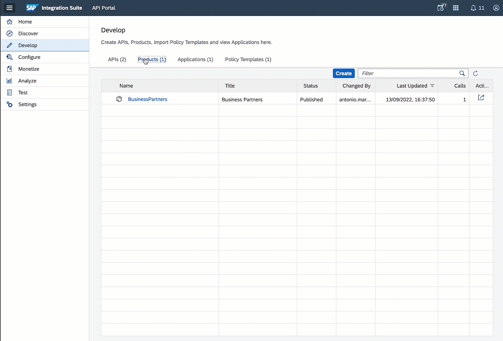
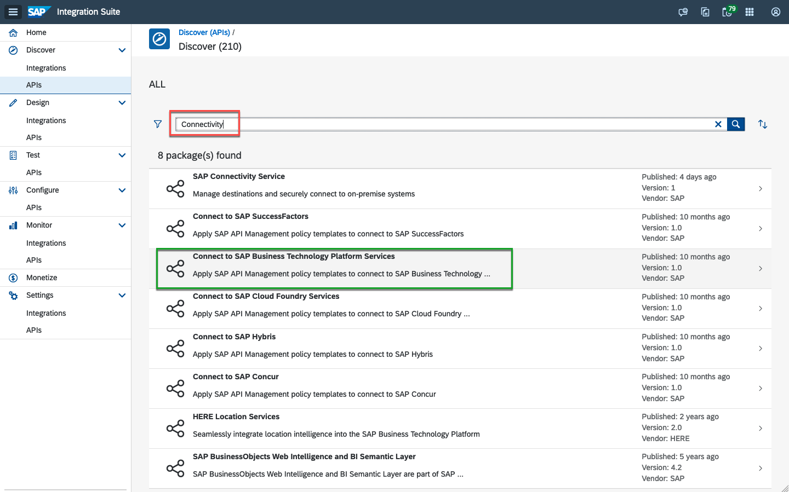
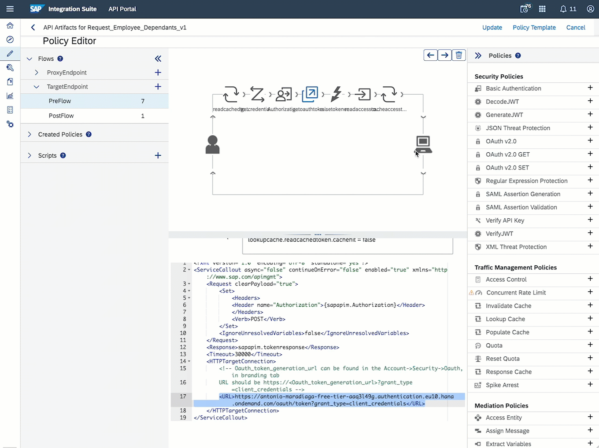
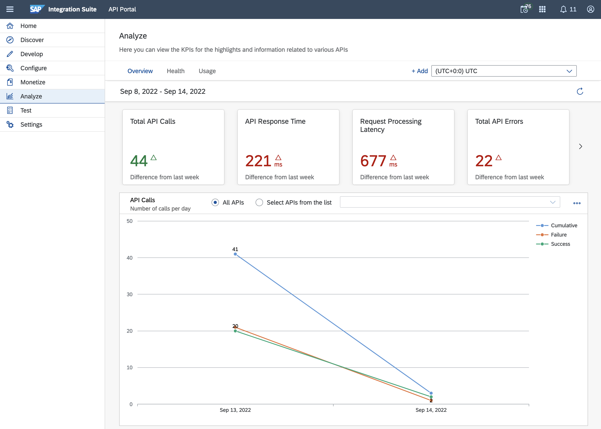

# Exercise 08 - Expose integration flow via API Management

In this exercise, we will expose our integration flow via API Management and take advantage of the functionality provided by API Management to govern and monitor the calls made to the integration flow. Once the API is created we will expose it via the API Business Hub Enterprise (Developer Portal). 

To achieve the above we create an API in API Management that will act as a proxy to our integration flow and we will leverage an OpenAPI specification to create it.

## What is an OpenAPI specification?**

> From the specification [website](https://swagger.io/specification/)...
>  
> *The OpenAPI Specification (OAS) defines a standard, language-agnostic interface to RESTful APIs which allows both humans and computers to discover and understand the capabilities of the service without access to source code, documentation, or through network traffic inspection. When properly defined, a consumer can understand and interact with the remote service with a minimal amount of implementation logic.*
> 
> *An OpenAPI definition can then be used by documentation generation tools to display the API, code generation tools to generate servers and clients in various programming languages, testing tools, and many other use cases.*

In simple terms, the specification is a document that describes an API. 

**Why is it important?** The OpenAPI specification is an industry standard, it is widely adopted by different vendors/services to document their APIs and there is a [huge community](https://openapi.tools/) behind it. SAP has adopted the OpenAPI spec to document its APIs, e.g. in the SAP API Business Hub you can find the OpenAPI spec for the APIs exposed by the different products. If you download the JSON file listed within the [SAP S/4HANA Cloud Business Partner API](https://api.sap.com/api/API_BUSINESS_PARTNER/overview) (`API resources > API specification > JSON`) and inspect it, you'll notice that it follows the OpenAPI spec `3.0.0`. Also, various SAP products, e.g. [SAP Process Automation](https://help.sap.com/docs/PROCESS_AUTOMATION/a331c4ef0a9d48a89c779fd449c022e7/609538e04bc843d887011765c14ecdda.html?locale=en-US), [API Management](https://help.sap.com/docs/SAP_CLOUD_PLATFORM_API_MANAGEMENT/66d066d903c2473f81ec33acfe2ccdb4/3ce080d478a34256b5dd4e971e7961f8.html?locale=en-US), [Cloud Integration](https://help.sap.com/docs/CLOUD_INTEGRATION/4b57f249012e4e1f8c15cbd5dbb4fff3/fb7c1df576d94516937ce773c456068a.html?locale=en-US), [SAP Data Intelligence](https://help.sap.com/docs/SAP_DATA_INTELLIGENCE/ca509b7635484070a655738be408da63/439278cbff87491c802d75de8cc5c97f.html?locale=en-US), use OpenAPI spec to define/consume APIs.

     
    <i>Business Partner API - specification</i>

> 🚨🚨 As part of the prerequisites of this CodeJam, you should have [set up the API Management capability of SAP Integration Suite](../../prerequisites.md#set-up-api-management-capability). If you've not done this, now would be a good time as we will start using API Management. 🚨🚨

## Create API by importing OpenAPI specification

An OpenAPI specification for our integration flow is included in the assets of this CodeJam - [integration-flow-openapi-spec-1.0.0.json](../../assets/cloud-integration/integration-flow-openapi-spec-1.0.0.json). The spec describes the endpoint we are exposing in SAP Cloud Integration and the data structure of the request and response expected from our endpoint. 

> In case you wonder how the OpenAPI spec included in the assets was created.... The file was generated from a Postman collection, with the help of the [postman-to-openapi](https://github.com/joolfe/postman-to-openapi) CLI. The output of the utility isn't the file that's in the repo but it was great starting point to define the API specification. 

👉 Open the specification file located under the assets folder in the root of the repository, e.g. `connecting-systems-services-integration-suite-codejam/assets/cloud-integration/integration-flow-openapi-spec-1.0.0.json` and update the following components. 
- `.servers.url`: Replace the value `https://your-tenant-free-tier-gfm1c35e.it-cpi018-rt.cfapps.eu10-654.hana.ondemand.com` with the value you configured for `host` variable in the Postman environment that communicates with the integration flow.
- *(Optional)* `.paths`: Depending on how you are deploying your integration flows, you might need to update the path as well, e.g. from `/http/request-employee-dependants-ex7` to `/http/request-employee-dependants` if you are not adding the suffix to the integration flows created.

Once we've updated the specification file, we can use this to create an API in API Management. Once the API is created we will add it to the Developer Portal. First, let's go ahead and create the API.

👉 Navigate to the `Develop` section of API Management and click the `Import API` button. Select the recently modified OpenAPI spec and create a version for the API, e.g. v1. Check that everything is fine after importing the file and click the `Save` button. Once saved, you can `Deploy` the API.

     
    <i>Import OpenAPI specification to create API</i>

To expose the API in the Developer Portal (API Business Hub Enterprise) we first need to add it to a Product and include the API within it. Let's go ahead, create the product and publish it.

👉 In the Develop section of API Management, click the `Create button` in the `Products` tab. Enter a name and a title, e.g. `Business Partners` and include the `Request_Employee_Dependants_v1` API. Lastly, click the `Publish button`.

> For a detailed step by step instruction on creating a Product, checkout steps 2 - 7 of the [Add an API Proxy to a Product tutorial](https://developers.sap.com/tutorials/hcp-apim-create-product.html).

After publishing the product, we can navigate to the API Business Hub Enterprise and see the `Business Partners` product we just published and the `Request_Employee_Dependants_v1` API.

<i>API Business Hub Enterprise - Business Partners product</i>

## Send a message to the integration flow via API Management 

Now that we've created the `Request_Employee_Dependants_v1` API, we can communicate with our integration flow through API Management.

- *From the API Management UI*

    Go to the API and *"try out"* the API from the `Resources` tab.

    

         
        <i>Import OpenAPI specification to create API</i>
    

    > ⚠️ The response is an HTTP 401. Why do you think we get that error? Are we missing something in our request? ❓❓

- *From Postman*
  
    Update the `proxy_url` variable in the `API Management` Postman environment with the API Proxy URL that's in the API.

    

         
        <i>API Proxy URL</i>
    

    Send a message to the integration flow by using the `api-management > Request Employee Dependants Proxy` request.

    
    

    <i>Send message via API Management from Postman</i>
    

At the moment we've set up an API (`Request_Employee_Dependants_v1`) in API Management that is a proxy for our integration flow. By doing this we can use API Management to add common API functionality to our API, e.g. secure the API, modify headers, transform message formats, or implement [rate limits](https://help.sap.com/docs/SAP_CLOUD_PLATFORM_API_MANAGEMENT/66d066d903c2473f81ec33acfe2ccdb4/bf441dc839034613b059cb508ad610f7.html?locale=en-US).

The additional functionality can be set in API Management in the form of [Policies](https://help.sap.com/docs/SAP_CLOUD_PLATFORM_API_MANAGEMENT/66d066d903c2473f81ec33acfe2ccdb4/7e4f3e590f164996994cddc8e48bf7f5.html?locale=en-US). A policy is a program that executes a specific function at runtime, which is what allows us to add the extra functionality to our API.  

## Add policies to the Request_Employee_Dependants_v1 API

To communicate with the integration flow we need to send a Bearer token in the request headers. This Bearer token is obtained by first authenticating against the token server using the `clientid` and `clientsecret` we got from the [Cloud Integration runtime service key](../../prerequisites.md#create-sap-cloud-integration-runtime-client-credentials) that was created as part of the CodeJam prerequisites.

Although it is possible to create a service key and share the details with a new consumer of the service, this approach might not be ideal as an administrator will need to be involved whenever new/update credentials is required. It is not self-service, meaning we cannot use the API Business Hub Enterpise to manage our application/credentials.

Given that the communication to our integration flow can now go through API Management, we can use API Management to change how we keep our service secure. In our case, we will apply the following policies:
1. [Business Technology Platform connectivity](https://api.sap.com/policytemplate/Cloud_Platform_Connectivity): This policy template helps us communicate with APIs hosted on SAP BTP and that are protected by the BTP OAuth, e.g. our integration flow. The template will be used to authenticate against Cloud Integration using our [existing service key](../../prerequisites.md#create-sap-cloud-integration-runtime-client-credentials).
2. [Verify API Key](https://help.sap.com/docs/SAP_CLOUD_PLATFORM_API_MANAGEMENT/66d066d903c2473f81ec33acfe2ccdb4/4d15a0427494452dbb42a319e9bb420f.html?locale=en-US): Creating an application in the Developer Portal will generate for us an Application Key. We can use this Application Key to authenticate our calls to a Product API in API Management.

### Business Technology Platform connectivity

The Business Technology Platform connectivity policy is available in the API Business Hub - https://api.sap.com/policytemplate/Cloud_Platform_Connectivity. To import it into our tenant, we will need to copy it from the Discover section in API Management.

🧭 Take some time to explore what's documented for the [Business Technology Platform connectivity policy template](https://api.sap.com/policytemplate/Cloud_Platform_Connectivity). Pay particular attention to the `getcredential` and `getoauthtoken` steps as these are the steps that we will need to update later.

👉 Navigate to `Discover`, search for `Connectivity`, select `Connect to SAP Business Technology Platform Services` and copy the `Business Technology Platform connectivity` artefact.

<i>Discover - Connect to SAP Business Technology Platform service</i>

Now that the policy template is available on our tenant, we can proceed to apply it in our `Request_Employee_Dependants_v1` API.

👉 Enter Edit mode for the `Request_Employee_Dependants_v1` API. Go to Policies, select the `Policy Template button` and apply the connectivity policy template. Now, in the `TargetEndpoint.PreFlow` section, update the `clientid` and `clientsecret` in the `getcredential` step and the `OAuth token URL` in the `getauthtoken` step with the details found in our service key. Finally, update the policy, save and re-deploy the API.

<i>Apply Business Technology Platform connectivity policy template</i>

<i>Update policy, save and deploy API</i>

> Detailed step by step screenshots on how to apply the policy template can be found in step 4 of this [tutorial](https://developers.sap.com/tutorials/cp-starter-isuite-api-management.html#be2bb154-9208-4ace-b635-a986f7f049cc).

The `Request_Employee_Dependants_v1` API was once again deployed. What will happen if we send a request to our API now? You can test this using the `api-management > After applying BTP connectivity policy template` request included in the Postman collection.

### Verify API Key

As our API is available via the API Business Hub Enterprise, we want developers interested in consuming the service to create an application (subscribe) and use the application key to authenticate.

👉 Enter Edit mode for the `Request_Employee_Dependants_v1` API. Go to Policies, select the `ProxyEndpoint.PreFlow` flow and add the `Verify API Key` policy. Enter a name and set `request.header.APIKey` as the value of the APIKey @ref attribute. Finally, update the policy, save and re-deploy the API.

<i>Add Verify API Key policy</i>

> Detailed step by step screenshots on how to add the Verify API Key policy can be found from step 10 - step 13 of this [tutorial](https://developers.sap.com/tutorials/hcp-apim-verify-api.html#b9f8a3d2-554e-482a-a8d1-b8af157da3dd).

The `Request_Employee_Dependants_v1` API was once again deployed. What will happen if we send a request to our API now? You can test this using the `api-management > After Verify API Key policy` request included in the Postman collection. 

Do you get an authentication error? That's good. It means that our policy is working. Now let's get an application key that we can use to authenticate against the API.

## Create an application in the API Business Hub Enterprise

The API Business Hub Enterprise can be the central point where developers in our organisation can discover APIs available in the company, create applications to communicate with these APIs and self-manage the applications.

👉 Navigate to the API Business Hub Enterprise and create an application (subscribe) for the `Business Partners - Request Employee Dependants` API.

<i>Create Benefits Platform app</i>

 

Note the `Application Secret` and `Application Key` that have been generated for us. As we added the Verify API Key policy to our API, we will now need to specify this `Application Key` in the `APIKey` header of our request.

> In case you face an "Unable to Create Application" error, check out the solution in [troubleshooting](../../troubleshooting.md#unable-to-create-application-exception-in-developer-portal) document. 

👉 Update the `APIKey` variable in the `API Management` Postman environment with the `Application Key` of the application, e.g. *UWuWAcWMMeX5bJgd49GbBoW6keEoq7lv*. Now, try sending a request using the `api-management > After Verify API Key policy` request included in the Postman collection.

🧭 We've sent several messages to our integration flow via API Management. Take some time to check the message in Cloud Integration and explore the monitoring capabilities available to us in API Management (Analyse section). You should see the successful and failed requests here. There is quite some information available to us here that can't be easily visualised in Cloud Integration and API Management gives us.

<i>API Management - Analyse section</i>

## Summary

You've made it to the last exercise of this CodeJam. Congratulations!!! 🎉 🙌. This is no easy feat as there is a lot to read/learn/process in the CodeJam and you need to dedicate some solid focus time to go through the exercises. Great job 👏👏👏!

We've achieved a lot in this exercise. We learnt about OpenAPI specifications, and how we can use a spec to create an API in API Management. We also modified how we communicate with our integration flow by applying/adding policies to our API and deployed the changes several times.

## Further reading

* [API Management - Security Best Practices blog post](https://blogs.sap.com/2017/08/22/sap-cloud-platform-api-management-api-security-best-practices/)
* [Security Best Practices - Policy Templates](https://api.sap.com/package/SecurityBestPractices/policytemplate)
* [Additional Attributes in OpenAPI Specification](https://help.sap.com/docs/SAP_CLOUD_PLATFORM_API_MANAGEMENT/66d066d903c2473f81ec33acfe2ccdb4/35f357c811f546c5ae3451df42f61ea0.html?locale=en-US)

---

If you finish earlier than your fellow participants, you might like to ponder these questions. There isn't always a single correct answer and there are no prizes - they're just to give you something else to think about.

1. How can we restrict which products/APIs are visible to developers in the API Business Hub Enterprise?
2. How long does it take for a request to be processed? Where can you find this information in API Management? What other information about our requests is available here?
3. If you look closely at the response headers, you can see that there is an APIKey header. Can you guess where this APIKey is coming from? Have you seen this value before? Looks like an APIKey is being leaked.... how can we handle this in Cloud Integration?

[^1]: OpenAPI Specification: [https://github.com/OAI/OpenAPI-Specification/blob/main/versions/3.0.3.md#infoObject](https://github.com/OAI/OpenAPI-Specification/blob/main/versions/3.0.3.md#infoObject)
