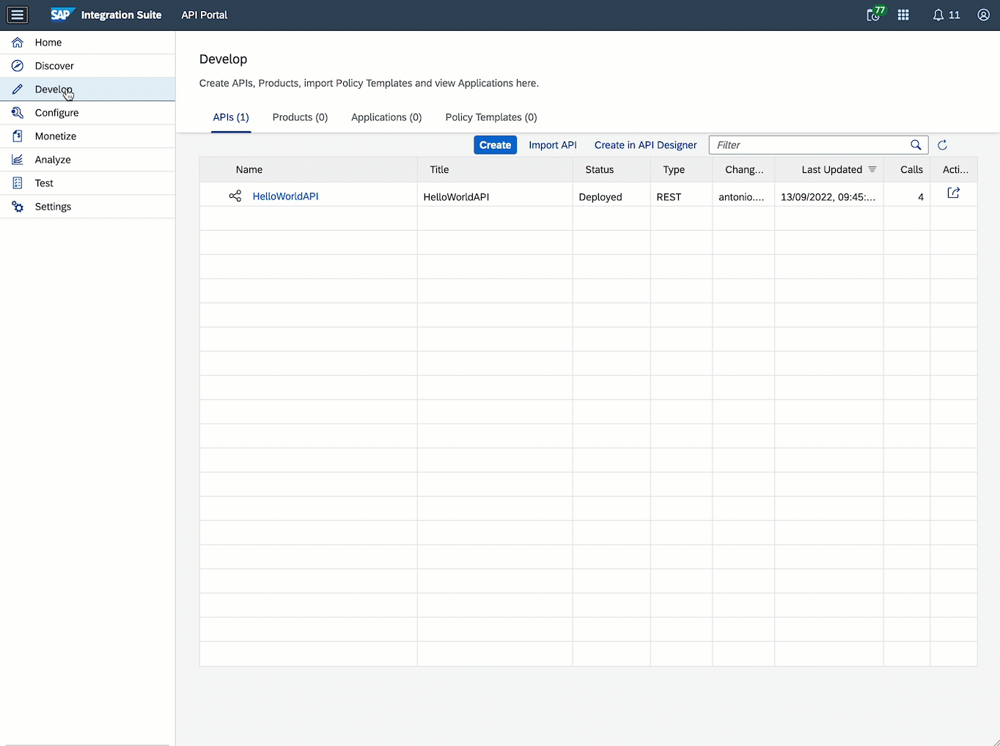

# Exercise 08 - API Management

At the end of this exercise, you'll have exposed the integration flow via API Management and take advantage of the functionality provided by API Management to govern and monitor the calls made to the integration flow. To achieve this we create an API in API Management that will act as a proxy to our integration flow and we will leverage an OpenAPI specification to create it.

## What is an OpenAPI specification?**

> From the specification [website](https://swagger.io/specification/)...
>  
> *The OpenAPI Specification (OAS) defines a standard, language-agnostic interface to RESTful APIs which allows both humans and computers to discover and understand the capabilities of the service without access to source code, documentation, or through network traffic inspection. When properly defined, a consumer can understand and interact with the remote service with a minimal amount of implementation logic.*
> 
> *An OpenAPI definition can then be used by documentation generation tools to display the API, code generation tools to generate servers and clients in various programming languages, testing tools, and many other use cases.*

In simple terms, the specification is a document that describes an API. 

**Why is it important?** The OpenAPI specification is an industry standard, it is widely adopted by different vendors/services to document their APIs and there is a [huge community](https://openapi.tools/) behind it. SAP has adopted the OpenAPI spec to document its APIs, e.g. in the SAP API Business Hub you can find the OpenAPI spec for the APIs exposed by the different products. If you download the JSON file listed within the [SAP S/4HANA Cloud Business Partner API](https://api.sap.com/api/API_BUSINESS_PARTNER/overview) (`API resources > API specification > JSON`) and inspect it, you'll notice that it follows the OpenAPI spec `3.0.0`. Also, various SAP products, e.g. [SAP Process Automation](https://help.sap.com/docs/PROCESS_AUTOMATION/a331c4ef0a9d48a89c779fd449c022e7/609538e04bc843d887011765c14ecdda.html?locale=en-US), [API Management](https://help.sap.com/docs/SAP_CLOUD_PLATFORM_API_MANAGEMENT/66d066d903c2473f81ec33acfe2ccdb4/3ce080d478a34256b5dd4e971e7961f8.html?locale=en-US), [Cloud Integration](https://help.sap.com/docs/CLOUD_INTEGRATION/4b57f249012e4e1f8c15cbd5dbb4fff3/fb7c1df576d94516937ce773c456068a.html?locale=en-US), [SAP Data Intelligence](https://help.sap.com/docs/SAP_DATA_INTELLIGENCE/ca509b7635484070a655738be408da63/439278cbff87491c802d75de8cc5c97f.html?locale=en-US), use OpenAPI spec to define/consume APIs.

     
    <i>Business Partner API - specification</i>

> 🚨🚨 As part of the prerequisites of this CodeJam, you should have [set up the API Management capability of SAP Integration Suite](../../prerequisites.md#set-up-api-management-capability). If you've not done this, now would be a good time as we will start using API Management. 🚨🚨

## Create API by importing OpenAPI specification

An OpenAPI specification for our integration flow is included in the assets of this CodeJam - [integration-flow-openapi-spec-1.0.0.json](../../assets/cloud-integration/integration-flow-openapi-spec-1.0.0.json). The spec describes the endpoint we are exposing in SAP Cloud Integration and the data structure of the request and response expected from our endpoint. 

> In case you wonder how the OpenAPI spec included in the assets was created.... The file was generated from a Postman collection, with the help of the [postman-to-openapi](https://github.com/joolfe/postman-to-openapi) CLI. The output of the utility isn't the file that's in the repo but it was great starting point to define the API specification. 

👉 Open the specification file located under the assets folder in the root of the repository, e.g. `connecting-systems-services-integration-suite-codejam/assets/cloud-integration/integration-flow-openapi-spec-1.0.0.json` and update the following components. 
- `.servers.url`: Replace the value `https://your-tenant-free-tier-gfm1c35e.it-cpi018-rt.cfapps.eu10-654.hana.ondemand.com` with the value you configured for `host` variable in the Postman environment that communicates with the integration flow.
- *(Optional)* `.paths`: Depending on how you are deploying your integration flows, you might need to update the path as well, e.g. from `/http/request-employee-dependants-ex7` to `/http/request-employee-dependants` if you are not adding the suffix to the integration flows created.

Once we've updated the specification file, we can use this to create an API in API Management. Let's go ahead and create the API.

👉 Navigate to the `Develop` section of API Management and click the `Import API` button. Select the recently modified OpenAPI spec and create a version for the API, e.g. v1. Check that everything is fine after importing the file and click the `Save` button. Once saved, you can `Deploy` the API.

     
    <i>Import OpenAPI specification to create API</i>

## Send a message to the integration flow via API Management 

Now that we've created the API, we can communicate with our integration flow through API Management.

- *From the API Management UI*

    Go to the API and try out the API from the `Resources` tab.

    

         
        <i>Import OpenAPI specification to create API</i>
    

    > ⚠️ The response is an HTTP 401. Why do you think we get that error? Are we missing something in our request? ❓❓

- *From Postman*
  
    Update the `proxy_url` variable in the `API Management` Postman environment with the API Proxy URL that's in the API.

    

         
        <i>API Proxy URL</i>
    

    Send a message to the integration flow by using the `api-management > Request Employee Dependants Proxy` request.

    
    

    <i>Send message via API Management from Postman</i>
    

## Subscribe to application in the API Business Hub Enterprise

<i>Create Benefits Platform app</i>

 

> In case you face an "Unable to Create Application" error, check out the solution in [troubleshooting](../../troubleshooting.md#unable-to-create-application-exception-in-developer-portal) document. 

## Summary

Now that you are familiar with the basic functionality of API Management.

## Further reading

* [Link 1](https://blogs.sap.com/)
* [Link 2](https://blogs.sap.com/)

---

If you finish earlier than your fellow participants, you might like to ponder these questions. There isn't always a single correct answer and there are no prizes - they're just to give you something else to think about.

1. First question.
2. Second question.

[^1]: OpenAPI Specification: [https://github.com/OAI/OpenAPI-Specification/blob/main/versions/3.0.3.md#infoObject](https://github.com/OAI/OpenAPI-Specification/blob/main/versions/3.0.3.md#infoObject)
