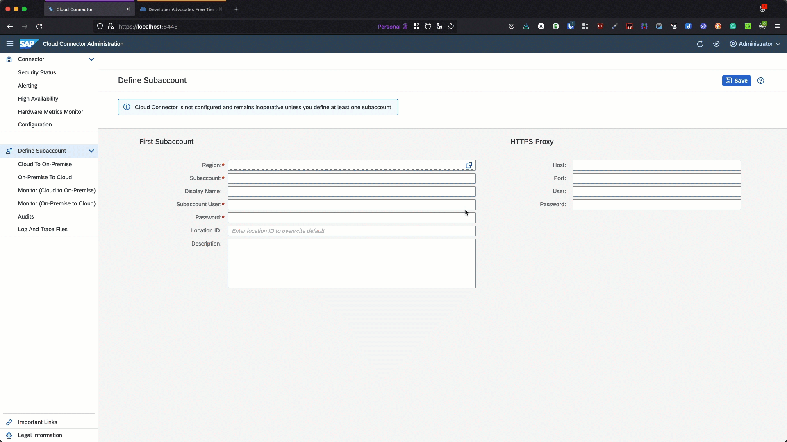
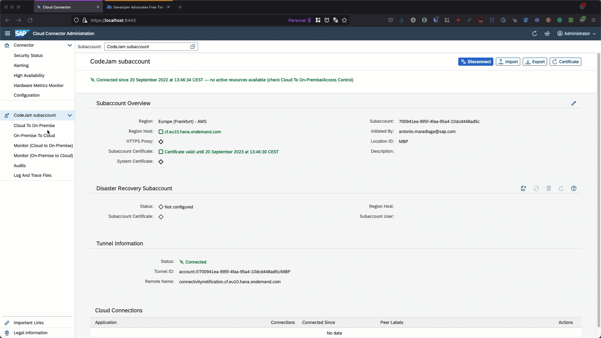
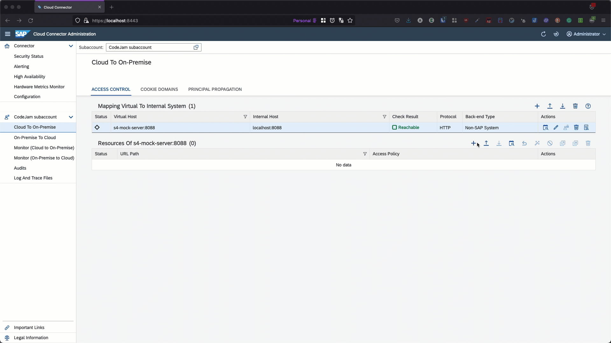
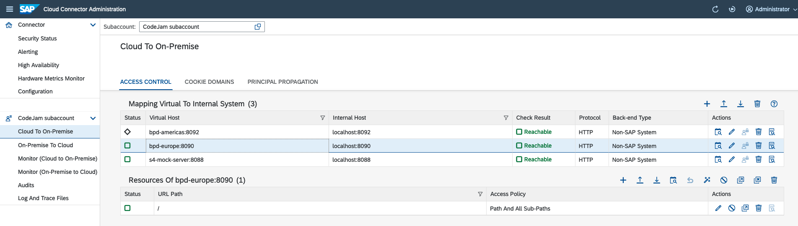
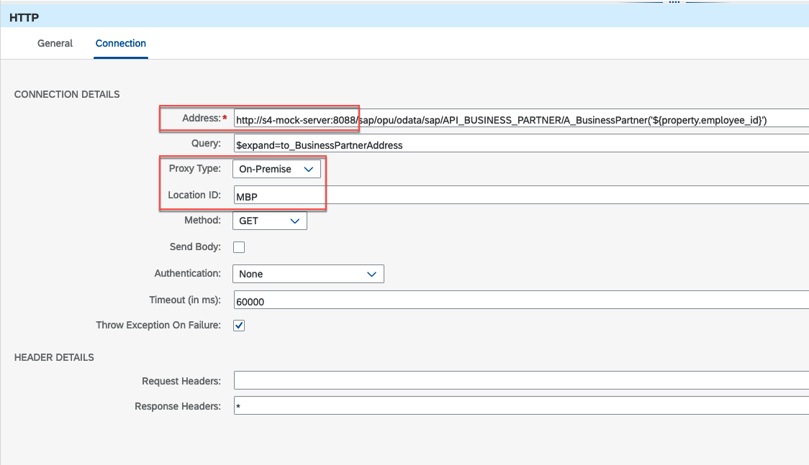

# Optional Exercise 01 - Running services locally

All the services that are used as part of this SAP CodeJam can be run locally. If you are doing this CodeJam outside of an event, you will likely need to run the services on your machine to complete the exercises. 

In this exercise, we will cover how you can run the services locally by using Docker 🐳 . Also, we will cover how you can connect Cloud Connector to your SAP BTP subaccount, configure a system in Cloud Connector and then show how the configuration in a Receiver HTTP adapter (SAP Cloud Integration) will differ when connecting to a service via Cloud Connector.

> ⚠️ To run the services used in this CodeJam locally, you should have completed the instructions included in the [running locally prerequisites](../../running-locally-prerequisites.md) page.

## Connecting Cloud Connector to your SAP BTP Subaccount

Cloud Connector allows us to secure expose our on-premise (local/internal) systems to the SAP BTP. It creates a secure tunnel to the connectivity service in SAP BTP, through which SAP BTP services can communicate with the internal systems if needed. For example, we can configure the HTTP adapter in SAP Cloud Integration to communicate with APIs exposed by our on-premise service. Also, Cloud Connector can be used to enable communication between SAP BTP and your systems deployed in the cloud infrastructure provider. For example, if you no longer have any on-premise data centres and have moved your servers to a cloud infrastructure provider (IaaS - Infrastructure as a Service), you can install Cloud Connector in a VM on the IaaS and through it, SAP BTP service can communicate with your server in the IaaS.

Once you've installed Cloud Connector and it's running. You can log in to the Administration UI by accessing the following URL: [https://localhost:8443](https://localhost:8443). The default username and password are: `Administrator:manage`. At first log in, it will prompt you to change the password.

👉  We first need to connect our Cloud Connector instance to our SAP BTP subaccount. For this, we will define a subaccount. Select the `Region` of your subaccount, enter the `Subaccount ID` (this can be found on the Overview page of the SAP BTP subaccount), set a `Display Name` and enter your user credentials (Subaccount user and password) to authenticate against SAP BTP security. Optionally, you can also specify a `Location ID`. A Location ID can be specified to identify your Cloud Connector instance. The location ID is used as routing information and therefore you can connect multiple Cloud Connectors to a single subaccount[^1]



<p align = "center">
<i>Define subaccount in Cloud Connector</i>
</p>

> 🚨  In the gif above I defined a Location ID for my Cloud Connector instance - *MBP*. This value is used also as an example in the configuration tables below. If you didn't define one leave the value as *blank* when specifying *MBP*.

Once defined, you'll see an overview page that will show us the connectivity status to our subaccount.

So far we've only registered the Cloud Connector instance against our SAP BTP subaccount. No on-premise systems are exposed via Cloud Connector yet. To expose a system we will need to add a mapping from virtual to an internal system.  Let's go ahead and do that.

> The instructions below assume that you are running the SAP S/4HANA Cloud mock server locally. If you are not running it locally you can follow the instructions in the [running locally prerequisites page](../../running-locally-prerequisites.md#local-services) or just run the following command 🐳  `docker run --name s4-mock-server --hostname s4-mock-server --publish 8088:8080 -d ajmaradiaga/s4-mock-server`.

👉  Navigate to the `Cloud to On-Premise` section of the recently defined subaccount. Click on the `Add System mapping button` and enter the following details.

<p align = "center">

| Field            | Value          |
| ---------------- | -------------- |
| *Back-end type*  | Non-SAP system |
| *Protocol*       | HTTP           |
| *Internal Host*  | localhost      |
| *Internal Port*  | 8088           |
| *Virtual Host*   | s4-mock-server |
| *Virtual Port*   | 8088           |
| *Principal Type* | None           |

</p>

<p align = "center">
<i>Table 1. SAP S/4HANA Cloud mock server mapping</i>
</p>


<p align = "center">
<i>Add on-premise system in Cloud Connector</i>
</p>

It is also possible to [limit the accessible service for HTTP](https://help.sap.com/docs/CP_CONNECTIVITY/cca91383641e40ffbe03bdc78f00f681/e7d4927dbb571014af7ef6ebd6cc3511.html?locale=en-US#loioe7d4927dbb571014af7ef6ebd6cc3511__limit). For that, we need to add a resource to the system we just added.

👉  Add a resource to the s4-mock-server system configured previously. Set the URL Path to `/sap/opu/odata/sap/API_BUSINESS_PARTNER` and the Access Policy to `Path and all sub-paths`.


<p align = "center">
<i>Add resource path</i>
</p>

> You can follow the Configure systems in Cloud Connector - [https://developers.sap.com/tutorials/btp-app-ext-service-cloud-connector.html](https://developers.sap.com/tutorials/btp-app-ext-service-cloud-connector.html) tutorial to learn how you can configure an ABAP system in Cloud Connector

### ***(Optional) Running all the services locally***

👉  The 🐳  commands and table below capture the configuration that would be required for the different services to be exposed via Cloud Connector. First, make sure that all the services are running locally and then configure the systems and resources below in the Cloud Connector administration UI.

> ⚠️ We've already configured the SAP S/4HANA Cloud mock server. All we will need to instantiate will be the BP Dependants services.

```bash
# Run the SAP S/4HANA Cloud mock server
docker run --name s4-mock-server --hostname s4-mock-server --publish 8088:8080 -d ajmaradiaga/s4-mock-server

# Run the Business Partner Dependants - European instance
docker run --name bpd-europe --publish 8090:8080 --env COUNTRIES=CH,DE,ES,FR,GB,IT,NL,PT --env MOCK_API_KEY=7B32D801-EA44-4C51-A49D-2F380B3A8B06 --detach ajmaradiaga/businesspartner-dependants-mock-server

# Run the Business Partner Dependants - Americas instance
docker run --name bpd-americas --publish 8092:8080 --env COUNTRIES=BR,CA,CL,MX,US --env MOCK_API_KEY=7AB7E1567-2A6A-4E5D-A3B1-008B9BE6EEA2 --detach ajmaradiaga/businesspartner-dependants-mock-server
```

<p align = "center">

| Field                      | SAP S/4HANA Cloud mock server                     | European BP Dependants service | Americas BP Dependants service |
| -------------------------- | --------------------------------------- | ------------------------------ | ------------------------------ |
| *Back-end type*            | Non-SAP system                          | Non-SAP system                 | Non-SAP system                 |
| *Protocol*                 | HTTP                                    | HTTP                           | HTTP                           |
| *Internal Host*            | localhost                               | localhost                      | localhost                      |
| *Internal Port*            | 8088                                    | 8090                           | 8092                           |
| *Virtual Host*             | s4-mock-server                          | bpd-europe                     | bpd-americas                   |
| *Virtual Port*             | 8088                                    | 8090                           | 8092                           |
| *Principal Type*           | None                                    | None                           | None                           |
| *Resource - URL Path*      | /sap/opu/odata/sap/API_BUSINESS_PARTNER | /                              | /                              |
| *Resource - Access Policy* | Path And All Sub-Paths                  | Path And All Sub-Paths         | Path And All Sub-Paths         |

<p align = "center">
<i>Table 2. Mapping Virtual to Internal System</i>
</p>

</p>

Once you've configured all the systems specified above, your Cloud to On-Premise configuration should look like the screenshot below:


<p align = "center">
<i>Cloud Connector with all systems configured</i>
</p>

## Configure HTTP adapter in Cloud Integration

There are minor differences to how you would configure the Receiver HTTP adapter in Cloud Integration when communicating via Cloud Connector compared to when accessing a server available via Internet. Below a list of the connections detail fields that change when configuring the adapter to use Cloud Connector:
- *Address*: You will configure here the virtual server that you set when adding the system in Cloud Connector. Depending on the protocol and port exposed, you might need to also update it in the `Address`.
- *Proxy Type*: `On-Premise`, always. Even if you've deployed Cloud Connector in an IaaS, from a connectivity perspective this is an On-Premise system.
- *(Optiona) Location ID*: If a Location ID was configured in Cloud Connector, you will need to populate this field with the configured value.


<p align = "center">
<i>Configure Cloud Connector connectivity in HTTP Adapter</i>
</p>

The tables below captures the values configured in the different Receiver HTTP adapters (*Table 3*) and how they should be configured when communicating via Cloud Connector (*Table 4*).

| Field                             | SAP S/4HANA Cloud mock server                                        | European BP Dependants service                                            | Americas BP Dependants service                                              |
| --------------------------------- | ---------------------------------------------------------- | ------------------------------------------------------------------------- | --------------------------------------------------------------------------- |
| *Address - Protocol and Hostname* | https://s4-mock-server-service.c-1e90315.kyma.ondemand.com | https://businesspartner-dependants-europe-svc.c-1e90315.kyma.ondemand.com | https://businesspartner-dependants-americas-svc.c-1e90315.kyma.ondemand.com |
| *Proxy Type*                      | Internet                                                   | Internet                                                                  | Internet                                                                    |
| *Location ID*                     |                                                            |                                                                           |                                                                             |

<p align = "center">
<i>Table 3. Communicating with Internet services</i>
</p>

</p>


| Field                             | SAP S/4HANA Cloud mock server        | European BP Dependants service | Americas BP Dependants service |
| --------------------------------- | -------------------------- | ------------------------------ | ------------------------------ |
| *Address - Protocol and Hostname* | http://s4-mock-server:8088 | http://bpd-europe:8090         | http://bpd-americas:8092       |
| *Proxy Type*                      | On-Premise                 | On-Premise                     | On-Premise                     |
| *Location ID*                     | MBP                        | MBP                            | MBP                            |


<p align = "center">
<i>Table 4. Communicating via Cloud Connector to local services</i>
</p>

</p>

## Summary

In this exercise, we've learned how we can get the services used in this CodeJam running locally. Also, we configure a couple of systems and resources in Cloud Connector and we know how we can use it to communicate with servers/services that are running within our landscape. Finally, we've highlighted how the connection details will change in the Receiver HTTP Adapter when communicating via Cloud Connector.

## Further reading

* [Cloud Connector, explained in simple terms](https://blogs.sap.com/2022/02/03/cloud-connector-explained-in-simple-terms/)
* [SAP BTP Connectivity - Cloud Connector](https://help.sap.com/docs/CP_CONNECTIVITY/cca91383641e40ffbe03bdc78f00f681/e6c7616abb5710148cfcf3e75d96d596.html?locale=en-US)

---

If you finish earlier than your fellow participants, you might like to ponder these questions. There isn't always a single correct answer and there are no prizes - they're just to give you something else to think about.

1. What happens if you do not add a resource to a mapped system? Try removing a resource path and send a message via Cloud Integration.
2. The BP Dependants service can also handle data for the APJ region, how can you run an instance of this service so that the data of the APJ region is available? 

[^1]: Location ID in a Subaccount: [Documentation](https://help.sap.com/docs/CP_CONNECTIVITY/cca91383641e40ffbe03bdc78f00f681/f16df12fab9f4fe1b8a4122f0fd54b6e.html?locale=en-US).