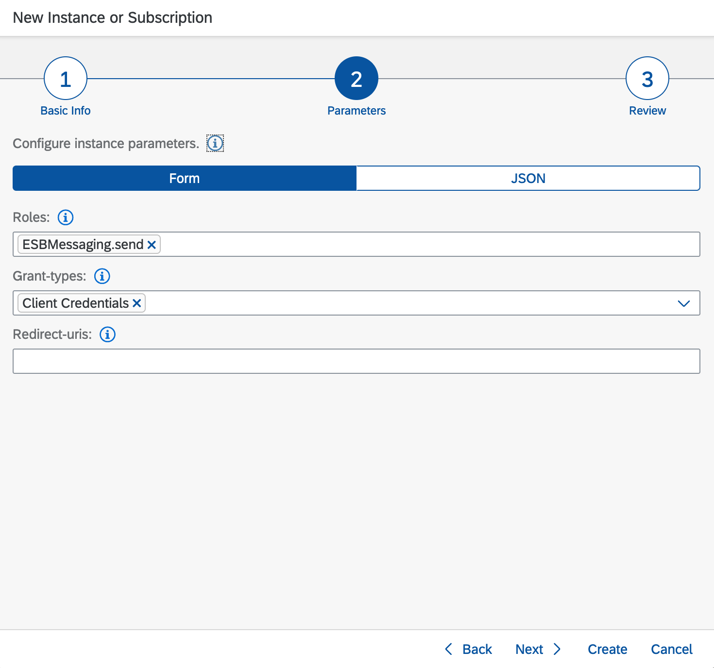
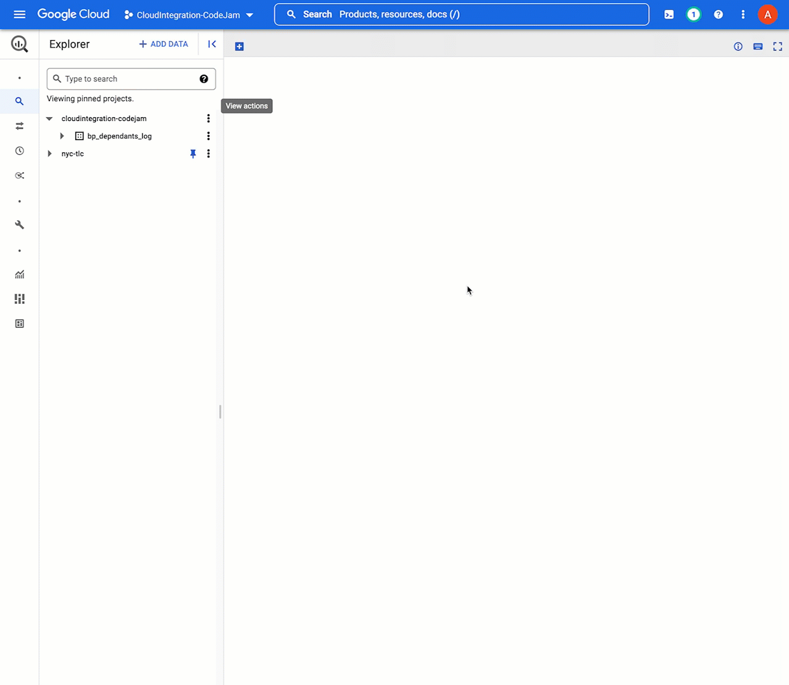

# Prerequisites

There are hardware, software and service prerequisites for participating in this CodeJam. The exercises will be developed using different SAP Integration Suite services and communicating with remote services that will be made available for the CodeJam. 

Alternatively, the remote services can be run locally and we can use [Cloud Connector](https://help.sap.com/docs/CP_CONNECTIVITY/cca91383641e40ffbe03bdc78f00f681/e6c7616abb5710148cfcf3e75d96d596.html?locale=en-US) to enable the communication between SAP BTP and the local service. The prerequisites to run it locally are included in [running-locally-prerequisites.md](running-locally-prerequisites.md) *Note: This is recommended if you are doing this exercise outside of a CodeJam event*. 

## Accessing the supporting material referenced in exercises

In this CodeJam, you will see that across exercises, there are references to files that will help you get started or that are needed to complete the activities. To access these files, you can download the individual files directly from the repository website, or you can make a copy of the repository on your local machine by following one of the options below:
1. **(Recommended)** Clone the git repository in your local machine with the following command:
   ```bash
   $ git clone https://github.com/SAP-samples/connecting-systems-services-integration-suite-codejam.git
   ```
   > If you've set up [SSH to communicate with GitHub](https://docs.github.com/en/authentication/connecting-to-github-with-ssh) from your local machine, you can clone it using the following command: `git clone git@github.com:SAP-samples/connecting-systems-services-integration-suite-codejam.git`

   Using `git` is recommended as there might be future updates on the CodeJam content; updating your local copy will just be a command away.

   ```bash
   $ git pull origin main
   ```
2. Alternatively, download the [repository as a zip](https://github.com/SAP-samples/connecting-systems-services-integration-suite-codejam/archive/refs/heads/main.zip), and unzip it.

## Hardware

None.

## Software

### Web browser

A web browser supported by the SAP Integration Suite[^1]: For the UIs of the service, the following browsers are supported on Microsoft Windows PCs and, where mentioned below, on macOS. Note that, however, certain limitations might apply for specific browsers:

```
Cloud Integration has been tested using the following browsers:
- Google Chrome (latest version)
- Microsoft Edge (latest version)
- Mozilla Firefox (latest version)
- Windows Internet Explorer (as of version 10)

The application can also be used with Safari browser and Internet Explorer 9. However, some features might not work as expected.
```

### Postman

[Postman](https://www.getpostman.com/downloads/), to send requests to the integration flows that we deploy to SAP Cloud Integration. Follow the installation instructions included in this [tutorial: Install Postman REST Client](https://developers.sap.com/tutorials/api-tools-postman-install.html).
  > Once installed you can import the collection and environments included in the `./connecting-services-integration-suite-codejam/assets/postman` folder.

  > 

## Services

<details>
<summary>Using the SAP BTP Free Tier (⚡️ recommended ⚡️)</summary>

<br>

* Get a free SAP Business Technology Platform account (if you don't already have one):
  * [Tutorial: Get an Account on SAP BTP to Try Out Free Tier Service Plans](https://developers.sap.com/tutorials/btp-free-tier-account.html)
  * [Video: SAP BTP Free Tier: Create Your Individual Account](https://www.youtube.com/watch?v=0zGuMus4R10)
* Subscribe to the SAP Integration Suite service by following the instructions included in [step 2](https://developers.sap.com/tutorials/cp-starter-isuite-onboard-subscribe.html#754869b5-274f-4a7d-b195-f4082f790b0d) of the _Set up the SAP Integration Suite trial_ tutorial. 

</details>

<details>
<summary>Using the SAP BTP Trial account</summary>

<br>

* Get an SAP Business Technology Platform trial account:
  * [Tutorial: Get an account on SAP BTP Trial](https://developers.sap.com/tutorials/hcp-create-trial-account.html)
  * [Tutorial: Set up the SAP Integration Suite trial](https://developers.sap.com/tutorials/cp-starter-isuite-onboard-subscribe.html#f55ec71c-2853-4b83-8092-4e3031f8d6e6)

</details>

### Activating SAP Integration Suite capabilities

Once subscribed to the SAP Integration Suite service, we will need to provision the following capabilities:
- Cloud Integration
- API Management
- Extend Non-SAP Connectivity

To provision the SAP Integration Suite capabilities, follow the instructions included in [step 3](https://developers.sap.com/tutorials/cp-starter-isuite-onboard-subscribe.html#d87e7e9f-7862-410d-ae85-ede409587a60) of the  _Set up the SAP Integration Suite trial_ tutorial.


### Create SAP Cloud Integration runtime client credentials

Once subscribed to the SAP Integration Suite, we will need to provision the create an instance of the Process Integration runtime. This service allow us to create client credentials which can be used to retrieve data from the SAP Cloud Integration APIs or calling an integration flow.

From command line:
```bash
# Login to Cloud Foundry
$ cf login --sso

# Create instance of service
$ cf create-service it-rt integration-flow pi-rt-iflow -c '{"roles": ["ESBMessaging.send"],"grant-types": ["client_credentials"],"redirect-uris": [] }'

# Create service key
$ cf create-service-key  pi-rt-iflow iflow-client

# Get the credentials
$ cf service-key pi-rt-iflow iflow-client
```

From the BTP Cockpit:
1. Create instance of service
   

   Ensure the `ESBMessaging.send` role is selected and the grant-type is `Client Credentials`

   

   Finalise by clicking the create button

   

2. Create service key
   

3. Copy credentials: click on the service key just created and a pop-up will appear with the service key details, e.g. `clientid`, `clientsecret`, `url`, `tokenurl`.
   

  > 👉 Copy and paste the credentials details from `iflow-client` service key in the `Cloud Integration` Postman environment.

### Set up API Management capability

The first time you access the API Management capability you will be prompted to complete the setup. Enter a host alias, add a notification contact (your email address) and click the `Set Up` button on the upper right corner.

<p align = "center">
  <br/>
  <i>Set up API Management capability</i>
</p>

<p align = "center">
  <br/>
  <i>Set up API Management - Complete</i>
</p>

For detailed steps, follow the instructions included in [step 5 - Configure the API Management Service](https://developers.sap.com/tutorials/api-mgmt-isuite-initial-setup.html#93fee77e-606e-425c-a6c3-1b6946d2ec87) of the  _Set Up API Management from Integration Suite_ tutorial. 

### BigQuery

In [exercise 07](exercises/07-log-requests-in-bigquery/) we will configure a connection to Google's BigQuery via Open Connectors. Google Cloud Platform offers a free tier, through which you can use BigQuery. Go ahead and create a free account if you don’t have access to Google Cloud Platform – https://cloud.google.com/free/.

Once you have an account, navigate to BigQuery - https://console.cloud.google.com/bigquery, create a dataset and a table under your project.

👉 Create dataset under your Google Cloud project. Enable table expiration and set the maximum table age to `60` days.


<p align = "center">
<i>Create bp_dependants_log dataset</i>
</p>

👉 Create a table under the `bp_dependants_log` dataset created with the schema below.

| Field name        | Type      | Max Length |
| ----------------- | --------- | ---------- |
| request_timestamp | TIMESTAMP |            |
| employee_id       | STRING    | 15         |
| employee_country  | STRING    | 2          |


<p align = "center">
<i>Create api-requests table</i>
</p>


[^1]: [Feature Scope Description for SAP Integration
Suite](https://help.sap.com/doc/e50e61e7b66c4b60ae5e88c00c01486a/sap.cp.integration.suite/en-US/FSD_IntegrationSuite.pdf)
