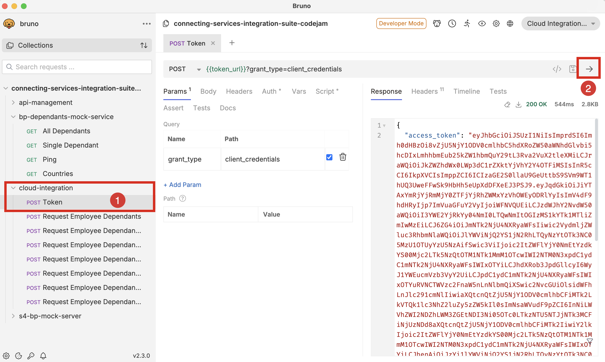

# Prerequisites

There are hardware, software and service prerequisites for participating in this CodeJam. The exercises will be developed using different SAP Integration Suite services and communicating with remote services that will be made available for the CodeJam.

## Accessing the supporting material referenced in exercises

In this CodeJam, you will see that across exercises, there are references to files that will help you get started or that are needed to complete the activities. To access these files, you can download the individual files directly from the repository website, or you can make a copy of the repository on your local machine by following one of the options below:

1. **(Recommended)** Clone the git repository in your local machine with the following command:

   ```bash
   git clone https://github.com/SAP-samples/connecting-systems-services-integration-suite-codejam.git
   ```

   > If you've set up [SSH to communicate with GitHub](https://docs.github.com/en/authentication/connecting-to-github-with-ssh) from your local machine, you can clone it using the following command: `git clone git@github.com:SAP-samples/connecting-systems-services-integration-suite-codejam.git`

   Using `git` is recommended as there might be future updates on the CodeJam content; updating your local copy will just be a command away.

   ```bash
   git pull origin main
   ```

2. Alternatively, download the [repository as a zip](https://github.com/SAP-samples/connecting-systems-services-integration-suite-codejam/archive/refs/heads/main.zip), and unzip it.

## Hardware

None.

## Software

### Web browser

A web browser supported by the SAP Integration Suite[^1]: For the UIs of the service, the following browsers are supported on Microsoft Windows PCs and, where mentioned below, on macOS. Note that, however, certain limitations might apply for specific browsers:

```text
Cloud Integration has been tested using the following browsers:
- Google Chrome (latest version)
- Microsoft Edge (latest version)
- Mozilla Firefox (latest version)
- Windows Internet Explorer (as of version 10)

The application can also be used with Safari browser and Internet Explorer 9. However, some features might not work as expected.
```

### Bruno

In this CodeJam we will use [Bruno](https://www.usebruno.com/downloads), to send requests to the integration flows that we deploy to SAP Cloud Integration. Please install the client in your computer.

👉 Once installed you can open the Bruno collection (`codejam-collection` folder) that's included in the `./connecting-systems-services-integration-suite-codejam/assets/bruno` folder.


Now that we've imported the collection, select the collection and it will display its details, e.g. requests, environments, that are part of the collection.


You'll notice that there are some environments included with the collection. These environments contains variables, which at runtime, Bruno will need to replace its values with the actual values of our systems. To manage the secrets securely we will use the DotEnv mechanism (`.env` - file) described in [this page](https://docs.usebruno.com/secrets-management/dotenv-file). We have given a sample (the `.env.sample` file included in the `assets/bruno/codejam-collection` folder), and you will replace the top values (`AMERICAS_HOST`, `AMERICAS_API_KEY`, `EUROPE_HOST`, `EUROPE_API_KEY`, and `S4HC_MOCK_HOST` variables) with values from your instructor, and the bottom 5 with values from your system – more details in the [Services > Copy SAP Cloud Integration runtime client credentials to local environment](#2-copy-sap-cloud-integration-runtime-client-credentials-to-local-environment) section.

👉 Make a copy of the `.env.sample` file included in the repository and name it just `.env`

The values in the new `.env` file will be used by Bruno when communicating with the different systems. Your new `.env` file should look something like the example below.

```text
AMERICAS_HOST=https://bpd-[name].cfapps.eu10.hana.ondemand.com
AMERICAS_API_KEY=EG6T2086-0C8K-6G8J-T1U2-736C3UC1GXN1

EUROPE_HOST=https://bpd-[name].cfapps.eu10.hana.ondemand.com
EUROPE_API_KEY=1R55V773-XF35-4J17-A17M-1L106D2A7T54

S4HC_MOCK_HOST=https://[host-name].cfapps.eu10.hana.ondemand.com

CPI_HOST=https://my-tenant.it-cpi018-rt.cfapps.eu10-003.hana.ondemand.com
CPI_SK_CLIENT_ID=sb-5357x445-l723-7634-n057-01703y207h20!b139588|it-rt-my-account!b117912
CPI_SK_CLIENT_SECRET=7055y834-3200-17464-gaws-36m00264h2t0Iq3=
CPI_SK_TOKEN_URL=https://my-tenant.authentication.eu10.hana.ondemand.com/oauth/token
CPI_ACCESS_TOKEN=eyJhbGciOiJSUzI1NiIsImprdSI6Imh0dHBzOi8vYW50b25pby1tYXJhZGlhZ
```

> 🔐 As part of the event, your instructor will provide you with the values for the `AMERICAS_HOST`, `AMERICAS_API_KEY`, `EUROPE_HOST`, `EUROPE_API_KEY`, and `S4HC_MOCK_HOST` variables.

## Services

> [!IMPORTANT]
> 🚨 It is recommended to use the SAP BTP Trial and create an account in the 🇸🇬 Singapore region.

### 1. Set up the SAP Integration Suite in your SAP BTP Trial account

The instructions below guide you on how to create an SAP Integration Suite instance using the SAP BTP Trial account:

1. Get an SAP Business Technology Platform trial account: [Tutorial: Get an account on SAP BTP Trial](https://developers.sap.com/tutorials/hcp-create-trial-account.html)
2. Subscribe to the SAP Integration Suite service and activate capabilities by following the instructions included in [Tutorial: Set up the SAP Integration Suite trial](https://developers.sap.com/tutorials/cp-starter-isuite-onboard-subscribe.html#f55ec71c-2853-4b83-8092-4e3031f8d6e6). This tutorial will guide you through the steps to subscribe to the SAP Integration Suite service and activate capabilities. We will need to provision the following capabilities: Cloud Integration and Manage APIs (API Management).

### 2. Copy SAP Cloud Integration runtime client credentials to local environment

In the tutorial above you used a Booster to set up SAP Integration Suite in your SAP BTP Trial account. The booster automatically create an instance of the Process Integration runtime. You will need to copy and paste the credentials details from the Process Integration runtime service key that's in your SAP BTP subaccount, for example, `default_it-rt_integration-flow`, in the `.env` file we created in the [Bruno section](#bruno). You will need to replace the variables with the values included in the service key:
  
  | `.env` file variable | service key field |
  | ---- | ---- |
  | CPI_HOST | oauth.url |
  | CPI_SK_CLIENT_ID | oauth.clientid |
  | CPI_SK_CLIENT_SECRET | oauth.clientsecret |
  | CPI_SK_TOKEN_URL | oauth.tokenurl |

> Once you've updated the environment variables you can test your connection by requesting an access token for Cloud Integration. A successful response will look like the screenshot below. Select the `POST Token` request under the `cloud-integration` folder in the Bruno collection and click on the *-> button* to send the request.
>
> 

### 3. API Management

For API Management we will need to do two things:

1. Complete the set up the API Management capability
2. Access the Developer Hub to complete set up.

#### 3.1 Complete the set up API Management capability

Before being able to access API Management, you will need to complete the setup. Go to the API Management settings by navigating within the Integration Suite UI to *Settings > APIs*.


> [!NOTE]
> By just choosing the API item, you will complete the setup of the API Management capability. Make sure to log out and log back for the changes to take effect.

#### 3.2 Access the Developer Hub

You can access the developer hub from the SAP Integration Suite UI. Click on the `Explore our ecosystem` button on the top bar and then select the `Developer Hub` tile.


> [!IMPORTANT]
> We need to carry out this step in order to finish the set up of the API Management capability. If we don't complete this step, we won't be able to Publish a Product to the Developer Hub, which is required in exercise 6.

After the first time you access the Developer Hub, the set up will complete and you will need to logout from it and log back in to access the Developer Hub.

### 4. Slack

In [exercise 05](exercises/05-log-requests-in-slack/README.md#exercise-05---log-request-in-slack) we will configure a connection to Slack via HTTP. We will need to join a Slack workspace ([https://isuite-codejam.slack.com](https://isuite-codejam.slack.com)) to successfully complete the exercise and see the results of the messages we will be creating as part of the exercise.

> [!NOTE]
> You will be using Slack to log the requests received by our integration flow. The messages will be posted in a channel in the Slack workspace that has been created for this CodeJam. You will be provided with two Slack URLs: one to join the Slack workspace (Slack workspace invite URL) and another to post messages in a channel (Slack webhook URL). The Slack webhook URL will be used in the integration flow to post messages in the channel.
>
> 🔐 As part of the event preparation, your instructor will send you an invite to join the workspace (Slack workspace invite URL).

## (Optional) Running the services outside of a CodeJam event

Alternatively, the remote services can be run locally or deployed to Cloud Foundry.

### Deploying to Cloud Foundry

You can use the [manifest.yml](assets/cf/manifest.yml) included in the [assets/cf](assets/cf/) folder to deploy the services to your SAP BTP subaccount.

```bash
# Login to Cloud Foundry
cf login --sso

# Deploy the services using the manifest file
cf push -f assets/cf/manifest.yml
```

### Running locally

When running the services locally, we can use [Cloud Connector](https://help.sap.com/docs/CP_CONNECTIVITY/cca91383641e40ffbe03bdc78f00f681/e6c7616abb5710148cfcf3e75d96d596.html?locale=en-US) to enable the communication between SAP BTP and the local service. The prerequisites to run it locally are included in [running-locally-prerequisites.md](running-locally-prerequisites.md) *Note: This is recommended if you are doing this exercise outside of a CodeJam event*.
