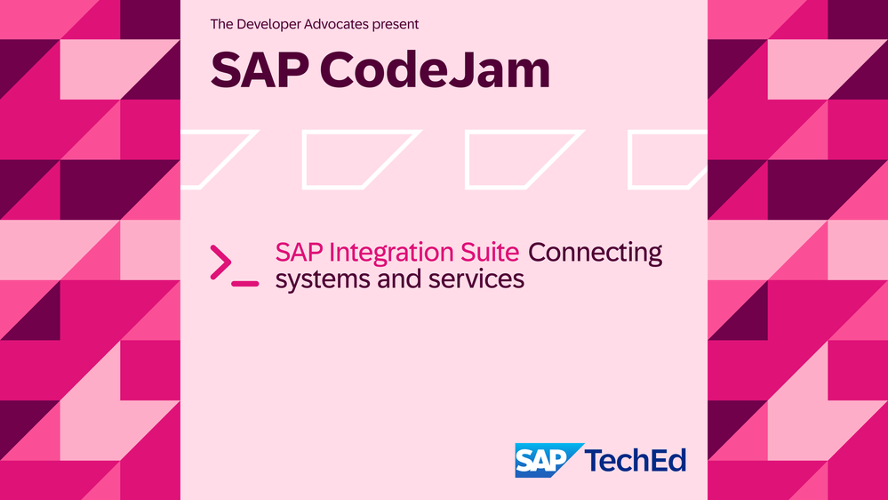
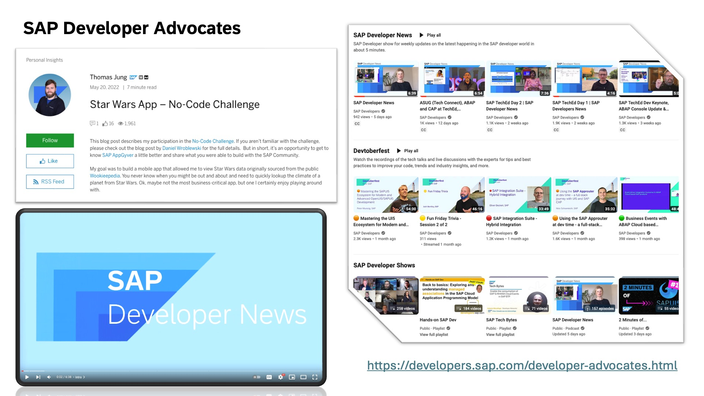
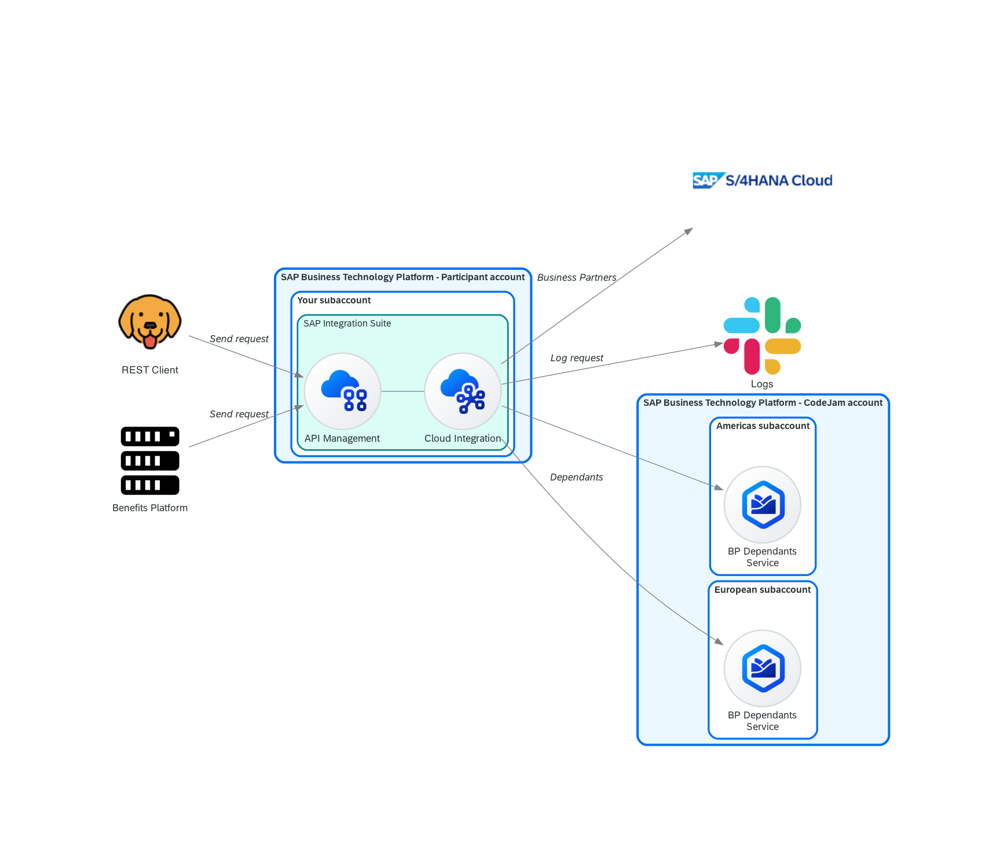
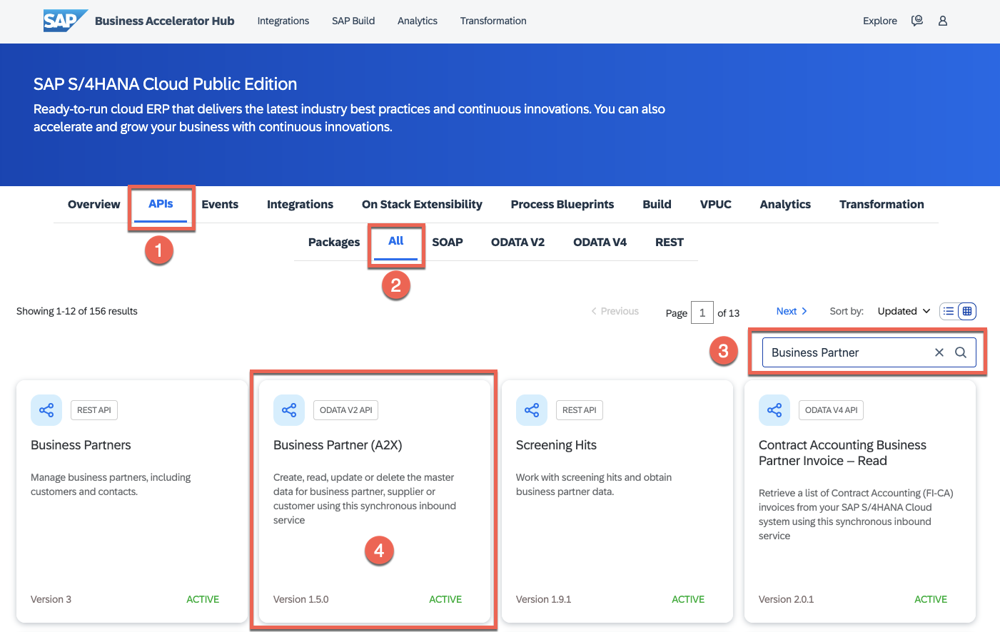
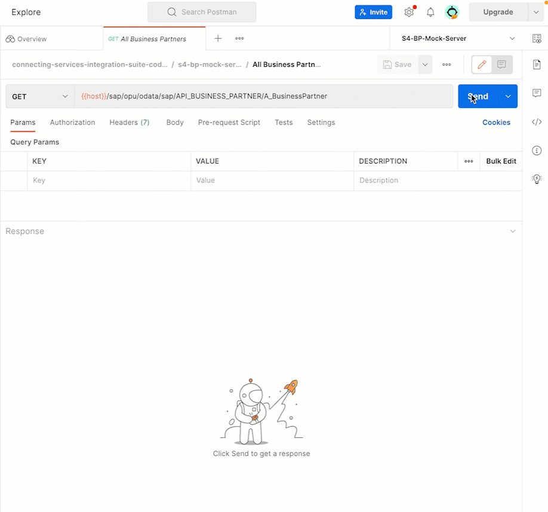
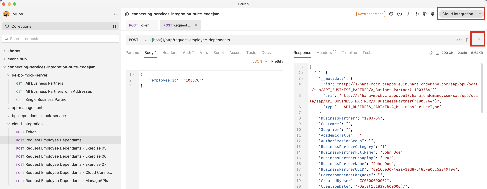
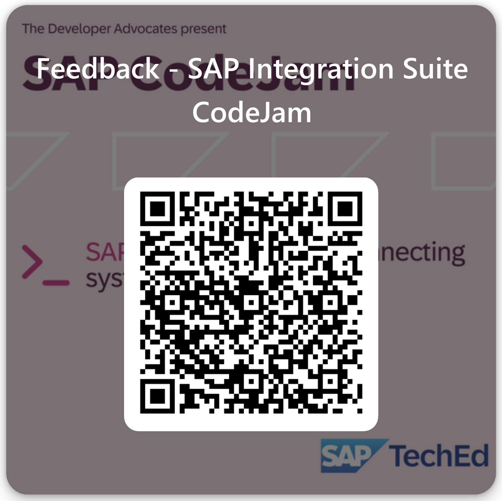

<!-- paginate: false -->

---
<!-- paginate: false -->

---
<!-- paginate: false -->

---
<!-- paginate: false -->

---
# SAP CodeJam - Agenda

 

<!-- - *13:00* - Introduction
- *13:30* - Exercise 01 - 04
- *15:00* - Break
- *15:30* - Exercise 05 - 06 -->
- *09:00* - Introduction
- *09:30* - Exercise 01 - 04
- *11:00* - Break
- *11:30* - Exercise 05 - 06

 
 
 

---
<!-- paginate: true -->

# SAP Integration Suite

--- 

# SAP Integration Suite

--- 

# SAP CodeJam - Integration scenario

<!-- _class: centersingleimage -->

--- 

# SAP CodeJam - Repository
 
 <!-- _class: centersingleimage -->

--- 

<!-- _footer: "*[Troubleshooting](https://github.com/SAP-samples/connecting-systems-services-integration-suite-codejam/blob/main/troubleshooting.md#troubleshooting): Whenever you face an issue, make sure to check this page first.*" -->

# SAP CodeJam - Exercises

* [Exercise 01 - Getting familiar with the SAP Business Accelerator Hub](.//exercises/01-getting-familiar-business-accelerator-hub/) (20')
* [Exercise 02 - Exploring the mock services](./exercises/02-exploring-the-mock-services/) (20')
* [Exercise 03 - Build our first integration flow](./exercises/03-build-first-integration-flow/) (30')
* [Exercise 04 - Send messages and monitor our integration flow](./exercises/04-send-messages-and-monitor/) (20')
  * [Exercise 04.1 - Retrieve Business Partner dependant's information](./exercises/04.1-retrieve-bp-dependants/) (45')
  * [Exercise 04.2 - Add the America's instance of the Business Partner Dependants service](./exercises/04.2-add-americas-bp-dependants/) (30')
* [Exercise 05 - Log service call in Google BigQuery (Open Connectors)](./exercises/05-log-requests-in-bigquery/) (20')
* [Exercise 06 - Expose integration flow via API Management](./exercises/06-expose-integration-flow-api-management/) (30')
* [(Optional) Exercise 01 - Running locally services used in CodeJam](./optional-01-running-locally/README.md#optional-exercise-01---running-locally-services-used-in-codejam)

--- 
<!-- _class: centersingleimage -->

# Exercise 01 - Getting familiar with the SAP Business Accelerator Hub (20')

--- 
<!-- _class: centersingleimage -->

# Exercise 02 - Exploring the mock services (20')

---
<!-- _class: centersingleimage -->

# Exercise 03 - Build our first integration flow (30')

---
<!-- _class: centersingleimage -->

# Exercise 04 - Send message and monitor our integration flow (20')

---
<!-- _class: centersingleimage -->

# Exercise 04.1 - Retrieve Business Partner dependant's information (45')

---
<!-- _class: centersingleimage -->

# Exercise 04.2 - Add the America's instance of the Business Partner Dependants service (30')

---
<!-- _class: centersingleimage -->

# Exercise 05 - Log service call in Google BigQuery (20')

---
<!-- _class: centersingleimage -->

# Exercise 06 - Expose integration flow via API Management (30')

--- 
<!-- _class: centersingleimage -->

# Thanks for attending!!!

