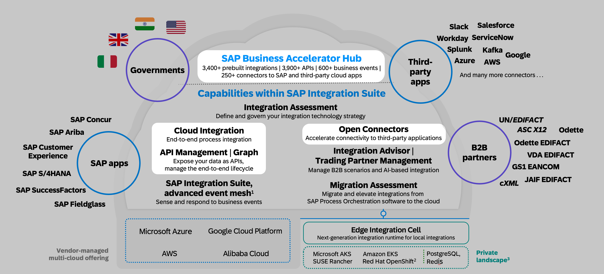
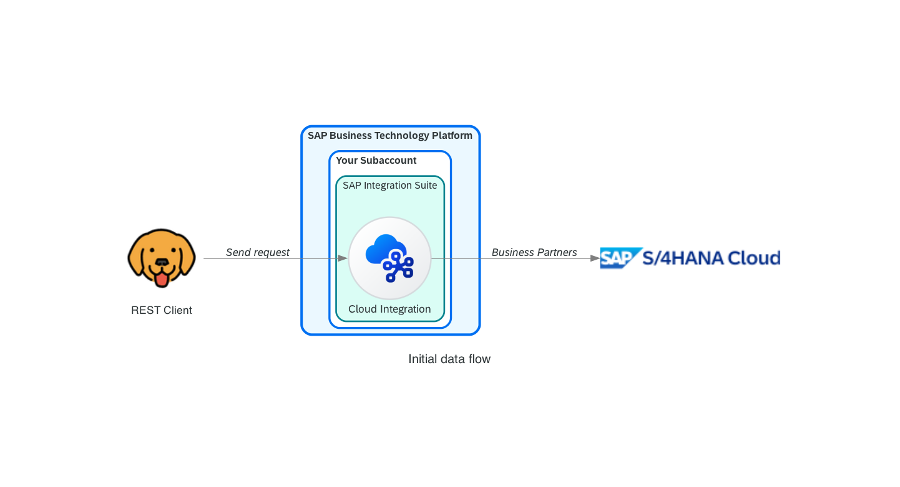
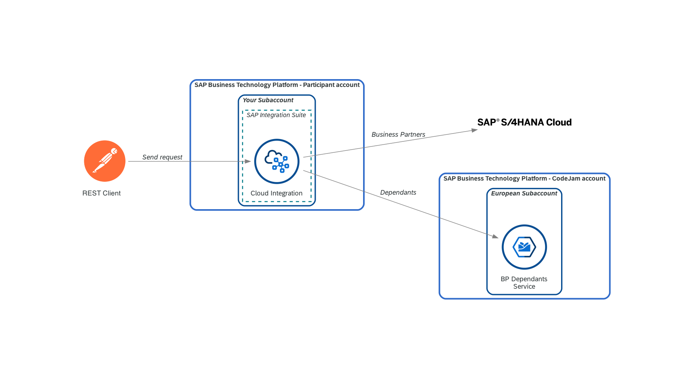

<!-- _class: lead -->

# SAP CodeJam

## [Connecting systems and services using SAP Integration Suite](https://github.com/SAP-samples/connecting-systems-services-integration-suite-codejam)

---
<!-- paginate: true -->

# SAP Integration Suite

--- 

# SAP Integration Suite

--- 

# SAP CodeJam - Integration scenario

<!-- _class: centersingleimage -->

--- 

# SAP CodeJam - Repository
 

--- 

<!-- _footer: "*[Troubleshooting](https://github.com/SAP-samples/connecting-systems-services-integration-suite-codejam/blob/main/troubleshooting.md#troubleshooting): Whenever you face an issue, make sure to check this page first.*" -->

# SAP CodeJam - Exercises

* [Exercise 01 - Getting familiar with the SAP API Business Hub](./01-getting-familiar-api-business-hub/README.md#exercise-01---getting-familiar-with-the-sap-api-business-hub)
* [Exercise 02 - Exploring the mock services](./02-exploring-the-mock-services/README.md#exercise-02---exploring-the-mock-services)
* [Exercise 03 - Build our first integration flow](./03-build-first-integration-flow/README.md#exercise-03---building-our-first-integration-flow)
* [Exercise 04 - Send messages and monitor our integration flow](./04-send-messages-and-monitor/README.md#exercise-04---sending-messages-and-monitoring-our-integration-flow)
* [Exercise 05 - Retrieve Business Partner dependant's information](./05-retrieve-bp-dependants/README.md#exercise-05---retrieve-business-partner-dependants-information)
* [Exercise 06 - Add the America's instance of the Business Partner Dependants service](./06-add-americas-bp-dependants/README.md#exercise-06---add-the-americas-instance-of-the-business-partner-dependants-service)
* [Exercise 07 - Log service call in Google BigQuery (Open Connectors)](./07-log-requests-in-bigquery/README.md#exercise-07---log-request-in-bigquery)
* [Exercise 08 - Expose integration flow via API Management](./08-expose-integration-flow-api-management/README.md#exercise-08---expose-integration-flow-via-api-management)
* [(Optional) Exercise 01 - Running locally services used in CodeJam](./optional-01-running-locally/README.md#optional-exercise-01---running-locally-services-used-in-codejam)

--- 
<!-- _class: centersingleimage -->

# Exercise 01 - Getting familiar with the SAP API Business Hub

--- 
<!-- _class: centersingleimage -->

# Exercise 02 - Exploring the mock services

---
<!-- _class: centersingleimage -->

# Exercise 03 - Build our first integration flow

---
<!-- _class: centersingleimage -->

# Exercise 04 - Send message and monitor our integration flow

---
<!-- _class: centersingleimage -->

# Exercise 05 - Retrieve Business Partner dependant's information

---
<!-- _class: centersingleimage -->

# Exercise 06 - Add the America's instance of the Business Partner Dependants service

---
<!-- _class: centersingleimage -->

# Exercise 07 - Log service call in Google BigQuery

---
<!-- _class: centersingleimage -->

# Exercise 08 - Expose integration flow via API Management

--- 
<!-- _class: lead -->

# Thank you for attending!!!

- Issues: You can [create an issue](https://github.com/SAP-samples/connecting-systems-services-integration-suite-codejam/issues/new) in this repository if you find a bug or have questions about it.
- [Feedback](https://github.com/SAP-samples/connecting-systems-services-integration-suite-codejam/issues/new?assignees=&labels=feedback&template=session-feedback-template.md&title=Feedback): If you can spare a couple of minutes at the end of the session, please help us improve for next time by giving me some feedback.
