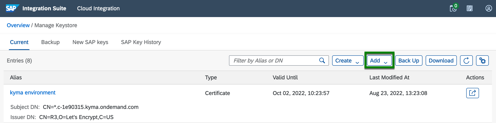
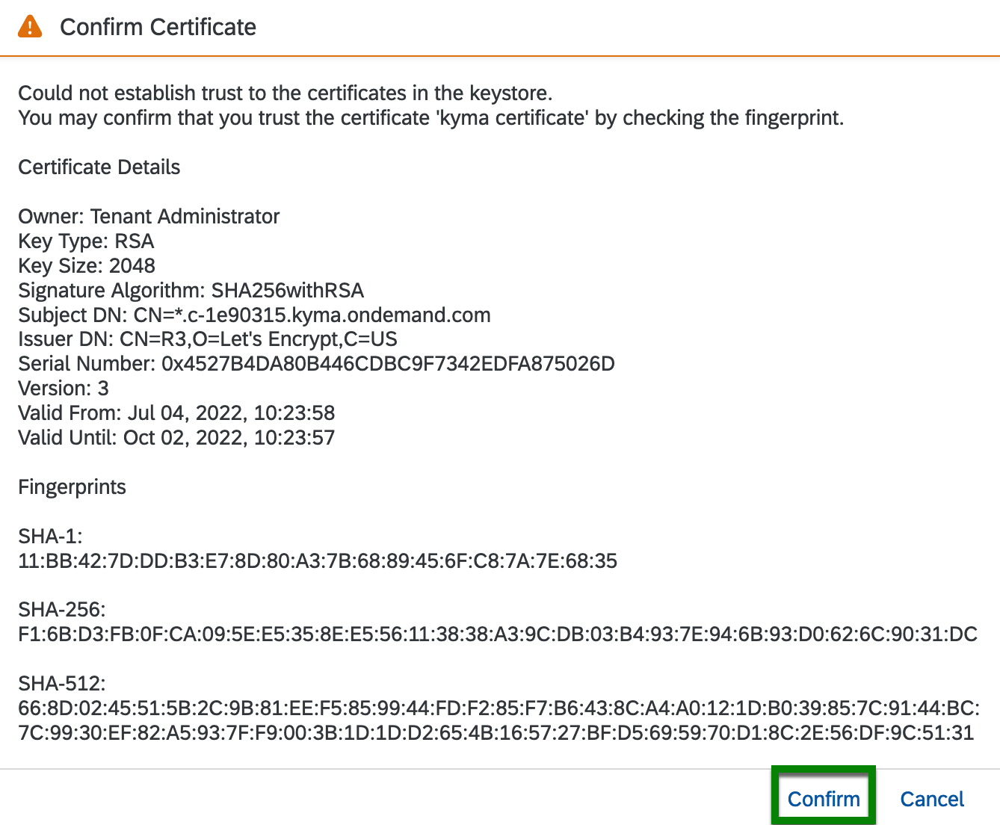

# Troubleshooting

This page intends to capture common problems that you might face while going through the exercises part of the CodeJam.

## Cloud Integration

- ### Tracing an integration flow

    To activate tracing in a deployed integration flow, navigate to  `Monitor > Manage Integration Content`, select the deployed integration flow and modify the `Log Level`.

    

    When tracing is enabled for an integration flow, if we send a message to it, we will then have access to the exchange headers, properties and payload at the different steps that are part of the integration flow. Having access to the different steps and the data flowing through them helps greatly when troubleshooting/debugging an integration flow.

    

    > Learn more on how [tracing an integration flow in SAP Cloud Integration](https://help.sap.com/docs/CLOUD_INTEGRATION/368c481cd6954bdfa5d0435479fd4eaf/4ec27d358d844c96b3ae11febd440eac.html?locale=en-US) works.

- ### Why am I unable to edit the integration flow?

    This is because our integration flow is not in edit mode. To switch to edit mode, click the `Edit button` (*upper right corner*).

- ### Why am I unable to edit the Groovy script in my integration flow?

    Same reason as above 👆.

- ### An internal server error occurred: End of input at line 1 column 1 path $

    No body was sent in the request. Remember that our integration flow expects a JSON payload. See [request payload sample](exercises/03-build-first-integration-flow/assets/request-payload-sample.json).

- ### There is no HTTP endpoint URL on the deployed content page

    In case you don't see the HTTP endpoint URL immediately on the deployed content page, it takes a couple of seconds before it is reflected in the UI. Refresh the web page a couple of times and it will then be displayed.

- ### Failed to create route - HTTP address already registered for another iflow

    You can face this error if you are trying to deploy an integration whose HTTP sender adapter is configured with the same address as another integration flow that's already deployed. There are two possible solutions to this problem:
    1. Change the address configured in the HTTP sender adapter of the integration flow that you are trying to deploy, e.g. add a suffix `-ex5`
        

    2. Undeploy the previous integration flow

        

- ### SecureStoreException: Secure Parameter not available

    Check the value set in the integration flow external parameters, e.g. `eu-bp-dependants-api-key-alias` or `americas-bp-dependants-api-key-alias`. This value is case-sensitive and needs to match the name of the deployed component(s) in Security Material.

- ### HTTP 401 Unauthorized error when sending requests to the integration flow

    1. Ensure that you are including authorization details in your request. In our case, that would be a Bearer token in the Authorization HTTP header.
    2. If the Authorization header is set, the Bearer token may have expired. Refresh the token by sending a request to the token URL (In Bruno collection - `cloud-integration > POST Token`) and then retry sending the request to the integration flow.

- ### HTTP 403 Forbidden error message when posting a message to SAP Cloud Integration

    It's an HTTP 403, not an HTTP 401... meaning that you are authenticating well to the service but the user you are using for communication doesn't have the right roles assigned to it. We can check two things here:
    1. Make sure that the user has the ESBMessagingSend.send role in the BTP Cockpit. See the roles set up for the instance in the [prerequisites - Create SAP Cloud Integration runtime client credentials](prerequisites.md#create-sap-cloud-integration-runtime-client-credentials).
    2. The HTTP sender adapter should have the CSRF Protected checkbox unchecked. If it is checked, you will get an HTTP 403 error.
        

- ### HTTP 404 Not Found when sending requests to the integration flow

    1. Ensure that the deployment of the integration flow that you are trying to send a message has completed. It might still be in the deploying status.
    2. Check the URL that you are trying to send the message.

- ### HTTP 405 Method not allowed when configuring communication via Cloud Connector

    The protocol specified in the URL address is likely HTTPS when it should be HTTP.

    

- ### HTTP 500 Internal Server error - PKIX path building failed. Unable to find valid certification path to requested target

    The certificate presented by the service you are communicating with is unknown to your Cloud Integration tenant. You need to import the certificate presented by the service in your Cloud Integration tenant.

    You might face this error when trying to communicate with the services part of this CodeJam. The services are hosted in a Kyma environment and Cloud Integration is missing the certificate root chain presented by the service hosted in Kyma.

    👉 Go to `Monitor > Manage Security - Keystore tile` and `Add` a certificate. Import the [kyma-ondemand-com-chain.pem](assets/cloud-integration/kyma-ondemand-com-chain.pem) certificate included in the assets folder and `Confirm` you want to add it.

    1. Add certificate
    

    2. Browse for certificate
    

    3. Confirm certificate
    

    Once the certificate is added, you can test connectivity with the service by using the `Connectivity Tests` utility under Monitor

    

    > Alternatively, you can download the certificate from your web browser. Access the URL from your web browser, e.g. `https://s4-mock-server-service.c-1e90315.kyma.ondemand.com/sap/opu/odata/sap/API_BUSINESS_PARTNER/A_BusinessPartner` and download the certificate chain. Once downloaded, follow the instructions above.

    

## API Management

- ### Unable to Create application exception in Developer Portal
  
  When creating an application in the Developer Portal, a pop-up is displayed stating that it was not possible to create the application.

  There are two potential solutions to the problem:
  - If you are the only user, make sure you register as a Developer. Go to Manage > Manage Users > Registered Users and add your account details. Select the Developer, Administrator and Content Admin roles.
  
    

  - Check SAP Note 2718466: [https://launchpad.support.sap.com/#/notes/0002718466](https://launchpad.support.sap.com/#/notes/0002718466)

## Bruno

- ### Could not send request - Error: getaddrinfo ENOTFOUND or Error: Invalid URI

    If you get this error when sending a request, it is possible that you've not selected the right environment or that the value for a variable that's used in the URL is incorrect. Ensure that you've selected the right environment for the request you are trying to make and check the values of the variables.

- ### Unresolved variable

    The UI states that it is not possible to resolve a variable. Ensure that you've selected the right environment for the request you are trying to make.
